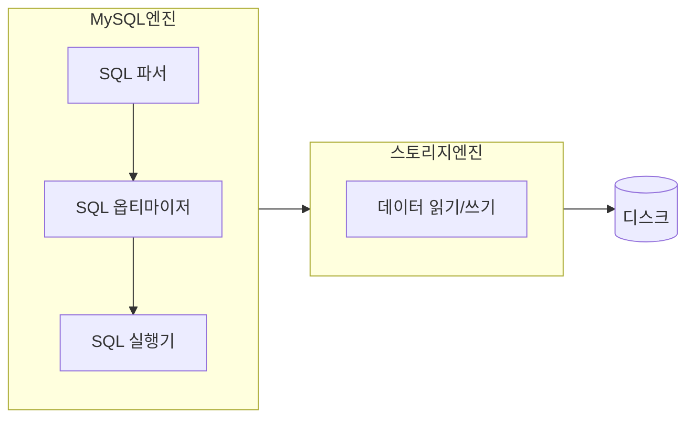
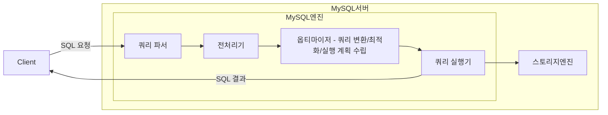

> MySQL 서버 = MySQL 엔진 + 스토리지 엔진   

# 4.1 MySQL 엔진 아키텍처 

### 4.1.1.1 MySQL 엔진
- SQL 문장 분석 및 최적화 
- 하나만 존재 

### 4.1.1.2 스토리지 엔진
- 데이터를 디스크 스토리지에 저장하거나 디스크 스토리지로 부터 읽어옴 
- 엔진은 여러개를 동시에 사용 가능

### 4.1.1.3 핸들러 API
- MySQL 엔진의 쿼리 실행기에서 데이터를 쓰거나 읽어야 할 때 
  - 각 스토리지 엔진에 쓰기 또는 읽기 요청 -> 핸들러 요청 -> 여기서 사용되는 API가 핸들러 API 
- 스토리지 엔진은 핸들러 API를 이용해 MySQL 엔진과 데이터를 주고받음
  - 얼마나 많은 데이터 작업이 있었는지 확인 가능 (커밋 등...)

## 4.1.2 MySQL 스레딩 구조 

- MySQL 서버는 스레드 기반으로 작동 
  - Foreground 스레드
    - 그중 커넥션 연결을 관리하는 스레드가 있음 
      - 커넥션 별로 스레드가 하나씩 생성되고 할당됨 
    - 스레드 풀 모델에서는 하나의 스레드가 여러 개의 커넥션 요청 담당 
  - Background 스레드 

### 4.1.2.1 포그라운드 스레드(클라이언트 스레드)
- 최소한 MySQL 서버에 접속된 클라이언트 수만큼 존재 
- 주로 각 클라이언트가 요청하는 쿼리 문장을 처리
- 클라이언트 커넥션 시작 -> 포그라운드 스레드 할당 -> 작업 수행 -> 커넥션 종료 -> 포그라운드 스레드를 스레드 캐시로 되돌려놓음 
  - 스레드 캐시에 대기중인 스레드가 일정 개수 이상인 경우, 스레드 캐시에 넣지 않고 스레드를 종료 시킴 (일정 개수만 캐시에 존재)
- 포그라운드 스레드는 데이터를 MySQL의 데이터 버퍼나 캐시로부터 가져옴 
  - 버퍼나 캐시에 없으면...
    - 디스크의 데이터 파일에서 직접 가져옴 
    - 인덱스 파일로부터 데이터를 읽어옴 
- MyISAM : 디스크 쓰기 작업도 포그라운드 스레드가 처리 
- InnoDB : 데이터 버퍼나 캐시까지만 포그라운드 스레드가 처리. 나머지는 백그라운드 스레드가!

### 4.1.2.2 백그라운드 스레드 
- 주로 InnoDB에 해당하는 내용임 
- 처리하는 작업 
  - Insert Buffer를 병합 
  - 로그를 디스크로 기록 (로그 스레드)
  - InnoDB 버퍼 풀의 데이터를 디스크에 기록 (쓰기 스레드) 
  - 데이터를 버퍼로 읽어옴 (읽기 스레드) 
  - 잠금이나 데드락을 모니터링 
- 읽는 작업은 주로 포그라운드 스레드에서 처리 
- 쓰기 작업은 아주 많은 작업을 백그라운드 스레드에서 처리 
- 쓰기 작업은 지연되어 처리될 수 있음
  - 쓰기 작업을 버퍼링해서 일괄 처리할 수 있음
- 읽기 작업은 지연 처리 불가 

## 4.1.3 메모리 할당 및 사용 구조 

### 4.1.3.1 글로벌 메모리 영역  
- MySQL 서버가 시작되면서 OS로부터 할당됨 (할당 방식은 OS에 따라 다르다)
- 클라이언트 스레드 수와는 무관하게 할당되는 영역 
- 모든 스레드에 의해 공유됨 
- 대표적인 영역
  - 테이블 캐시 
  - InnoDB 버퍼 풀
  - InnoDB 어댑티브 해시 인덱스 
  - InnoDB 리두 로그 버퍼 

### 4.1.3.2 로컬 메모리 영역 
- 세션(커넥션) 메모리 영역이라고도 표현함
  - 세션 : 클라이언트와 MySQL 서버와의 커넥션 
- 클라이언트 스레드가 쿼리를 처리하는 데 사용하는 메모리 영역 
- 각 클라이언트 스레드별로 독립적으로 할당됨 
- 공유되지 않는 영역 
- 커넥션이 열려 있는 동안 계속 할당된 상태로 남아있는 공간 
  - 커넥션 버퍼
  - 결과 버퍼 
- 쿼리를 실행하는 순간에만 할당했다가 다시 해제하는 공간 (메모리 공간은 할당조차 하지 않을 수도..) 
  - 소트 버퍼 
  - 조인 버퍼 
- 대표적인 영역
  - 소트 버퍼 
  - 조인 버퍼 
  - 바이너리 로그 캐시 
  - 네트워크 버퍼 

## 4.1.4 플러그인 스토리지 엔진 모델 

- MySQL의 독특한 구조 중 대표적인 것 
- 플러그인하여 사용할 수 있는 것 
  - 스토리지 엔진
  - 전문 검색 엔진을 위한 검색어 파서 (인덱싱 키워드 분리 작업)
  - Native Authentication, Caching SHA-2 Authentication...
- 핸들러(Handler)
  - 어떤 기능을 호출하기 위해 사용하는 객체 
  - MySQL 엔진 - 핸들러 - 스토리지 엔진 
  - MySQL 엔진이 각 스토리지 엔진에게 데이터 읽기/쓰기를 명령하려면 **반드시 핸들러를 통해야 함**
  - `Handler_`로 시작하는 상태 변수는 MySQL 엔진이 각 스토리지 엔진에게 보낸 명령의 횟수를 의미하는 변수라고 이해해도 됨 
- 중요한 내용
  - **하나의 쿼리 작업은 여러 하위 작업으로 나뉘는데, 각 하위 작업이 MySQL 엔진 영역에서 처리되는지, 스토리지 엔진 영역에서 처리되는지를 구분할 줄 알아야 한다.**

## 4.1.5 컴포넌트 
- MySQL 8.0 부터 지원되는 기능
- 플러그인 아키텍처를 대체하기 위한 아키텍처 
- 기존 플러그인 아키텍처의 단점 
  - 플러그인은 오직 MySQL 서버와 인터페이스할 수 있고, 플러그인끼리는 통신 불가 
  - 플러그인은 MySQL 서버의 변수나 함수를 직접 호출 -> 안전하지 않음 (캡슐화가 안됨)
  - 플러그인은 상호 의존 관계를 설정할 수 없어 초기화가 어려움 

## 4.1.6 쿼리 실행 구조 

### 4.1.6.1 쿼리 파서
- 사용자 요청으로 들어온 쿼리 문장을 토큰으로 분리
  - 토큰? MySQL이 인식할 수 있는 최소 단위의 어휘나 기호 
- 분리된 토큰을 **트리 형태의 구조로 만들어내는 작업**을 수행 
  - 이를 파서 트리라고 함 
- 쿼리 문장의 기본 문법 오류를 발견할 수 있음 

### 4.1.6.2 전처리기
- 파서 트리를 기반으로 쿼리 문장에 구조적인 문제점이 있는지 확인 가능
- 각 토큰에 테이블 이름, 칼럼 이름 또는 내장 함수와 같은 개체를 매핑 
  - **객체 존재 여부와 객체의 접근 권한 등을 확인하는 과정**을 수행

### 4.1.6.3 옵티마이저 
- 사용자의 요청으로 들어온 쿼리 문장을 **저렴한 비용으로 가장 빠르게 처리할 수 있는 방법을 결정**하는 역할을 담당
- DBMS의 두뇌 
- 중요한 역할을 담당하며, 영향 범위가 넓기 때문에, 옵티마이저가 더 나은 선택을 할 수 있게 유도하는 방법을 학습하는 것은 중요함 

### 4.1.6.4 실행 엔진 
- 옵티마이저가 회사의 경영진이라면, 실행 엔진은 중간관리자
- 옵티마이저에 의해 만들어진 실행 계획대로 각 핸들러에게 업무를 요청하여 결과를 받고, 그 결과를 또 다른 핸들러 요청의 입력으로 연결하는 역할을 수행   
- 예: 옵티마이저가 group by를 처리하기 위해 임시 테이블을 사용하기로 결정한 경우 
  1. 실행 엔진이 핸들러에게 임시 테이블을 만들라고 요청 
  2. 실행 엔진이 where 절에 일치하는 레코드를 읽어오라고 핸들러에게 요청 
  3. 읽어온 레코드들을 1번에서 준비한 임시 테이블로 저장하라고 핸들러에게 요청 
  4. 데이터가 준비된 임시 테이블에서 필요한 방식으로 데이터를 읽어오라고 핸들러에게 요청 
  5. 실행 엔진이 결과를 사용자 혹은 다른 모듈로 넘김

### 4.1.6.5 핸들러(스토리지 엔진)
- 옵티마이저가 회사의 경영진이라면, 핸들러는 각 업무의 실무자 
- MySQL 서버의 가장 밑단에서 실행 엔진의 요청에 따라 데이터를 디스크로 저장하고, 디스크로부터 읽어오는 역할을 담당 
- 결국 핸들러는 스토리지 엔진을 의미한다 
  - MyISAM, InnoDB

## 4.1.7 복제 
- MySQL 서버에서 Replication은 매우 중요한 역할을 담당함 
- 16장 복제에서 다시 언급됨 

## 4.1.8 쿼리 캐시 
- SQL 실행 결과를 메모리에 캐시 
  - 동일 SQL 쿼리가 실행되면 테이블을 읽지 않고 즉시 결과 반환 -> 매우 빠른 성능 
- 테이블의 데이터가 변경되면 캐시에 저장된 결과 중, 변경된 테이블과 관련된 것들은 모두 삭제해야 함 
  - **이는 심각한 동시 처리 성능 저하를 유발**
  - 수많은 버그의 원인 
- MySQL 8.0 부터는 쿼리 캐시 기능이 완전히 제거됨 

## 4.1.9 스레드 풀 
- 엔터프라이즈 에디션에서만 제공 
- 동시에 실행 중인 스레드들을 CPU가 최대한 잘 처리해낼 수 있는 수준으로 줄여서 빨리 처리하게 하는기능
  - 스케줄링 과정에서 CPU 시간을 잘 확보하지 못하는 경우 쿼리 처리가 오히려 느려질 수도 있음
- 서버의 자원 소모를 줄이는 것이 목적 
- CPU 코어의 개수와 스레드 풀의 사이즈를 맞추는 것이 CPU processor affinity를 높이는 데 좋음 
- 요청 -> MySQL 서버가 스레드 풀로 처리 이관 
- 스레드 풀의 스레드가 모두 일을 하고 있는데 새로운 요청이 들어왔을 때의 전략
  - 새로운 작업 스레드 추가 
  - or 기존의 작업 스레드가 처리르 완료할 때까지 대기 

## 4.1.10 트랜잭션 지원 메타데이터 
- 메타데이터? 테이블 구조 정보, 스토어드 프로그램 등의 정보를 의미
- ~ MySQL 5.7
  - 파일 기반 메타데이터 이용 
  - 생성 및 변경 작업이 트랜잭션 지원 X 
  - 생성 또는 변경 도중, MySQL 서버가 비정상 종료될 경우 일관되지 않은 상태로 남는 문제가 발생 
- MySQL 8.0 ~ 
  - 메타데이터를 InnoDB의 테이블에 저장
  - 시스템 테이블, 데이터 딕셔너리(메타데이터) 정보를 모두 `mysql` DB에 저장함 (트랜잭션 지원)
  - 생성 또는 변경 도중, MySQL 서버가 비정상 종료가 되더라도 완전한 성공 or 완전한 실패로 정리됨

