> MySQL 서버 = MySQL 엔진 + 스토리지 엔진   

# 4.1 MySQL 엔진 아키텍처 
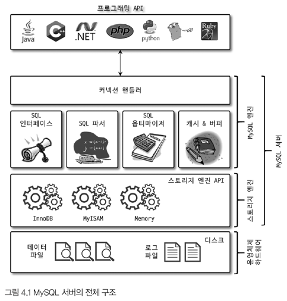

### 4.1.1.1 MySQL 엔진
- SQL 문장 분석 및 최적화 
- 하나만 존재 

### 4.1.1.2 스토리지 엔진
- 데이터를 디스크 스토리지에 저장하거나 디스크 스토리지로 부터 읽어옴 
- 엔진은 여러개를 동시에 사용 가능

### 4.1.1.3 핸들러 API
- MySQL 엔진의 쿼리 실행기에서 데이터를 쓰거나 읽어야 할 때 
  - 각 스토리지 엔진에 쓰기 또는 읽기 요청 -> 핸들러 요청 -> 여기서 사용되는 API가 핸들러 API 
- 스토리지 엔진은 핸들러 API를 이용해 MySQL 엔진과 데이터를 주고받음
  - 얼마나 많은 데이터 작업이 있었는지 확인 가능 (커밋 등...)

## 4.1.2 MySQL 스레딩 구조 
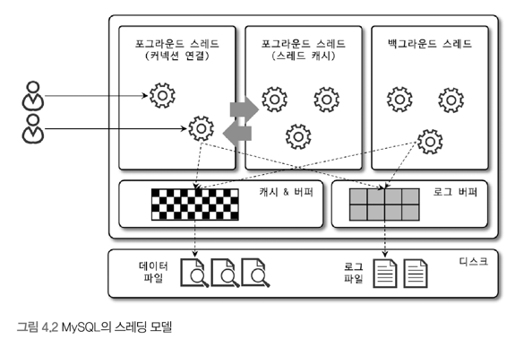
- MySQL 서버는 스레드 기반으로 작동 
  - Foreground 스레드
    - 그중 커넥션 연결을 관리하는 스레드가 있음 
      - 커넥션 별로 스레드가 하나씩 생성되고 할당됨 
    - 스레드 풀 모델에서는 하나의 스레드가 여러 개의 커넥션 요청 담당 
  - Background 스레드 

### 4.1.2.1 포그라운드 스레드(클라이언트 스레드)
- 최소한 MySQL 서버에 접속된 클라이언트 수만큼 존재 
- 주로 각 클라이언트가 요청하는 쿼리 문장을 처리
- 클라이언트 커넥션 시작 -> 포그라운드 스레드 할당 -> 작업 수행 -> 커넥션 종료 -> 포그라운드 스레드를 스레드 캐시로 되돌려놓음 
  - 스레드 캐시에 대기중인 스레드가 일정 개수 이상인 경우, 스레드 캐시에 넣지 않고 스레드를 종료 시킴 (일정 개수만 캐시에 존재)
- 포그라운드 스레드는 데이터를 MySQL의 데이터 버퍼나 캐시로부터 가져옴 
  - 버퍼나 캐시에 없으면...
    - 디스크의 데이터 파일에서 직접 가져옴 
    - 인덱스 파일로부터 데이터를 읽어옴 
- MyISAM : 디스크 쓰기 작업도 포그라운드 스레드가 처리 
- InnoDB : 데이터 버퍼나 캐시까지만 포그라운드 스레드가 처리. 나머지는 백그라운드 스레드가!

### 4.1.2.2 백그라운드 스레드 
- 주로 InnoDB에 해당하는 내용임 
- 처리하는 작업 
  - Insert Buffer를 병합 
  - 로그를 디스크로 기록 (로그 스레드)
  - InnoDB 버퍼 풀의 데이터를 디스크에 기록 (쓰기 스레드) 
  - 데이터를 버퍼로 읽어옴 (읽기 스레드) 
  - 잠금이나 데드락을 모니터링 
- 읽는 작업은 주로 포그라운드 스레드에서 처리 
- 쓰기 작업은 아주 많은 작업을 백그라운드 스레드에서 처리 
- 쓰기 작업은 지연되어 처리될 수 있음
  - 쓰기 작업을 버퍼링해서 일괄 처리할 수 있음
- 읽기 작업은 지연 처리 불가 

## 4.1.3 메모리 할당 및 사용 구조 
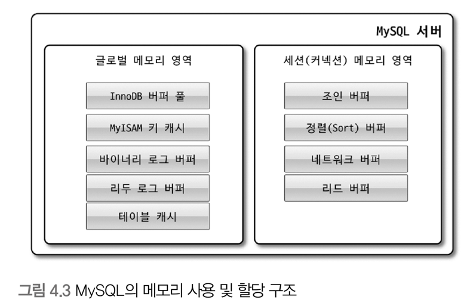

### 4.1.3.1 글로벌 메모리 영역  
- MySQL 서버가 시작되면서 OS로부터 할당됨 (할당 방식은 OS에 따라 다르다)
- 클라이언트 스레드 수와는 무관하게 할당되는 영역 
- 모든 스레드에 의해 공유됨 
- 대표적인 영역
  - 테이블 캐시 
  - InnoDB 버퍼 풀
  - InnoDB 어댑티브 해시 인덱스 
  - InnoDB 리두 로그 버퍼 

### 4.1.3.2 로컬 메모리 영역 
- 세션(커넥션) 메모리 영역이라고도 표현함
  - 세션 : 클라이언트와 MySQL 서버와의 커넥션 
- 클라이언트 스레드가 쿼리를 처리하는 데 사용하는 메모리 영역 
- 각 클라이언트 스레드별로 독립적으로 할당됨 
- 공유되지 않는 영역 
- 커넥션이 열려 있는 동안 계속 할당된 상태로 남아있는 공간 
  - 커넥션 버퍼
  - 결과 버퍼 
- 쿼리를 실행하는 순간에만 할당했다가 다시 해제하는 공간 (메모리 공간은 할당조차 하지 않을 수도..) 
  - 소트 버퍼 
  - 조인 버퍼 
- 대표적인 영역
  - 소트 버퍼 
  - 조인 버퍼 
  - 바이너리 로그 캐시 
  - 네트워크 버퍼 

## 4.1.4 플러그인 스토리지 엔진 모델 
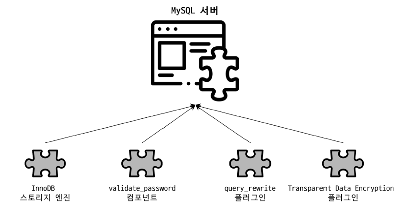
- MySQL의 독특한 구조 중 대표적인 것 
- 플러그인하여 사용할 수 있는 것 
  - 스토리지 엔진
  - 전문 검색 엔진을 위한 검색어 파서 (인덱싱 키워드 분리 작업)
  - Native Authentication, Caching SHA-2 Authentication...
- 핸들러(Handler)
  - 어떤 기능을 호출하기 위해 사용하는 객체 
  - MySQL 엔진 - 핸들러 - 스토리지 엔진 
  - MySQL 엔진이 각 스토리지 엔진에게 데이터 읽기/쓰기를 명령하려면 **반드시 핸들러를 통해야 함**
  - `Handler_`로 시작하는 상태 변수는 MySQL 엔진이 각 스토리지 엔진에게 보낸 명령의 횟수를 의미하는 변수라고 이해해도 됨 
- 중요한 내용
  - **하나의 쿼리 작업은 여러 하위 작업으로 나뉘는데, 각 하위 작업이 MySQL 엔진 영역에서 처리되는지, 스토리지 엔진 영역에서 처리되는지를 구분할 줄 알아야 한다.**

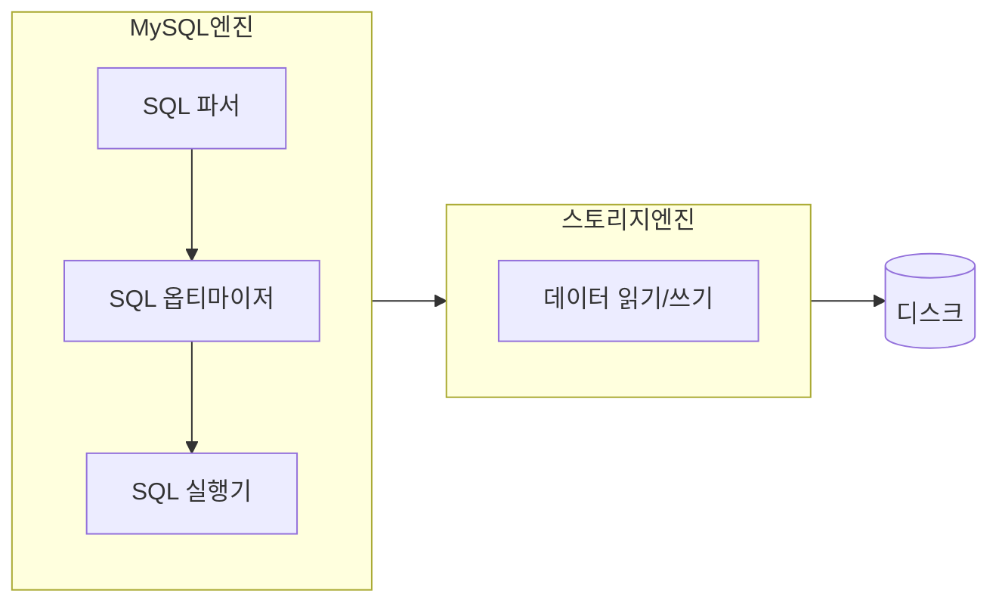

## 4.1.5 컴포넌트 
- MySQL 8.0 부터 지원되는 기능
- 플러그인 아키텍처를 대체하기 위한 아키텍처 
- 기존 플러그인 아키텍처의 단점 
  - 플러그인은 오직 MySQL 서버와 인터페이스할 수 있고, 플러그인끼리는 통신 불가 
  - 플러그인은 MySQL 서버의 변수나 함수를 직접 호출 -> 안전하지 않음 (캡슐화가 안됨)
  - 플러그인은 상호 의존 관계를 설정할 수 없어 초기화가 어려움 

## 4.1.6 쿼리 실행 구조 
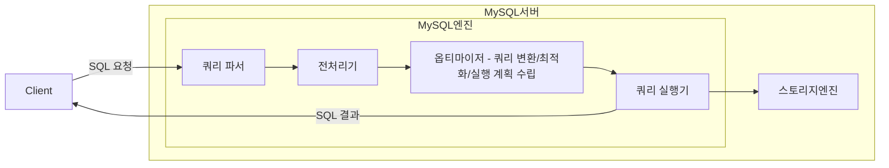
### 4.1.6.1 쿼리 파서
- 사용자 요청으로 들어온 쿼리 문장을 토큰으로 분리
  - 토큰? MySQL이 인식할 수 있는 최소 단위의 어휘나 기호 
- 분리된 토큰을 **트리 형태의 구조로 만들어내는 작업**을 수행 
  - 이를 파서 트리라고 함 
- 쿼리 문장의 기본 문법 오류를 발견할 수 있음 

### 4.1.6.2 전처리기
- 파서 트리를 기반으로 쿼리 문장에 구조적인 문제점이 있는지 확인 가능
- 각 토큰에 테이블 이름, 칼럼 이름 또는 내장 함수와 같은 개체를 매핑 
  - **객체 존재 여부와 객체의 접근 권한 등을 확인하는 과정**을 수행

### 4.1.6.3 옵티마이저 
- 사용자의 요청으로 들어온 쿼리 문장을 **저렴한 비용으로 가장 빠르게 처리할 수 있는 방법을 결정**하는 역할을 담당
- DBMS의 두뇌 
- 중요한 역할을 담당하며, 영향 범위가 넓기 때문에, 옵티마이저가 더 나은 선택을 할 수 있게 유도하는 방법을 학습하는 것은 중요함 

### 4.1.6.4 실행 엔진 
- 옵티마이저가 회사의 경영진이라면, 실행 엔진은 중간관리자
- 옵티마이저에 의해 만들어진 실행 계획대로 각 핸들러에게 업무를 요청하여 결과를 받고, 그 결과를 또 다른 핸들러 요청의 입력으로 연결하는 역할을 수행   
- 예: 옵티마이저가 group by를 처리하기 위해 임시 테이블을 사용하기로 결정한 경우 
  1. 실행 엔진이 핸들러에게 임시 테이블을 만들라고 요청 
  2. 실행 엔진이 where 절에 일치하는 레코드를 읽어오라고 핸들러에게 요청 
  3. 읽어온 레코드들을 1번에서 준비한 임시 테이블로 저장하라고 핸들러에게 요청 
  4. 데이터가 준비된 임시 테이블에서 필요한 방식으로 데이터를 읽어오라고 핸들러에게 요청 
  5. 실행 엔진이 결과를 사용자 혹은 다른 모듈로 넘김

### 4.1.6.5 핸들러(스토리지 엔진)
- 옵티마이저가 회사의 경영진이라면, 핸들러는 각 업무의 실무자 
- MySQL 서버의 가장 밑단에서 실행 엔진의 요청에 따라 데이터를 디스크로 저장하고, 디스크로부터 읽어오는 역할을 담당 
- 결국 핸들러는 스토리지 엔진을 의미한다 
  - MyISAM, InnoDB

## 4.1.7 복제 
- MySQL 서버에서 Replication은 매우 중요한 역할을 담당함 
- 16장 복제에서 다시 언급됨 

## 4.1.8 쿼리 캐시 
- SQL 실행 결과를 메모리에 캐시 
  - 동일 SQL 쿼리가 실행되면 테이블을 읽지 않고 즉시 결과 반환 -> 매우 빠른 성능 
- 테이블의 데이터가 변경되면 캐시에 저장된 결과 중, 변경된 테이블과 관련된 것들은 모두 삭제해야 함 
  - **이는 심각한 동시 처리 성능 저하를 유발**
  - 수많은 버그의 원인 
- MySQL 8.0 부터는 쿼리 캐시 기능이 완전히 제거됨 

## 4.1.9 스레드 풀 
- 엔터프라이즈 에디션에서만 제공 
- 동시에 실행 중인 스레드들을 CPU가 최대한 잘 처리해낼 수 있는 수준으로 줄여서 빨리 처리하게 하는기능
  - 스케줄링 과정에서 CPU 시간을 잘 확보하지 못하는 경우 쿼리 처리가 오히려 느려질 수도 있음
- 서버의 자원 소모를 줄이는 것이 목적 
- CPU 코어의 개수와 스레드 풀의 사이즈를 맞추는 것이 CPU processor affinity를 높이는 데 좋음 
- 요청 -> MySQL 서버가 스레드 풀로 처리 이관 
- 스레드 풀의 스레드가 모두 일을 하고 있는데 새로운 요청이 들어왔을 때의 전략
  - 새로운 작업 스레드 추가 
  - or 기존의 작업 스레드가 처리르 완료할 때까지 대기 

## 4.1.10 트랜잭션 지원 메타데이터 
- 메타데이터? 테이블 구조 정보, 스토어드 프로그램 등의 정보를 의미
- ~ MySQL 5.7
  - 파일 기반 메타데이터 이용 
  - 생성 및 변경 작업이 트랜잭션 지원 X 
  - 생성 또는 변경 도중, MySQL 서버가 비정상 종료될 경우 일관되지 않은 상태로 남는 문제가 발생 
- MySQL 8.0 ~ 
  - 메타데이터를 InnoDB의 테이블에 저장
  - 시스템 테이블, 데이터 딕셔너리(메타데이터) 정보를 모두 `mysql` DB에 저장함 (트랜잭션 지원)
  - 생성 또는 변경 도중, MySQL 서버가 비정상 종료가 되더라도 완전한 성공 or 완전한 실패로 정리됨

---

---

# 4.2 InnoDB 스토리지 엔진 아키텍처
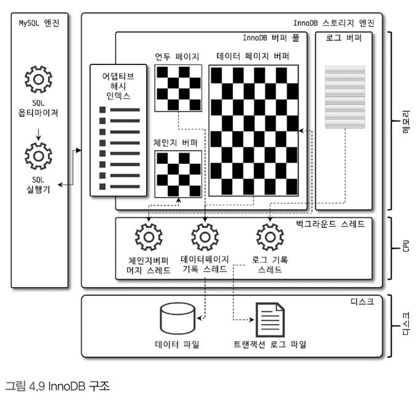
- 레코드 기반 잠금을 제공하여 높은 동시성 처리 성능을 가짐 
- 안정적 & 뛰어난 성능 

## 4.2.1 프라이머리 키에 의한 클러스터링 
- 모든 테이블은 기본적으로 PK를 기준으로 클러스터링 되어 저장됨 -> **클러스터링 인덱스**
  - PK 값 순서대로 디스크에 저장 
- 모든 세컨더리 인덱스는 레코드 주소가 아닌 PK 값을 논리적인 주소로 사용 
- PK를 이용한 레인지 스캔이 상당히 빠름 
- 쿼리 실행 계획에서 PK는 다른 보조 인덱스에 비해 비중이 높게 설정됨 (PK가 선택될 확률이 높음)

## 4.2.2 외래 키 지원 
- 외래 키 특징 
  - 부모 테이블과 자식 테이블 모두 해당 컬럼에 인덱스 생성이 필요 
  - 변경 시에는 부모 테이블이나 자식 테이블에 데이터가 있는지 체크하는 작업 필요 
    - 잠금이 여러 테이블로 전파
    - 데드락 발생 가능성이 높으므로 주의 
- `foreign_key_checks`
  - 테이블의 관계를 명확하게 파악해서 순서대로 작업해야 하는데, 외래 키가 복잡하게 얽힌 경우 이게 어려울 수 있음 
  - 해당 변수를 일시적으로 `OFF`로 설정할 경우 외래 키 관계에 대한 체크를 멈출 수 있음 
  - `global`, `session` 모두 사용 가능하니, 해당하는 `session`에만 사용하도록 주의하자 
  - 사용했다면 다시 `ON`으로 켜주는 것을 잊지말자 

## 4.2.3 MVCC(Multi Version Concurrency Control)
- 잠금을 사용하지 않는 일관된 읽기를 제공하는 방법
  - Multi Version : 하나의 레코드에 대해 여러 개의 버전이 동시에 관리된다는 의미
  - 여러 개의 버전이 있고, 필요에 따라 어느 버전의 데이터가 보여지는지는 여러가지 상황에 따라 달라지는 구조 
- InnoDB는 Undo log를 이용하여 구현
  - 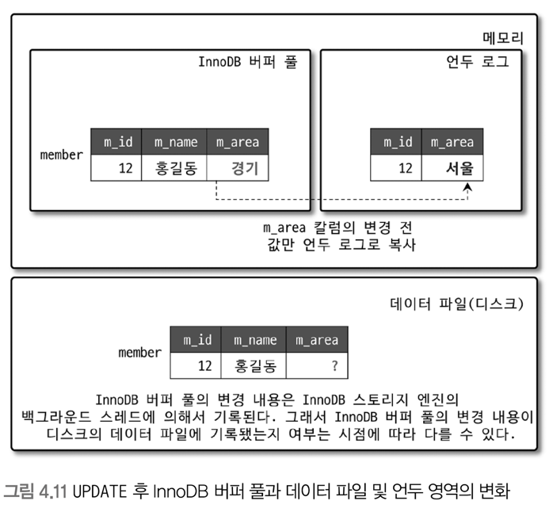
  - UPDATE 문장 실행 시, 
    - 버퍼 풀의 값은 즉시 새로운 값으로 업데이트
    - 기존 데이터는 언두 영역으로 복사 
    - 데이터 파일에는 체크 포인트나 write 스레드에 의해 새로운 값으로 업데이트 되어있을 수도 있고 아닐 수도 있음 
    - 보통은 ACID를 보장하기 때문에 동일한 상태라고 가정해도 무방함
  - 위 상태가 커밋되기 전에 조회를 할 경우
    - 격리 수준에 따라 조회되는 정보가 다름 
      - READ_UNCOMMITTED : 버퍼 풀의 정보를 반환 
      - READ_COMMITTED ~ SERIALIZABLE : 변경되기 이전인 언두 영역의 데이터를 반환
  - 위 상태가 커밋된다면 
    - 버퍼 풀의 상태를 영구적인 데이터를 만들어버림 
    - 커밋이 된다고 언두 영역의 데이터가 항상 바로 삭제되지는 않음
    - 해당 언두 영역을 필요로 하는 트랜잭션이 없을 때 비로소 삭제됨 
  - 위 상태가 롤백된다면
    - 언두 영역의 백업 데이터를 InnoDB 버퍼 풀로 다시 복구 & 언두 영역의 내용 삭제 

## 4.2.4 잠금 없는 일관된 읽기(Non-Locking Consistent Read)
- InnoDB는 MVCC 기술을 이용해 잠금 없이 읽기 작업 수행 
  - 격리 수준이 `SERIALIZABLE`이 아닌 경우, 다른 트랜잭션이 가지고 있는 잠금을 기다리지 않고 읽기 작업 가능 
  - 특정 사용자가 레코드를 변경하고 아직 커밋을 하지 않았다 하더라도, 다른 사용자의 조회 작업을 방해하지 않음
    - 변경 전 데이터를 읽기 위해 언두 로그 이용 
- 언두 로그가 오래 유지될 경우 성능 문제가 발생할 수 있으므로, 트랜잭션이 시작된 경우 가능한 한 빠르게 롤백/커밋을 하여 트랜잭션을 완료하자 

## 4.2.5 자동 데드락 감지 
- 잠금이 교착 상태에 빠지지 않았는지 체크하기 위해 잠금 대기 목록을 그래프 형태로 관리
  - Wait-for List
- InnoDB 엔진은 데드락 감지 스레드를 가지고 있음 
  - 주기적으로 잠금 대기 그래프를 검사 
  - 교착 상태에 빠진 트랜잭션을 찾아서 그중 하나를 강제 종료 
  - 강제 종료 기준 = 트랜잭션의 언두 로그 양 
    - 언두 로그를 더 적게 가진 트랜잭션이 우선적으로 롤백의 대상이 됨
    - 언두 로그가 적다 -> 언두 처리를 해야 할 대용이 적다 -> 트랜잭션 강제 롤백으로 인한 서버 부하가 적다  
- 동시 처리 스레드가 매우 많아지거나, 각 트랜잭션이 가진 잠금의 개수가 많아지면 데드락 감지 스레드가 느려짐
  - 데드락 감지 스레드가 잠금 목록을 검사할 때 **잠금 테이블에 새로운 잠금을 걸고 검사**하기 때문 
  - 동시 처리 스레드가 많은 경우, 데드락 감지 스레드가 더 많은 CPU 자원을 소모할 수도 있음 
  - 데드락 감지 스레드를 비활성화 할 수 있음 -> 이럴 경우, 락 대기 시간 시스템 변수(`innodb_lock_wait_timeout`)를 활성화 해서 설정해둘것 

## 4.2.6 자동화된 장애 복구 
- 손실이나 장애로부터 데이터를 보호하기 위한 여러 메커니즘 제공 
  - MySQL 서버가 시작될 때, 완료하지 못한 트랜잭션이나 디스크에 일부만 기록된 데이터 페이지 등에 대한 복구 작업이 자동 진행 (자동 복구)
- 자동으로 복구 불가능한 손상이 있는 경우, 자동 복구를 멈추고 서버 종료
  - 데이터 파일이나 로그 파일의 손상 여부 검사 과정을 선별적으로 진행할 수 있음 
- 자세한 내용은 MySQL 매뉴얼의 `innodb_force_recovery` 시스템 변수의 내용 참고 

## 4.2.7 InnoDB 버퍼 풀 
- InnoDB 스토리지 엔진의 가장 핵심적인 부분 
- 디스크의 데이터 파일이나 인덱스 정보를 메모리에 캐시 해두는 공간 
- 쓰기 작업을 지연시켜 일괄 작업으로 처리
  - INSERT, UPDATE, DELETE 처럼 데이터 변경 쿼리는 이곳 저곳에 위치한 레코드를 변경함 
  - 이는 랜덤 디스크 I/O 작업을 발생시킴 
  - 버퍼 풀이 모아서 처리할 경우 랜덤 디스크 작업 횟수 감소 

### 4.2.7.1 버퍼 풀 크기 설정 
- OS와 각 클라이언트 스레드가 사용할 메모리도 충분히 고려해서 설정해야 함 
- 버퍼 풀은 내부적으로 128MB 청크 단위로 쪼개어 관리됨 
  - 버퍼 풀의 크기를 늘리거나 줄일 때 128MB 단위로 처리됨 

### 4.2.7.2 버퍼 풀의 구조 
- 거대한 메모리 공간을 **페이지 크기의 조각으로 쪼개어 InnoDB 스토리지 엔진이 데이터를 필요로 할 때 해당 데이터 페이지를 읽어서 각 조각에 저장함**
- 버퍼 풀의 페이지 크기 조각을 관리하기 위한 자료 구조 
  - LRU(Least Recently Used) 리스트
    - 엄밀히는 LRU + MRU(Most Recently Used)가 결합된 형태
    - 자주, 최근에 참조되는 데이터들을 버퍼 풀에 적재하여 관리 
  - 플러시(Flush) 리스트 
    - 디스크로 동기화되지 않은 데이터를 가진 데이터 페이지(더티 페이지)의 변경 시점 기준의 페이지 목록을 관리 
    - 디스크에서 읽은 상태 그대로 전혀 변경이 없는 경우, 플러시 리스트에서 관리되지 않음
    - 데이터 변경이 한번이라도 가해진 경우, 플러시 리스트에서 관리 -> 특정 시점에 디스크로 기록
      - 데이터 변경 -> 변경 내용이 리두 로그에 기록 -> 버퍼 풀의 데이터 페이지에도 변경 내용 반영 
  - 프리(Free) 리스트 
    - 비어있는 페이지들의 목록 
    - 사용자의 쿼리가 새롭게 디스크의 데이터 페이지를 읽어와야 하는 경우에 사용 

#### LRU 리스트 
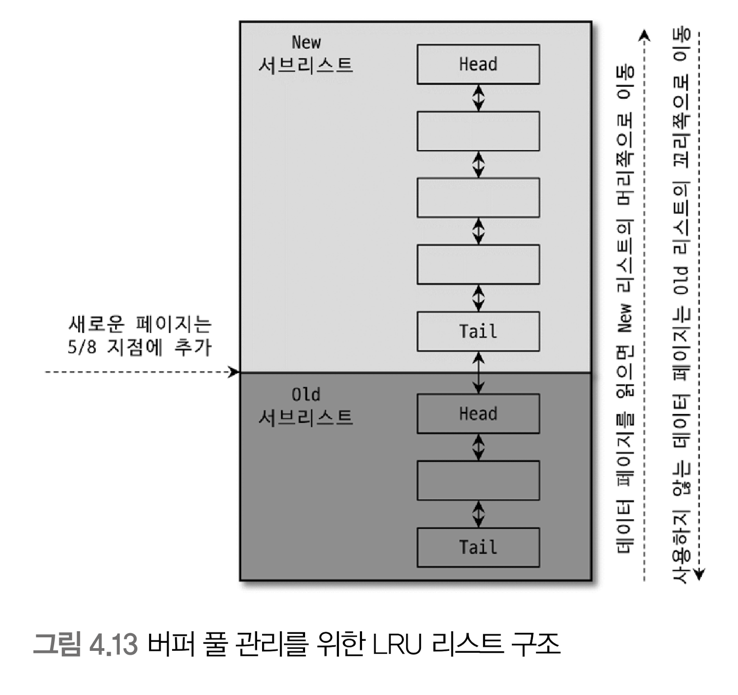
- 주 목적 : 디스크 읽기 최소화
  - 디스크로부터 한 번 읽어온 페이지를 최대한 오랫동안 InnoDB 버퍼 풀에 유지함으로써 달성 
- 데이터를 찾는 과정 
  1. 필요한 레코드가 저장된 데이터 페이지가 버퍼 풀에 있는지 
     1. InnoDB 어댑티브 해시 인덱스를 이용해 페이지 검색 
     2. 해당 테이블의 인덱스(B-Tree)를 이용해 버퍼 풀에서 페이지 검색 
     3. 버퍼 풀에 데이터 페이지가 있었다면 해당 페이지의 포인터를 MRU 헤더 방향으로 승급 
  2. 디스크에서 필요한 데이터 페이지를 버퍼 풀에 적재
  3. 적재된 페이지에 대한 포인터를 LRU 헤더에 추가 
  4. LRU 헤더에 적재된 데이터 페이지가 실제로 읽히면 MRU 헤더 부분으로 이동 
  5. 버퍼 풀에 상주하는 데이터 페이지는 사용자 쿼리가 얼마나 최근에 접근했는지에 따라 Age가 부여됨 
     - 버퍼 풀에 상주하는 동안 쿼리에서 오랫동안 사용되지 않는 경우 -> 부여된 Age가 오래됨 (Aging)
       - 결국 버퍼 풀에서 제거됨 
     - 사용되는 경우 -> Age 초기화 -> MRU 헤더로 이동 
  6. 필요한 데이터가 자주 접근되는 경우, 해당 페이지의 인덱스 키를 어댑티브 해시 인덱스에 추가

### 4.2.7.3 버퍼 풀과 리두 로그 
- 버퍼 풀과 리두 로그는 매우 밀접한 관계를 가짐 
- InnoDB 버퍼 풀은 캐시 뿐만 아니라 쓰기 버퍼링이라는 기능도 제공함
  - 버퍼풀은 클수록 쿼리 성능이 빨라짐 
  - 크기를 늘리는 것은 캐시 기능만 향상시키는 것 
  - 쓰기 버퍼링 기능까지 향상시키려면...

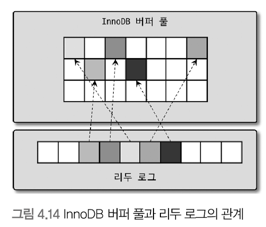
- 버퍼 풀이 가진 것 
  - 읽은 상태에서 변경되지 않은 클린 페이지
  - 변경된 더티 페이지
    - 디스크와 버퍼 풀의 데이터 상태가 다르기 때문에, 언젠가는 디스크로 기록돼야 함 
    - 버퍼 풀에 무한정 머무를 수 없음 
- 리두 로그 
  - 1개 이상의 고정 크기 파일을 연결 
  - 데이터 변경이 계속 발생할 경우, 리두 로그 파일에 기록됐던 정보들(로그 엔트리)은 새로운 로그 엔트리로 덮어 쓰여짐
- InnoDB 스토리지 엔진은 전체 리두 로그 공간중에서, 재사용 가능한 공간과 불가능한 공간을 구분해서 관리해야 함 
  - 재사용 불가능한 공간 = 현재 사용 중인 리두 로그가 위치한 공간 = `활성 리두 로그(Active Redo Log)`
  - 리두 로그 공간은 계속 순환되어 재사용 됨 
    - 리두 로그가 기록될 때마다 **로그 포지션이 계속 증가함**
    - 이를 LSN(Log Sequence Number)이라고 함 
- 체크 포인트
  - 리두 로그와 버퍼 풀의 더티 페이지를 디스크로 동기화하는 이벤트 
  - 가장 최근 체크 포인트 지점의 LSN이 활성 리두 로그 공간의 시작점이 됨
- 체크 포인트 에이지
  - 가장 최근 체크 포인트의 LSN - 마지막 리두 로그 엔트리의 LSN 
  - 활성 리두 로그 공간의 크기를 일컬음 
- InnoDB 버퍼 풀의 더티 페이지는 특정 리두 로그 엔트리와 관계를 가짐 
  - 체크 포인트 발생 -> 체크 포인트의 LSN보다 작은 리두 로그 엔트리와 관련된 더티 페이지들과 리두 로그 엔트리들은 모두 디스크로 동기화

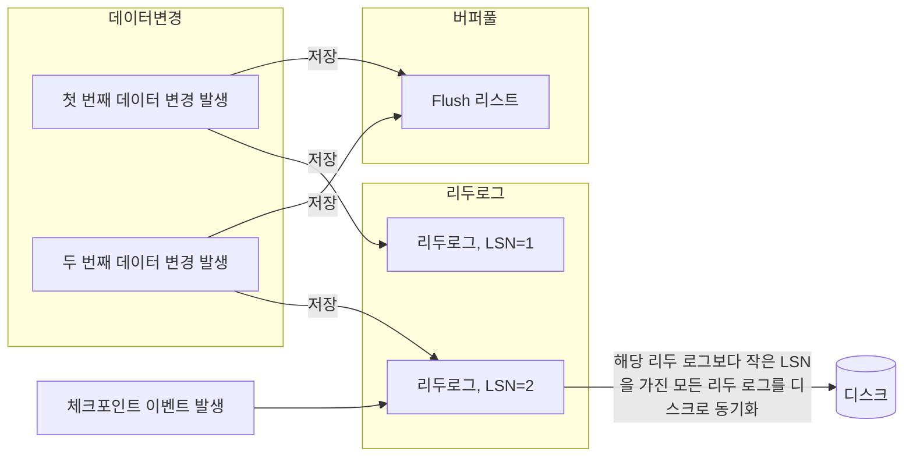

### 4.2.7.4 버퍼 풀 플러시(Buffer Pool Flush)
- 버퍼 풀에서 디스크로 기록되지 않은 더티 페이지들을 성능에 악영향 없이 디스크에 동기화 하기 위해 아래의 기능들을 백그라운드로 실행

#### 4.2.7.4.1 플러시 리스트(Flush_list) 플러시
- 리두 로그 공간 재활용을 위해 오래된 리두 로그 엔트리가 사용하는 공간을 비워야 함 
  - 오래된 리두 로그 공간을 지우기 위해서는, 반드시 버퍼 풀의 더티 페이지가 먼저 디스크로 동기화돼야 함 
- `Flush_list`함수 호출 -> 플러시 리스트에서 오래 전에 변경된 더티 페이지 순서대로 디스크에 동기화 
  - 이는 `Cleaner Thread`가 수행한다 (하나의 클리너 스레드가 하나 이상의 버퍼 풀 인스턴스 처리)
- Adaptive flush
  - 더티 페이지가 어느 정도 속도로 생성되는지 분석 (리두 로그 생성 속도 분석)
  - 적절한 수준의 더티 페이지가 버퍼 풀에 유지될 수 있도록 디스크 쓰기 실행 

#### 4.2.7.4.2 LRU 리스트(LRU_list) 플러시
- LRU 리스트에서 사용 빈도가 낮은 데이터 페이지들을 제거하여 새로운 페이지들을 읽어올 공간을 만들어내는 작업 
  - 이를 위해 `LRU_list`함수를 사용 
- LRU 리스트의 끝 부분부터, 시스템 변수에 설정된 개수만큼의 페이지들을 스캔
  - 더티 페이지는 디스크에 동기화
  - 클린 페이지는 Free 리스트로 페이지를 옮김 

### 4.2.7.5 버퍼 풀 상태 백업 및 복구 
- 워밍업
  - 디스크의 데이터가 버퍼 풀에 적재 돼있는 상태 
  - 잘 워밍업된 상태의 MySQL 서버는 그렇지 않은 경우보다 몇십 배의 처리 속도를 보이는 것이 일반적임 
- MySQL 서버를 셧다운 하기 전에 버퍼 풀의 상태 백업 가능 
  - 서버 재시작 시, 백업된 버퍼 풀의 상태를 다시 복구할 수 있음 

## 4.2.8 Double Write Buffer
- 리두 로그 
  - 페이지의 변경된 내용만 기록 
  - 더티 페이지를 디스크 파일로 플러시할 때 일부만 기록되는 문제(Partial-page or Torn-page)가 발생할 수 있음
- InnoDB는 Double-Write 기법을 이용해 위와 같은 상황을 방지 
  - 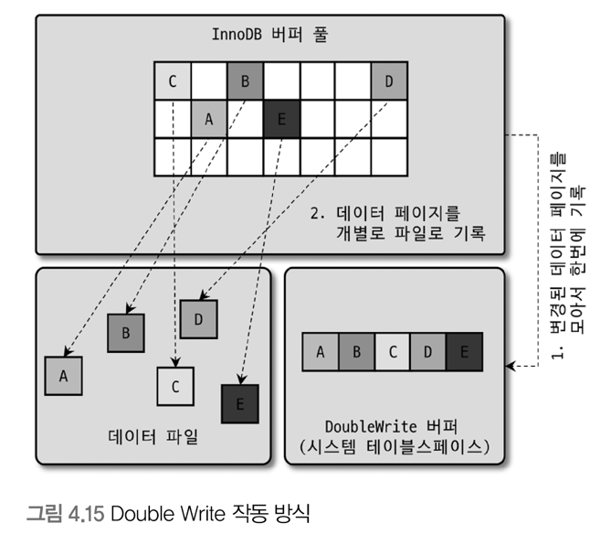
  - 더티 페이지 A~E를 디스크로 플러시한다고 할 때
    - A~E 더티 페이지를 묶어서 시스템 테이블 스페이스의 Double Write 버퍼에 기록 
    - 각 더티 페이지를 데이터 파일의 적당한 위치에 하나씩 랜덤 쓰기 실행 
    - 데이터 파일에 정상적으로 기록된 경우 
      - Double Write 버퍼의 변경 내용은 필요가 없어짐
    - A, B는 정상 등록됐지만 C가 기록되는 도중에 OS가 비정상 종료된 경우  
      - 재시작될 때 DoubleWrite 버퍼의 내용과 데이터 파일의 페이지들을 모두 비교 
      - 다른 내용이 있는 경우 DoubleWrite 버퍼의 내용을 데이터 파일의 페이지로 복사 

## 4.2.9 언두 로그 
- 트랜잭션과 격리 수준을 보장하기 위해 DML로 변경되기 이전 버전의 데이터를 별도로 백업한 백업본
- 어떻게 사용되는가
  - 트랜잭션 보장
    - 트랜잭션 롤백 -> 언두 로그에 백업해둔 이전 버전의 데이터를 이용해서 변경 전으로 복구 
  - 격리 수준 보장 
    - 특정 커넥션에서 데이터 변경 도중에 다른 커넥션에서 데이터를 조회할 경우, 트랜잭션 격리 수준에 맞게 변경중인 레코드를 읽지 않고 언두 로그에 백업해둔 데이터를 읽어서 반환하기도 함 
- 중요한 역할을 담당하고, 관리 비용도 많이 필요 

### 4.2.9.1 언두 로그 레코드 모니터링 
- 언두 로그가 많을수록, 레코드 조회 시 언두 로그의 이력을 필요한만큼 스캔해야 하므로 쿼리 성능이 저하될 수 있다 
- 활성 상태의 트랜잭션이 장시간 유지되지 않도록 주의하자 
  - 언두 로그의 급증 여부 모니터링 필요 

### 4.2.9.2 언두 테이블스페이스 관리 
- 언두 테이블스페이스? 언두 로그가 저장되는 공간
- MySQL 8.0.14 ~
  - 시스템 테이블 스페이스 외부의 별도 로그 파일에 기록되도록 개선됨
- 구성 
  - 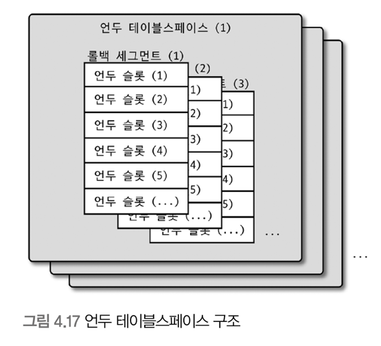
  - 하나의 언두 테이블 스페이스는 1개 이상 128개 이하의 롤백 세그먼트를 가짐 
  - 롤백 세그먼트는 1개 이상의 언두 슬롯을 가짐 
- 롤백 세그먼트 
  - `InnoDB의 페이지 크기 / 16byte` 개수 만큼의 언두 슬롯을 가짐 
    - ex: 페이지 크기 = 16KB -> 16KB / 16byte인 1024개의 언두 슬롯을 갖게 됨 
  - 하나의 트랜잭션이 필요로 하는 언두 슬롯의 개수
    - DML 문장 특성에 따라 최대 4개 까지의 언두 슬롯 사용 
    - 하나의 트랜잭션은 대략 2개 정도의 언두 슬롯을 필요로 함 
- 동시 처리 가능한 트랜잭션의 개수
  - `(InnoDB 페이지 크기) / 16 * (롤백 세그먼트 개수) * (언두 테이블 스페이스 개수)`
  - ex: 기본 설정의 경우 `16 * 1024 / 16 * 128 * 2 / 2`, 즉 `131072`개 정도의 트랜잭션이 동시 처리 가능 
- 언두 로그 공간이 남는 것은 크게 문제 X
  - 언두 로그 공간이 부족한 경우 **트랜잭션을 시작할 수 없는 심각한 문제가 발생**
- Undo tablespace truncate 
  - 자동 모드
    - 트랜잭션이 커밋되는 경우 언두 로그에 복사된 이전 값은 불필요해짐 
    - Purge Thread가 주기적으로 깨어나 불필요해진 언두 로그를 삭제 -> Undo Purge 
    - 사용되지 않는 공간을 OS로 반납 
  - 수동 모드 
    - 언두 테이블 스페이스 비활성화 -> 비활성 상태의 언두 테이블 스페이스를 찾아 OS로 공간 반납 -> 언두 테이블 스페이스 활성화

## 4.2.10 체인지 버퍼 
