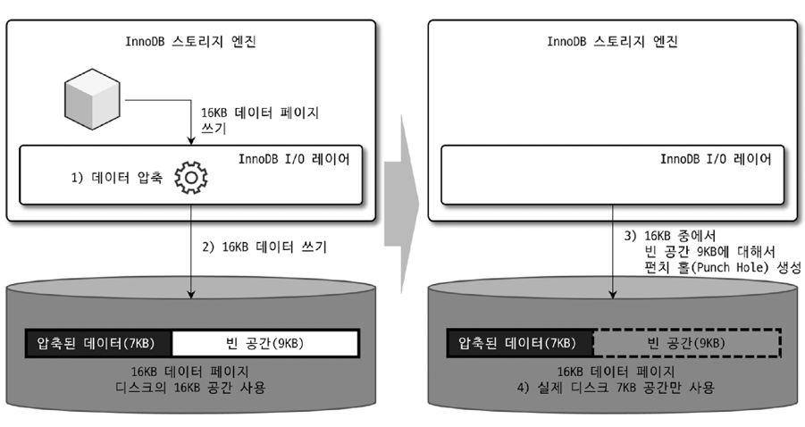
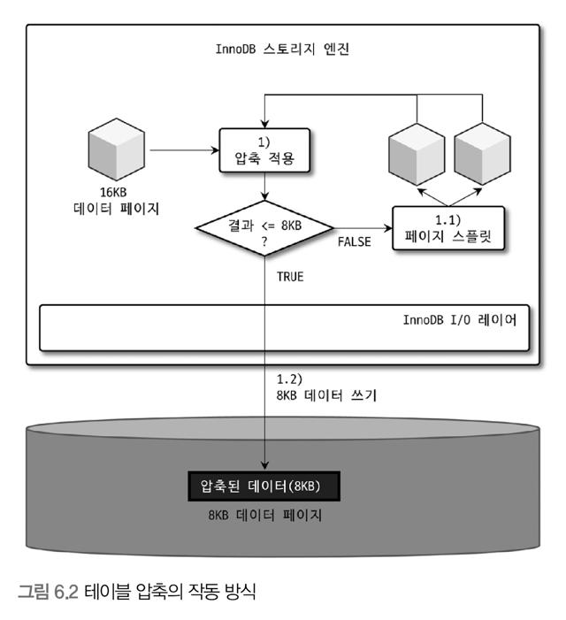

# Introduction
- 디스크의 데이터 파일의 크기 ↑
  - 쿼리 처리를 위해 더 많은 데이터 페이지를 InnoDB 버퍼 풀로 로딩
  - 새로운 페이지가 버퍼 풀로 적재 => 더티 페이지가 더 자주 디스크로 기록 => 디스크 I/O ↑
  - 백업 시간 ↑
  - 복구 시간 ↑
- 이를 해결하기 위해 **데이터 압축 기능**제공
  - MySQL 서버는 테이블 압축과 페이지 압축 두 가지 압축 방식을 제공

# 6.1 페이지 압축
- 디스크에 저장하는 시점에 데이터 페이지를 압축하여 저장
  - 읽어올 때 압축이 해제
- 버퍼 풀에 데이터 페이지 적재 -> InnoDB 스토리지 엔진은 **압축이 해제된 상태로만 데이터 페이지를 관리**
  - MySQL 서버의 내부 코드에서는 압축 여부와 관계 없이 **투명하게 작동한다고 해서 Transparent Page Compression**이라고도 함
- 데이터 페이지는 16KB -> 압축한 결과 용량이 얼마나 될 지 예측 불가
  - 적어도 하나의 테이블은 동일한 크기의 페이지(블록)로 통일되어야 함 (한 테이블 내 페이지 크기는 같아야 된다는 의미)

### 동일한 크기의 페이지를 제공하기 위한 압축 방법

- OS별로 특정 파일 시스템에서만 지원되는 **펀치 홀(Punch hole)** 기능 사용
  - 펀치홀이란?
    - 파일 시스템에서 빈 공간을 표현하는 방법

1. 16KB 페이지를 압축 (결과가 7KB라고 가정)
2. MySQL 서버가 디스크에 압축된 결과인 7KB를 기록
   - `압축된 데이터 7KB`를 기록하고, `빈 공간 9KB`를 기록
3. 7KB 이후 공간인 9KB에 대해 **펀치 홀(Punch hole)** 생성
4. 파일 시스템은 7KB만 남기고, 나머지 9KB는 OS로 반납
5. 실제 디스크는 7KB 공간만 사용하나, 데이터 페이지는 펀치 홀 크기까지 해서 16KB 크기를 유지함

- 문제점
  - 펀치 홀 기능은 OS 뿐만 아니라, 하드웨어 자체에서도 해당 기능을 지원해야만 사용할 수 있음
  - 파일 시스템 관련 유틸리티(명령어)가 펀치 홀을 지원하지 못함
    - MySQL 또한 이러한 명령어들을 사용하기 때문에 문제점에서 자유롭기 어려움
    - ex: `cp`와 같은 파일 복사 명령이 파일을 복사하면, 실제 데이터 파일 크기가 작아도, 펀치 홀이 다시 채워져서 원본 크기가 되어버릴 수도 있음
  - 결국, **페이지 압축 방식은 많이 사용되지 않음**

# 6.2 테이블 압축
- OS나 하드웨어에 대한 제약 없이 사용 가능
- 디스크의 데이터 파일 크기를 줄일 수 있음
- 단점
  - 낮은 버퍼 풀 공간 활용률
  - 낮은 쿼리 성능
  - 빈번한 데이터 변경 시 압축률 저하

## 6.2.1 압축 테이블 생성
- 전제 조건
  - 압축을 사용하려는 테이블이 별도의 테이블 스페이스를 사용해야 함 
  - `innodb_file_per_table`이 `ON`으로 설정된 상태에서 테이블이 생성되어야 함 
  - `ROW_FORMAT=COMPRESSED` 옵션을 명시해야 함
- `KEY_BLOCK_SIZE`
  - 압축된 페이지의 목표 크기 (`2n (2<=n)`)
  - `innodb_page_size`가 16KB라면, 4KB or 8KB만 설정 가능 
- 페이지 크기가 32KB or 64KB인 경우 테이블 압축 적용 불가 

### 압축 적용 방식 

> InnoDB I/O 레이어에서는 아무런 일도 하지 않음 
1. 16KB의 데이터 페이지를 압축 (`KEY_BLOCK_SIZE`가 8KB라고 가정)
   1. `압축된 결과 <= 8KB` → 그대로 디스크에 저장 (압축 완료)
   2. `압축된 결과 > 8KB` → 원본 페이지를 split → 2개의 페이지에 8KB씩 저장
      - Q.압축된 결과가 15KB인 경우 → 8KB, 7KB로 나누어 저장하나? 아님 7.5KB, 7.5KB로 나누어 저장하나? 
2. 나뉜 페이지 각각에 대해 1번 과정을 반복 실행 

### 특징 
- 테이블 압축은 압축 실패율이 꽤 높다
  - InnoDB 버퍼 풀에서 디스크로 기록하기 전에 압축하는 과정에 꽤 오랜 시간이 소요될 것이다 
  - 성능에 민감한 서비스일 경우, 테이블 압축은 적용하지 않는 것이 좋다고 판단할 수 있다 
- 압축 실패율이 높다고 해서 압축을 사용하지 말아야 한다는 것을 의미하지는 않는다
- 빈번하게 조회되거나 변경되는 경우
  - 압축을 고려하지 않는 것이 좋음
  - 압축은 예상 외로 많은 CPU 자원을 소모함 
- 조회나 변경이 적으면 압축을 고려해도 좋음 

## 6.2.3 압축된 페이지의 버퍼 풀 적재 및 사용 
- 압축된 테이블의 데이터 페이지를 버퍼 풀에 적재 → 압축된 상태와 압축이 해제된 상태 2개 버전을 관리 
  - 디스크에서 읽은 상태 그대로의 데이터 페이지 목록을 관리하는 LRU 리스트 
  - 압축 해제 버전인 Unzip_LRU 리스트 
- LRU 리스트에는 압축된 테이블과 압축되지 않은 테이블이 공존 
  - 압축이 적용되지 않은 테이블의 데이터 페이지 
  - 압축이 적용된 테이블의 압축된 데이터 페이지 
- Unzip_LRU 리스트는 압축이 적용되지 않은 테이블의 데이터 페이지는 가지지 않음 
  - 압축이 적용된 테이블에서 읽은 데이터 페이지만 관리 
  - 압축을 해제한 상태의 데이터 페이지가 관리됨

- 문제점 
  - 결국, 압축된 테이블에 대해서는 **버퍼 풀의 공간을 이중으로 사용함으로써 메모리를 낭비하는 효과를 가짐**
  - 압축된 페이지에서 데이터를 읽거나 변경하기 위해서는 압축을 해제해야 함 
    - CPU를 상대적으로 많이 소모하는 작업 

- 위 두 가지 문제점을 해결하기 위해 Unzip_LRU 리스트를 별도로 관리하는 것 
  - InnoDB 버퍼 풀 공간이 필요한 경우 → LRU 리스트에서 원본 데이터 페이지 유지, Unzip_LRU 리스트에서 압축 해제된 데이터 페이지 제거 → 버퍼 풀 공간 확보 
  - 압축된 데이터 페이지가 자주 사용되는 경우 → Unzip_LRU 리스트에 압축 해제된 페이지를 유지 → 압축 및 압축 해제 작업 최소화 
  - 압축된 데이터 페이지가 사용되지 않아서 LRU 리스트에서 제거되는 경우 → Unzip_LRU 리스트에서도 함께 제거 

### Adaptive 알고리즘 
- 압축 해제된 버전의 데이터 페이지를 적절한 수준으로 유지하기 위한 알고리즘 
- CPU 사용량이 높은 서버 
  - 압축과 압축 해제를 피하기 위해 Unzip_LRU 비율을 높여서 유지 
- Disk I/O 사용량이 높은 서버 
  - Unzip_LRU 리스트의 비율을 낮춰서 InnoDB 버퍼 풀 공간을 더 확보 

## 6.2.4 테이블 압축 관련 설정 
- 도서 참고... 
