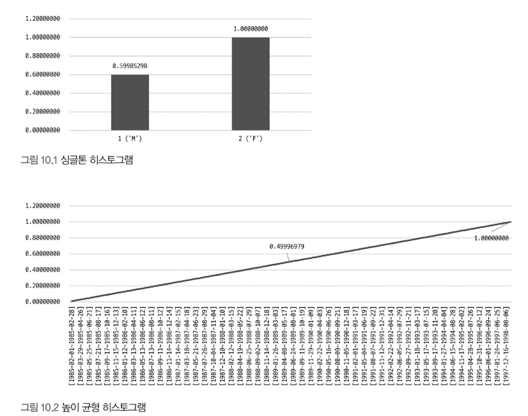

# 10.1 통계 정보 
## 10.1.1 테이블 및 인덱스 통계 정보 
- 비용 기반 최적화에서 가장 중요한 것은 통계 정보 

### 10.1.1.1 MySQL 서버의 통계 정보 
- InnoDB 스토리지 엔진을 사용하는 테이블에 대한 통계 정보를 영구적으로 관리할 수 있도록 테이블의 형태로 저장함 
  - 의도하지 않은 통계 정보 변경을 막을 수 있음 
  - 통계 정보 자동 갱신 (`innodb_stats_auto_recalc`)을 `OFF`로 변경하면 자동 갱신을 막을 수 있음 → 영구적인 통계 정보를 이용하고자 할 때 사용 
- 정확한 통계 정보를 수집하는 것이 쿼리 성능에 도움이될 수 있음
  - 서버 점검, 사용량이 많지 않은 시간을 이용해 정확한 정보를 수집 

## 10.1.2 히스토그램 
- 컬럼의 데이터 분포도를 참조할 수 있는 정보 

### 10.1.2.1 히스토그램 정보 수집 및 삭제 
- 히스토그램 정보는 컬럼 단위로 관리됨 
- `ANALYZE TABLE` 명령을 통해 수동으로 수집 및 관리 
  - 시스템 딕셔너리에 함께 저장 
  - MySQL 서버가 시작될 때 딕셔너리의 히스토그램 정보를 `information_schema` 스키마의 `column_statistics` 테이블에 로딩
- 히스토그램은 Bucket 단위로 구분되어 관리됨
- 2 종류의 히스토그램 타입
  - 
  - `Singleton`
    - 컬럼 값 개별로 레코드 건수 관리 
      - 컬럼 값 별로 버킷 할당 
      - 버킷 구성: 컬럼 값 + 발생 빈도 비율 
    - 누적 값이 표현됨 
      - 그림 상에서 `M` = 0.5998 , `F` = 1 - 0.5998
    - value-based 히스토그램 or 도수 분포도 
  - `Equi-Height`
    - 컬럼 값의 범위를 균등한 개수로 구분해서 관리
      - 개수가 균등한 컬럼값의 범위 별로 하나의 버킷 할당
      - 버킷 구성: 범위 시작 값 + 마지막 값 + 발생 빈도 비율 + 버킷에 포함된 유니크한 값의 개수
    - 컬럼 값의 각 범위에 대해 레코드 건수 비율이 누적으로 표시됨 
      - 그림 상에서 기울기가 일정한것을 보면 각 범위가 비슷한 값의 레코드 건수를 가진다는 것을 알 수 있음 
    - Height-Balanced 히스토그램 

### 10.1.2.2 히스토그램의 용도 
- 실제 응용 프로그램 데이터는 항상 균등한 분포도를 가지지 않음 
- 히스토그램을 이용해 데이터 분포도를 파악하고, 이를 이용해 쿼리 실행 계획을 수립할 수 있음
  - 버킷 별 레코드 건수, 유니크한 값의 개수 정보 등을 가지기 때문에 더 정확한 예측이 가능 
- 히스토그램 정보가 없으면, 옵티마이저는 데이터가 균등하게 분포돼 있을 것으로 예측함
- 히스토그램이 있으면, 특정 범위의 데이터가 많고 적음을 식별할 수 있음 
  - 어느 테이블을 먼저 읽어야 조인의 횟수를 줄일 수 있을지 더 정확히 판단 가능 

### 10.1.2.3 히스토그램과 인덱스 
- 인덱스 다이브
  - 사용 가능한 인덱스들로 부터 조건절에 일치하는 레코드 건수를 대략 파악하기 위해 실제 인덱스의 B-Tree를 샘플링해서 살펴보는 것 
- 인덱스된 컬럼에 대해 히스토그램 정보를 수집 해두는 것이 좋을까?
  - 인덱스된 컬럼을 검색 조건으로 사용하는 경우, 해당 컬럼의 히스토그램은 사용하지 않고 실제 인덱스 다이브를 통해 수집한 정보를 활용함 
  - 이는 실제 검색 조건의 대상 값에 대한 샘플링을 실행하는 것 → 항상 히스토그램보다 정확한 결과를 기대할 수 있음 
  - 따라서, 히스토그램은 주로 **인덱스되지 않은 컬럼에 대한 데이터 분포도를 참조하는 용도**로 사용함 
- 인덱스 다이브는 어느 정도의 비용이 필요함 
  - `IN` 절에 값이 많이 명시된 경우, 실행 계획 수립만으로도 상당한 인덱스 다이브를 실행함 (비용 증가)

## 10.1.3 코스트 모델
- 코스트 모델
  - 쿼리 처리 비용을 계산하는 데 필요한 단위 작업들의 비용 
- 쿼리 처리에 필요한 작업들 
  - 디스크로부터 페이지 읽기
  - InnoDB 버퍼 풀로부터 데이터 페이지 읽기
  - 인덱스 키 비교 
  - 레코드 평가 
  - 메모리 임시 테이블 작업 
  - 디스크 임시 테이블 작업 
- 위 작업들이 얼마나 필요한지 예측 → 전체 작업 비용 계산 → 최적의 실행 계획

### MySQL 8.0 서버의 코스트 모델 
- `server_cost`: 인덱스를 찾고, 레코드를 비교하고, 임시 테이블 처리에 대한 비용을 관리 
- `engine_cost`: 레코드를 가진 데이터 페이지를 가져오는 데 필요한 비용을 관리

### 코스트 모델에서 중요한 것 
- 각 단위 작업에 설정되는 비용 값이 커지면 어떤 실행 계획들이 고비용으로 바뀌고, 어떤 실행 계획들이 저비용으로 바뀌는지를 파악해야 함

### 각 단위 작업 비용이 변경되면 예상할 수 있는 결과 
- `key_compare_cost`↑
  - 가능하면 정렬을 수행하지 않는 방향의 실행 계획을 선택할 가능성 ↑
- `row_evaluate_cost`↑
  - 풀 스캔을 사용하는 쿼리들의 비용 ↑ 
  - 인덱스 레인지 스캔을 사용하는 실행 계획을 선택할 가능성 ↑
- `disk_temptable_create_cost`↑
  - 디스크에 임시 테이블을 만들지 않는 방향의 실행 계획을 선택할 가능성 ↑
- `memory_temptable_create_cost`↑
  - 메모리에 임시 테이블을 만들지 않는 방향의 실행 계획을 선택할 가능성 ↑
- `io_block_read_cost`↑
  - InnoDB 버퍼 풀에 데이터 페이지가 많이 적재돼 있는 인덱스를 사용하는 실행 계획을 선택할 가능성 ↑
- `memory_block_read_cost`
  - 버퍼 풀에 적재된 데이터 페이지가 상대적으로 적다고 하더라도 그 인덱스를 사용할 가능성 ↑

---

---

# 10.2 실행 계획 확인 
- `DESC`, `EXPLAIN` 명령으로 확인 

## 10.2.1 실행 계획 출력 포맷 
- 테이블 포맷
- 트리 포맷 
- JSON 포맷 

## 10.2.2 쿼리 실행 시간 
- `EXPLAIN ANALYZE` 명령으로 확인 가능
  - 기본이 Tree 포맷
- 실행 계획의 단계별로 소요된 시간 정보를 확인할 수 있음
- 읽는 방법 
  - 들여쓰기가 같은 레벨에서는 상단에 위치한 라인이 먼저 실행
  - 들여쓰기가 다른 레벨에서는 가장 안쪽에 위치한 라인이 먼저 실행
  - ex
    - 

---

---

# 10.3 실행 계획 분석 
- 실행 계획에서는 아래 사항이 중요하다  
  - 어떤 접근 방법을 사용하여 어떤 최적화를 수행하는가 
  - 어떤 인덱스를 사용하는가 

## 10.3.1 id 
- `select` 쿼리별로 부여되는 식별자 값 
  - 단위 쿼리마다 `id` 값 부여 
    - 단위 쿼리
      - `select` 키워드 단위로 구분한 것 
- `join`
  - 조인되는 테이블 개수만큼 실행 계획 레코드가 출력됨
  - 같은 `id`값이 부여됨 
- 여러 개의 `select` 쿼리로 구성된 쿼리
  - 각각 다른 `id`값이 부여됨 
- `id`값이 테이블 접근 순서를 의미하지는 않음 

## 10.3.2 select_type
- 각 단위 `select` 쿼리가 어떤 타입인지 표시 

### simple
- union, 서브쿼리를 사용하지 않는 단순한 select 쿼리 
- 쿼리 문장이 아무리 복잡해도 실행 계획에서 simple인 단위 쿼리는 단 하나만 존재 

### primary
- union, 서브 쿼리가 있는 select 쿼리의 실행 계획에서 가장 바깥쪽에 있는 단위 쿼리는 primary로 표시됨 
- 쿼리 문장이 아무리 복잡해도 실행 계획에서 primary인 단위 쿼리는 단 하나만 존재

### union
- union으로 결합하는 단위 select 쿼리 중, 첫 번째를 제외한 두 번째 이후 단위 select 쿼리의 select type은 union으로 표시 
  - union의 첫 번째 단위 select는 derived로 표시 (임시 테이블)\
  
### dependent union
- union, union all 로 집합을 결합하는 쿼리에서 표시됨 
- dependent는 결합된 단위 쿼리가 외부 쿼리에 의해 영향을 받는 것을 의미 
  - 내부 쿼리가 외부의 값을 참조해서 처리될 때 표시됨 

### union result
- union 결과를 담아두는 임시 테이블을 의미 
  - union all은 임시 테이블을 사용하지 않으나, union, union distinct는 여전히 임시 테이블에 결과를 버퍼링함

### subquery
- `from`절 이외에서 사용되는 서브쿼리만을 의미 
  - `from`절의 서브쿼리는 `derived`로 표기 

> 서브 쿼리 사용 위치에 따른 이름
> - Nested Query: select되는 컬럼에 사용된 서브 쿼리 
> - Subquery: where 절에 사용된 서브 쿼리 
> - Derived Table: from 절에 사용된 서브 쿼리 (인라인 뷰, 서브 셀렉트)
> 
> 반환하는 값의 특성에 따른 구분
> - Scalar Subquery: 단일 값을 반환하는 서브 쿼리 (컬럼이 단 1개인 레코드 1건)
> - Row Subquery: 여러 개의 컬럼 값을 반환하는 서브 쿼리 (컬럼의 개수와 관계 없이 1개의 레코드)

### dependent subquery
- 서브쿼리가 바깥쪽 select 쿼리에서 정의된 컬럼을 사용하는 경우 
  - 즉, 안쪽의 서브쿼리 결과가 바깥쪽 select 쿼리의 컬럼에 의존적인 경우를 의미 
- 외부 쿼리가 먼저 수행된 후 내부 쿼리가 실행되어야 함 

### derived
- 단위 select 쿼리의 실행 결과로 메모리나 디스크에 임시 테이블을 생성함
- 실행 계획을 join으로 해결할 수 있게 쿼리를 바꿔주는 것이 좋음 
- 쿼리 튜닝 시 `derived`가 있는지를 먼저 확인한다 
  - 서브쿼리를 조인으로 해결할 수 있다면 조인을 사용할 것을 강력히 권장한다 

### dependent derived
- `from`절의 서브쿼리가 외부 컬럼을 참조하는 경우 (lateral join)

### uncacheable subquery
- 서브쿼리에 포함된 요소에 의해 캐시 자체가 불가능한 경우
  - 서브쿼리 결과 캐시  
    - 똑같은 서브쿼리가 여러번 실행될 때는 다시 실행하지 않고 이전의 실행 결과를 그대로 사용할 수 있는 기능
    - 쿼리 캐시와 derived와는 무관 

- 캐시를 사용하지 못하게 하는 요소 
  - 사용자 변수가 서브쿼리에 사용된 경우
  - not-deterministic 속성의 스토어드 루틴이 서브쿼리 내에 사용된 경우 
  - uuid(), rand()와 같이 호출할 때마다 결괏값이 달라지는 함수가 서브쿼리에 사용된 경우

### materialized
- from절이나 in(subquery) 형태의 쿼리에 사용된 서브 쿼리의 최적화를 위해 사용 
- 서브쿼리 내용을 임시 테이블로 구체화(materialize) 하여 사용 
  - 쿼리의 내용을 임시 테이블로 생성함 

## 10.3.3 table
