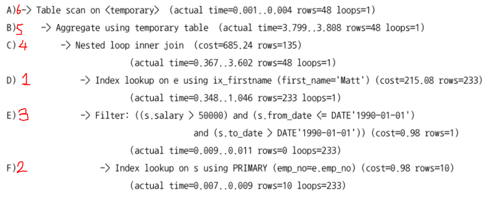

# 10장 실행계획
- MySQL의 옵티마이저는 사용자의 쿼리가 최적으로 실행될 수 있게 도와주는 역할을 한다.
- 하지만 항상 좋은 실행계획만을 만들어 낼 수 없고, 이러한 부분들을 사용자가 보완할 수 있게 EXPLAIN 명령으로 확인할 수 있게 해준다.
- 그러기 위해서는 MySQL 서버가 데이터를 어떻게 처리하는지 흐름을 파악해야한다.

## 10.1 통계 정보
- MySQL 서버는 5.7 까지는 테이블과 인덱스에 대해 개괄적 정보로 실행 계획을 수립했고, 8.0 버전부터는 인덱스 되지 않은 컬럼에 대한 데이터도 관리하는 히스토그램이 도입되었다.

### 10.1.1 테이블 및 인덱스 통계 정보
- 비용 기반의 최적화에서 가장 중요한 것은 **통계 정보**
  - 통계 정보가 정확하지 않다면 엉뚱한 방향으로 쿼리가 실행 될 수 있다.

#### 10.1.1.1 MySQL 서버의 통계 정보
- MySQL 5.6 부터 InnoDB 스토리지 엔진을 사용하는 테이블에 대해 영구적인 통계 정보 관리를 제공한다.
  - 이 전 까지는 각 테이블의 통계 정보가 메모리에만 관리되어 서버가 재시작되면 통계 정보가 사라졌다.
- 각 테이블의 통계 정보는 MySQL 데이터 베이스의 `innodb_index_stats`, `innodb_table_stats` 테이블로 관리할 수 있다.
- 테이블 별로는 테이블을 생성할 때 `STATS_PERSISTENT` 옵션 설정으로 통계정보를 영구적으로 보관할 지 결정할 수 있다.
  - STATS_PERSISTENT=0 : 영구적인 관리가 아닌 메모리 형태로 관리
  - STATS_PERSISTENT=1 : 통계정보를 테이블을 통해 영구적으로 관리한다.
  - STATS_PERSISTENT=DEFAULT : 옵션 설정을 하지 않은 것과 동일, 시스템 변수 값으로 결정한다.
  - 테이블의 통계 정보 저장 설정을 생성 후 변경하려면 `ALTER TABLE` 명령어를 사용하면 된다.
- 통계 정보의 각 칼럼은 아래의 값을 저장하고 있다.
  - innodb_index_stats.stat_name='n_diff_pfx%': 인덱스가 가진 유니크한 값의 개수
  - innodb_index_stats.stat_name='n_leaf_pages': 인덱스의 리프 노드 페이지 개수
  - innodb_index_stats.stat_name='size': 인덱스 트리의 전체 페이지 개수
  - innodb_index_stats.stat_name=n_rows: 테이블의 전체 레코드 건수
  - innodb_index_stats.stat_name=clustered_index_size: 프라이머리 키 크기(InnoDB 페이지 개수)
  - innodb_index_stats.stat_name=sum_of_other_index_sizes: 프라이머리 키 제외 인덱스의 크기(InnoDB 페이지 개수)
- 기존의 MySQL 서버는 재시작 되면 통계 정보가 초기화 되었고, 사용자가 알지 못하는 순간에 이벤트가 발생되면 통계 정보가 갱신되며 실행 계획 또한 변경되었다.
  - 테이블 새로 오픈
  - 테이블의 레코드 대량 변경(전체의 1/16 정도가 변경, 추가, 제거
  - ANALYZE TABLE 명령 실행(통계 자료 수집 및 DB 객체에 대한 유효성 검사)
  - SHOW TABLE STATUS / SHOW INDEX FROM 명령 실행
  - InnoDB 모니터 활성화
  - innodb_stats_on_metadata 시스템 설정 ON 상태에서 TABLE STATUS 명령어 실행


- innodb_stats_auto_recalc: 통계 정보 갱신 옵션
  - 1 : 과거의 방식대로 통계 정보를 자동 수집
  - 0 : 테이블의 통계 정보는 `ANALYZE TABLE` 실행시에만 수집
  - DEFAULT : innodb_stats_auto_recalc 변수 값으로 결정
- 테이블 통계 정보 수집 시 샘플링할 테이블 블록 결정 옵션 `innodb_stats_sample_pages` 이 있었는데 MySQL 5.6 버전부터는 `innodb_stats_transient_sample_pages`와 `innodb_stats_persistent_sample_pages` 로 분리되었다.
  - innodb_stats_transient_sample_pages : 기본값 8로 자동으로 통계 정보가 수집될 때 설정 값 만큼의 페이지만 임의로 샘플링해 분석하고 결과를 통계 정보로 활용한다.
  - innodb_stats_persistent_sample_pages : 기본값 20으로 ANALYZE TABLE 명령 실행시 임의로 설정 값 만큼의 페이지를 샘플링해 분석하고 결과를 통계 정보로 활용한다.
- innodb_stats_persistent_sample_pages 변수를 이용하면 통계 정보 수집의 정확도를 높일 수 있다.
  - 정확성이 높아질수록 통계정보 수집에 많은 시간이 소요되지만 이 정보를 바탕으로 실행 계획이 수집되기 때문에 가치가 있다.


### 10.1.2 히스토그램
- 히스토그램: 인덱스가 아닌 컬럼의 데이터 분포도를 참조할 수 있는 정보
  - 5.7 버전 까지는 단순히 인덱스된 칼럼의 유니크한 값의 개수를 가지고 인덱스 페이지의 일부를 가져와 참고하는 방식을 사용
  - 8.0 버전부터는 히스토그램을 사용할 수 있게 되었다.

#### 10.1.2.1 히스토그램 정보 수집 및 삭제
- 8.0 버전에서의 히스토그램 정보는 칼럼 단위로 관리되며 수동으로 수집 및 관리된다.
- 수집된 정보는 시스템 딕셔너리에 저장되고, MySQL 서버 시작 시 딕셔너리의 정보를 불러와 히스토그램 정보를 information_schema 데이터 베이스의 column_statistics 테이블로 로드한다.
- 히스토그램은 버킷(Bucket) 단위로 구분 되어 레코드 건수나 칼럼값의 범위가 관리된다.
  - 싱글톤 히스토그램은 칼럼이 가지는 값 별로 버킷이 할당되며 각 버킷이 칼럼의 값, 발생 빈도의 비율 2가지의 값을 가진다.
  - 높이 균형 히스토그램은 개수가 균등한 칼럼값의 범위별로 하나의 버킷이 할당되며 각 버킷의 시작 값, 마지막 값, 발생 빈도율, 각 버킷에 포함된 유니크한 값의 개수 등의 4개의 값을 가진다.


#### 싱글톤 히스토그램
- 칼럼 값 개별로 레코드 건수를 관리, Value_Based 히스토그램 또는 도수 분포라고 부른다.
- 코드 값과 같이 유니크한 값이 상대적으로 적은 경우 사용된다.
- gender 컬럼의 값이 'M'인 레코드의 비율은 0.5998 정도, 'F'인 레코드의 비율은 1로 표시되는데 히스토그램의 모든 레코드 건수 비율은 누적으로 표시되기 때문에 'F'인 레코드의 비율은 `1-0.5998`이 된다.


#### 높이 균형 히스토그램
- 칼럼값의 범위를 균등한 개수로 구분해 관리, Height-Balanced 히스토그램이라고도 불린다.
- 칼럼값의 각 범위에 대해 건수 비율이 누적되어 표시된다.
- 범위별로 비율이 같은 수준에서 해당 칼럼의 범위가 선택된 것으로 기울기가 일정할 수록 각 범위가 비슷한 레코드 건수를 가진다는 의미가 된다.


- information_schema.colum_statistics 테이블의 HISTOGRAM 컬럼 필드
  - sampling-rate: 히스토그램 정보 수집을 위해 스캔한 페이지의 비율을 저장
  - 페이지의 샘플링 비율이 높을수록 정확하지만 부하와 시스템 자원 소모량이 높다.
    - histogram_generation_max_mem_size(20MB) 변수에 따라 적절히 샘플링
- histogram-type: 히스토그램의 종류 저장
- number-of-buckets-specified: 히스토그램 생성 시 설정한 버킷의 개수 저장
  - 버킷 개수 미설정시 기본 값 100 사용
  - 최대 1024개로 설정이 가능하지만 100이면 충분하다.
> 8.0.19 미만 버전까지는 히스토그램 생성시 풀스캔을 통해 데이터 페이지를 샘플링 해서 생성했고, 8.0.19 부터 innoDB 스토리지 엔진 자체적으로 샘플링 알고리즘을 구현해 풀스캔이 불필요해졌다.


- 히스토그램은 `ANALYZE TABLE employees.employess DROP HISTOGRAM ON gender, hire_date;` 형태로 제거가 가능하다.
  - 딕셔너리의 내용만 삭제해 다른 쿼리 처리 성능에 영향을 주지 않지만 쿼리의 실행계획이 달라질 수 있어 주의가 필요하다.
- `SET GLOBAL optimizer_switch='condition_fanout_filter=off';`
  - 해당 시스템 변수의 값을 글로벌로 변경하면 서버의 모든 쿼리가 히스토그램을 미사용한다.
    - 단, condition_fanout_filter 옵션에 영향받는 다른 기능이 사용되지 않을 수 있다.
- `SET SESSION optimizer_switch='condition_fanout_filter=off';`
  - 현재 커넥션에서 실행되는 쿼리만 히스토그램 미사용 설정
- `SELECT /*+SET_VAR(optimizer_switch='condition_fanout_filter=off') */ * FROM ...`
  - 현재 쿼리만 히스토그램을 사용하지 않게 설정

#### 10.1.2.2 히스토그램의 용도
- 응용 프로그램의 데이터는 항상 균등한 분포도를 가질 수 없는데 이 단점을 보완하기 위해 히스토그램이 도입되었다.
- 히스토그램이 특정 칼럼이 가지는 모든 값에 대한 분포도를 가지지는 않지만 범위(버킷) 별로 레코드 건수, 유니크 값의 수를 가지기 때문에 보다 정확한 예측이 가능하다.
- 옵티마이저가 히스토그램 정보 유무에 따라 특정 범위 내 데이터의 양을 예측해 실행계획을 생성하기 때문에 쿼리 성능에 영향을 미친다.


#### 10.1.2.3 히스토그램과 인덱스
- 옵티마이저는 실제 인덱스의 B-Tree를 샘플링해서 살펴보며 조건절에 일치하는 레코드 건수를 예측하는데 이 작업을 `인덱스 다이브(Index Dive)` 라고 한다.
- MySQL 서버는 검색 조건으로 인덱스 컬럼을 사용하는 경우 그 컬럼의 히스토그램 정보가 아닌 인덱스 다이브를 통해 수집한 정보를 활용한다.
  - 실제 검색 조건의 대상 값에 대한 샘플링을 실행하기 때문에 히스토그램보다 정확한 결과를 기대할 수 있다.
- 인덱스 다이브 작업은 어느 정도의 비용이 필요해 실행계획 수립 만으로 비용이 히스토그램보다 커질 수 있다.


### 10.1.3 코스트 모델(Cost Model)
- MySQL 서버는 쿼리에 대해 아래의 작업이 얼마나 필요하고, 작업 비용을 계산해 최적의 실행계획을 찾는다.
  - 디스크로부터 페이지 읽기
  - 메모리(InnoDB 버퍼 풀)로 부터 데이터 페이지 읽기
  - 인덱스 키 비교
  - 레코드 평가
  - 메모리 임시 테이블 작업
  - 디스크 임시 테이블 작업
- 쿼리 비용을 계산하는데 필요한 단위 작업의 비용을 `코스트 모델`이라고 한다.
- 비용은 하드웨어에 따라 달라질 수 있기 때문에 MySQL 5.7 부터 작업의 비용을 관리자가 조정할 수 있게 되었고, 8.0 부터는 히스토그램과 각 인덱스별 적재 페이지의 비율이 관리되어 실행계획에 적용되었다.


- 코스트 모델은 2개의 테이블에 저장된 설정값을 사용
  - server_cost: 인덱스 찾기, 레코드 비교, 임시 테이블 처리에 대한 비용 관리
    - cost_name:row_evaluate_cost
      - 스토리지 엔진이 반환한 레코드가 쿼리 조건에 일치하는지 확인
      - 값이 증가할수록 많은 레코드 처리 비용이 오르고, 적은 레코드 처리 비용이 낮아진다.
    - cost_name:key_compare_cost
      - 값의 비교 작업에 필요한 비용
      - 값이 증가할수록 키 값 비교 처리가 많은 쿼리의 비용이 높아진다.
  - engine_cost: 레코드를 가진 데이터 페이지를 가져오는데 필요한 비용 관리

- 코스트 모델에서 각 단위 작업의 비용이 변경되면 예상할 수 있는 결과
  - key_compare_cost: 비용을 높이면 정렬을 수행하지 않는 방향의 실행 계획 선택 가능성↑
  - row_evaluate_cost: 비용을 높이면 풀 스캔 실행 쿼리 비용↑, 인덱스 레인지 스캔 사용 선택 가능성↑
  - dist_temptable_create_cost, dist_temptable_row_cost: 비용을 높이면 디스크에 임시 테이블을 만들지 않을 가능성↑
  - io_block_read_cost: 비용을 높이면 InnoDB 버퍼풀에 데이터가 많이 적재된 인덱스를 사용할 가능성↑
  - memory_block_read_cost: 비용을 높이면 적재된 데이터 페이지가 작아도 그 인덱스를 사용할 가능성↑


## 10.2 실행 계획 확인
- MySQL 서버의 실행 계획은 DESC 또는 EXPLAIN 명령으로 확인 가능

### 10.2.1 실행 계획 출력 포맷
- FORMAT 옵션: 실행 계획 표시 방법을 JSON, TREE, 단순 테이블 형태로 제공

### 10.2.2 쿼리의 실행 시간 확인
- EXPLAIN ANALYZE 기능: 쿼리 실행 계획과 단계별 소요 시간 정보를 확인
  - 기존 SHOW PROFILE 은 단계별 소요 시간 정보를 보여주지는 않음
  - TREE 포맷으로만 보여져 FORMAT 옵션 적용 불가능
- 실제 실행 순서를 읽는 방법
  - 들여쓰기가 같은 레벨에서는 상단 라인 먼저 실행
  - 들여쓰기가 다른 레벨에서는 가장 안쪽에 위치한 라인 먼저 실행



- 명령의 결과 필드의 의미
  - actual time: 실제 소요된 시간
    - 첫 번째 값 - 첫 번째 레코드를 가져오는데 걸린 평균 시간/ 두 번째 값 - 마지막 레코드를 가져오는데 걸린 평균 시간
  - rows: 처리한 레코드 건수
  - loops: 반복 횟수

## 10.3 실행 계획 분석
- 실행 계획이 어떤 접근 방법으로 어떤 최적화를 수행하는지, 어떤 인덱스를 사용하는지 이해하는게 더 중요
- 출력된 실행 계획에서 위쪽일수록 쿼리의 바깥 부분이거나 먼저 접근한 테이블이고, 아래쪽에 출력된 결과일수록 쿼리의 안쪽 부분 또는 나중에 접근한 테이블에 해당한다.

### 10.3.1 id 컬럼
- 단위 SELECT 쿼리 별 식별자 값
  - select 키워드 단위로 구분한 것을 `단위(select) 쿼리`라고 표현
- 조인되는 테이블의 수만큼 계획 레코드 출력 같은 레벨의 쿼리문은 동일한 id 값을 가진다.
  - 테이블의 접근 순서를 의미하지는 않는다.

### 10.3.2 select_type 칼럼
- 어떤 타임의 쿼리인지 표시
- 10.3.2.1 SIMPLE
  - 단순히 조인 정도만 가진 SELECT 쿼리
- 10.3.2.2 PRIMARY
  - UNION, 서브쿼리를 가진 쿼리 실행 계획에서 가장 바깥쪽에 있는 단위 쿼리
- 10.3.2.3 UNION
  - PRIMARY 를 제외한 두 번째 이후 단위 쿼리
  - UNION 의 첫번째 단위쿼리는 UNION 이 아닌 결과를 임시 저장하는 임시 테이블(DERIVEN)
- 10.3.2.4 DEPENDENT UNION
  - UNION, UNION ALL 로 집합을 결정하는 쿼리에 표시
  - 외부 쿼리에 의해 영향을 받는다는 것을 의미
  - EX) 아래 쿼리에서 e1을 먼저 읽고 서브쿼리가 진행되어 e1.emp_no가 e2, e3 의 emp_no가 같다는 조건이 자동으로 추가되어 실행된다.
    - 이런 경우 DEPENDENT 로 표시된다.
    ```SQL
      EXPLAIN
      SELECT *
      FROM employees e1 WHERE e1.emp_no IN (
        SELECT e2.emp_no FROM employees e2 WHERE e2.first_name='Matt'
        UNION
        SELECT e3.emp_no FROM employees e3 WHERE e3.last_name='Matt');
      ```
- 10.3.2.5 UNION RESULT
  - UNION 결과를 담아두는 테이블을 의미
  - `<union1,2>` 형태로 표시 되는데 id값 1과 2인 단위 쿼리의 조회 결과를 UNION 했음을 의미
- 10.3.2.6 SUBQUERY
  - FROM 절 이외에서 사용된 서브쿼리를 의미
    - FROM 절에서 사용된 서브쿼린느 DERIVED 로 표시
- 10.3.2.7 DEPENDENT SUBQUERY
  - 서브쿼리가 바깥쪽 단위 쿼리에서 정의된 칼럼 사용하는 경우 표시
  - DEPENDENT UNION 같이 외부 쿼리 먼저 수행 후 내부 쿼리 실행
    - 일반 서브쿼리보다 처리속도가 느릴때가 많다
- 10.3.2.8 DERIVED
  - SELECT 쿼리의 실행 결과로 메모리나 디스크에 임시 테이블을 생성한것을 의미
  > 쿼리 튜닝 목적으로 실행계획 확인 시 select_type 이 DERIVED 인 것이 있는지 확인해야한다. 서브쿼리를 조인으로 해결할 수 있다면 조인으로 해결하는게 좋다.
- 10.3.2.9 DEPENDENT DERIVED
  - FROM 절의 서브쿼리에서 외부 칼럼 참조시 표시
    - 레터럴 조인: 외부 칼럼 참조 기능으로 LATERAL 키워드를 사용해야함
- 10.3.2.10 UNCACHEABLE SUBQUERY
  - 캐시를 사용할 수 없는 서브 쿼리를 의미
    - 사용자 변수가 서브쿼리에 사용된 경우
    - NOT-DETERMINISTIC 속성의 스토어드 루틴이 서브쿼리 내 사용된 경우
    - UUID()나 RAND()와 같은 결과값이 호출때마다 달라지는 함수가 사용된 경우
- 10.3.2.11 UNCACHEABLEN UNION
  - UNION과 UNCACHEABLE 이 혼합된 select_type
- 10.3.2.12 MATERIALIZED
  - FROM 절이나 IN(subquery) 형태 쿼리에 사용된 서브쿼리 최적화를 위해 사용
  - 서브쿼리의 내용을 임의로 구체화해 바깥 쿼리로 조인하는 형태로 최적화 되는 형태


### 10.3.3 table 칼럼
- 실행 계획은 테이블 기준으로 표시되며 별칭이 있으면 별칭으로 표시, 테이블이 없으면 NULl 표시
- `<>`로 둘러쌓인 이름은 임시 테이블을 의미

| Id | select_type | table       |
|----|-------------|-------------|
| 1  | PRIMARY     | <derived 2> |
| 1  | PRIMARY     | e           |
| 2  | DERIVED     | dept_emp    |
1. 첫번째 라인보다 값이 2인 라인이 먼저 실행 후 결과가 파생 테이블로 준비된다.
2. 세번째 라인의 select_type 이 DERIVED 이기 때문에 dept_emp 테이블을 읽어 파생 테이블을 생성한다.
3. 다시 처음으로 돌아가서
4. id가 1인 라인 두개 중 더 위의 라인인 <derived 2>가 드라이빙 테이블이 되고 e 테이블이 드리븐 테이블이 된다. 즉, <derived 2> 를 먼저 읽어 e 테이블로 조인을 실행했다.
```SQL
-- 실제 쿼리
  SELECT *
  FROM
    (SELECT de.emp_no FROM dept_emp de GROUP BY de.emp_no) tb,
    employees e
  WHERE e.emp_no=tb.emp_no;
```


### 10.3.4 partitions 컬럼
- 파티션이 여러개인 테이블에 대해 필요한 테이블만 골라내는 과정을 `파티션 프루닝(Partition pruning)` 라고 한다.
- partitions 컬럼은 어느 파티션을 읽는지 표시한다.
> 대부분의 RDBMS의 파티션은 물리적으로 개별 테이블처럼 별도의 저장공간을 가진다.

### 10.3.5 type 컬럼
- 각 테이블의 레코드를 어떤 방식으로 읽었는지 표시
  - 인덱스를 통해 읽거나 풀 테이블 스캔으로 읽었는지를 표시
- type 컬럼으로 인덱스가 효율적으로 사용되는지 알 수 있다.
- system/const/eq_ref/ref_fulltext/ref_or_null/unique_subquery/index_subquery/range/index_merge/index/ALL
  - 주로 12개의 방법을 사용하며 ALL 을 제외한 나머지는 모두 인덱스를 이용한 접근 방법이다.
  - ALL 은 인덱스 사용 없이 풀 테이블 스캔 접근 방법을 의미

#### 10.3.5.1 system
- 레코드가 1건만 존재하는 테이블, 테이블을 참조하지 않는 접근 방법을 의미
- MyISAM, MEMORY 테이블에서만 사용
  - innoDB 에서는 ALL 로 표시된다.

#### 10.3.5.2 const : `=`/`<=>`
- 조인 순서와 관계 없이 프라이머리 키/유니크 키 의 모든 칼럼에 대해 동등 조건 검색으로 반드시 1건만 반환
- 다른 DBMS 에서는 유니크 인덱스 스캔이라고도 표현
- 인덱스 일부 칼럼 / 프라이머리 키의 일부만 조회할 경우 사용 불가능
  - 데이터를 읽지 않고는 레코드가 1건이라고 확신할 수 없기 때문에 ref 로 표현됨

#### 10.3.5.3 eq_ref : `=`/`<=>`
- 여러 테이블이 조인되는 쿼리의 실행 계획에서 표시
- 조인에서 첫 번째 읽은 테이블의 컬럼 값을 이용해 두 번째 테이블을 프라이머리 키/유니크 키 로 동등 조건 검색
- 반드시 1건만 반환

#### 10.3.5.4 ref : `=`/`<=>`
- eq_ref 와 다르게 조인의 순서와 관계 없이 사용
- 인덱스의 종류와 관계 없이 동등(Equal) 조건으로 검색할 때 사용
- 레코드가 1건 이상일 수 있어 eq_ref 보다 느리지만 동등 조건으로 비교되어 빠르다.

#### 10.3.5.5 fulltext
- 서버의 전문 검색(Full-text Search) 인덱스를 이용해 읽는 방법

#### 10.3.5.6 ref_or_null
- ref 와 동일한 접근 방법에 NULL 비교가 추가 된 형태

#### 10.3.5.7 unique_subquery
- WHERE 조건에서의 IN 형태의 쿼리를 위한 접근 방법
- 서브쿼리에서 중복되지 않는 유니크한 값만 반환할 때 사용

#### 10.3.5.8 index_subquery
- unique_subquery 과 다르게 중복된 값이 반환될 때 인덱스를 이용해 제거해 접근하는 방법

#### 10.3.5.9 range
- 인덱스 레인지 스캔 형태의 접근 방법
- `<, >, IS NULL, BETWEEN, IN, LIKE` 등의 연산자를 이용해 검색할 때 사용
- 많이 사용하지만 접근 순서상 우선순위가 낮음


> 인덱스를 효율적으로 사용한다/작업 범위 결정 조건으로 인덱스를 사용한다 라는 표현은 const, ref, range 접근 방식을 사용할 때 얘기한다.

#### 10.3.5.10 index_merge
- 2개 이상의 인덱스를 이용해 각 결과 생성 후 결과를 병합해 처리하는 방식
- 특징
  - 여러 인덱스를 읽어야해 range 방식 보다 효율성↓
  - 전문 검색 인덱스 사용시 적용X
  - 결과가 항상 2개 이상의 집합이 되기 때문에 부가적인 작업 필요
- 생각보다 효율적으로 작동하지 않는다.

#### 10.3.5.11 index
- 인덱스 풀 스캔을 의미
- 인덱스 데이터가 전체 데이터보다 작아 풀 테이블 스캔보다는 빠르며 아래의 1,2 조건 또는 1,3 조건을 충족해야한다.
  1. range 나 const, ref 같은 접근 방법으로 인덱스 사용 불가능
  2. 인덱스에 포함된 컬럼만으로 처리 가능(데이터 파일 읽을 필요X)
  3. 인덱스를 이용해 정렬이라 그루핑 가능(별도의 정렬 작업 필요X)
- 레코드 건수가 적을 때 실행 속도가 빠르며 많아질수록 처리 속도가 느려진다.

#### 10.3.5.12 ALL
- 풀 테이블 스캔으로 테이블 전체를 읽고 불필요한 레코드 제거 후 반환
- 리드 어헤드 라는 대량의 디스크 I/O를 유발하는 작업을 위해 ALL 방식을 사용하기도 한다.


### possible_keys 칼럼
- 최적의 실행 계획을 위해 선정했던 접근 방법에 사용된 인덱스 목록

### 10.3.7 key 칼럼
- 최종 선택된 실행 계획에서 사용하는 인덱스
- 쿼리 튜닝 시 key 칼럼에 의도한 인덱스가 표시되었는지 확인하는게 중요
- PRIMARY 는 프라이머리 키 사용을 의미, 그 외에는 테이블/인덱스 생성시 부여한 고유 이름

### 10.3.8 key_len 칼럼
- 다중 칼럼으로 구성된 인덱스 중 몇 개의 칼럼까지 사용했는지 알려준다.
- 더 정확하게는 인덱스의 각 레코드에서 몇 바이트까지 사용했는지 알려준다.

### 10.3.9 ref 칼럼
- 접근방법이 ref 일 때 참조 조건(Equal 비교 조건)으로 제공된 값을 의미
- 상수 값은 const, 다른 테이블의 칼럼은 해당 테이블과 칼럼명이 표시
- 칼럼값이아닌 func 인 경우 참조 값이 변환이나 값 자체 연산을 의미한다.
  - 조인 컬럼은 타입이 일치하는게 좋다

### 10.3.10 rows 칼럼
- 실행 계획 효율성 판단을 위해 예측한 레코드 건수를 표시
- 반환하는 레코드의 수가 아닌 몇개의 레코드를 읽고 체크해야하는지를 나타내 결과 값의 레코드 건수는 일치하지 않을 수 있다.

### 10.3.11 filtered 칼럼
- 필터링되고 남은 레코드의 비율을 의미
- 얼마나 정확하냐에 따라 조인의 성능이 달라진다.

### 10.3.12 Extra 칼럼
- 내부적인 처리 알고리즘에 대한 내용을 표시
- 10.3.12.1 const row not found
  - const 접근 방법으로 읽었지만 실제 레코드가 존재하지 않으면 표시
- 10.3.12.2 Deleting all rows
  - 스토리지 엔진의 핸들러 차원에서 테이블의 모든 레코드 삭제 기능을 제공하는 테이블을 표시
- 10.3.12.3 Distinct
  - 쿼리의 DISTINCT 처리를 위해 조인이 필요하지 않은 항목을 무시했음을 의미
- 10.3.12.4 FirstMatch
  - 세미 조인의 최적화 중 FirstMatch 전략이 사용되면 실행계획에 표시된다.
  - FirstMatch(table) 의 테이블은 기준 테이블을 의미
- 10.3.12.5 Full scan on Null key
  - NULL 을 '알 수 없는 값' 으로 정의했을 때 `col1 IN (SELECT col2 FROM...)` 의 쿼리의 연산 조건
    - 서브쿼리가 1개 이상의 레코드를 가진다면 비교 결과는 NULL
    - 서브쿼리의 결과 레코드가 없다면 비교 결과는 FALSE
  - 위의 과정에서 col1이 NULL 이면 풀 테이블 스캔을 해야 결과를 알 수 있는데 이러한 과정을 의미한다.
  - 풀 테이블 스캔이 필요하지 않다면 조건에 `col1 IS NOT NULL` 형태로 지정한다.
- 10.3.12.6 Impossible HAVING
  - 쿼리에 사용된 HAVING 절의 조건을 만족하는 레코드가 없을 때 표시
  - 쿼리가 올바르지 않을 수 있어서 쿼리 내용을 다시 점검하는게 좋다.
- 10.3.12.7 Impossible WHERE
  - Impossible HAVING 과 비슷하며 조건이 항상 FALSE 가 되는 경우 표시
- 10.3.12.8 LooseScan
  - 세미 조인 최적화 중 LooseScan 최적화 전략이 사용됐을 때 표시
- 10.3.12.9 No matching min/max row
  - MIN(), MAX() 와 같은 집합 함수가 있는 쿼리의 조건절에 일치되는 레코드가 없을 때 표시
- 10.3.12.10 no matching row in const table
  - 조인에 사용된 테이블에서 const 방법으로 접근해 일치하는 레코드가 없을 때 표시
- 10.3.12.11 No matching rows after partition pruning
  - 파티션된 테이블에 대해 UPDATE, DELETE 할 대상 레코드가 없을 때 표시
- 10.3.12.12 No tables used
  - FROM 절이 없거나 FROM DUAL 의 경우 표시
- 10.3.12.13 Not exists
  - 아우터 조인을 이용해 안티-조인을 수행하는 쿼리에 표시
- 10.3.12.14 Plan isn't ready yet
  - EXPLAIN FOR CONNECTION 명령 실행 시 해당 커넥션에서 쿼리의 실행 계획을 수립하지 못했을 때 표시
- 10.3.12.15 Range checked for each record(index map: N)
  - 레코드마다 인덱스 레인지 스캔을 체크하는 경우 표시
  - `(index map: 0x1)`: 사용할지 말지 판단하는 후보 인덱스의 순번을 의미
- 10.3.12.16 Recursive
  - CTE를 이용한 재귀 쿼리 사용시 표시
- 10.3.12.17 Rematerialize
  - 래터럴로 조인된 테이블이 선행 테이블의 레코드 별로 서브쿼리 실행 후 임시 테이블에 저장할 때 표시
- 10.3.12.18 Select tables optimized away
  - MIN(), MAX() 만 SELECT에 사용되거나 GROUP BY 로 MIN(), MAX() 가 사용되어 인텍스를 1건만 읽는 형태의 최적화 적용시 표시
- 10.3.12.19 Start temporary, End temporary
  - 세미 조인 최적화 중 Duplicate Weed-out 최적화 전략이 사용되었을 때 표시
  - Duplicate Weed-out 최적화에 사용되는 첫번째 테이블을 Start temporary 로 표시, 마지막 부분에 End temporary 를 표시
- 10.3.12.20 unique row not found
  - 테이블 두개가 각각 유니크 칼럼으로 아우터 조인 실행시 아우터 테이블에 레코드가 존재하지 않을 때 표시
- 10.3.12.21 Using filesort
  - ORDER BY 처리가 인덱스를 사용하지 못할 때 표시
  - 레코드를 정렬용 메모리 버퍼에 복사해 소트 알고리즘을 이용해 정렬을 수행했음을 의미
  - 많은 부하를 일으킨다는 의미로 튜닝하거나 인덱스를 생성하는게 좋다.
- 10.3.12.22 Using index(커버링 인덱스)
  - 데이터 파일 없이 인덱스만 읽어 쿼리를 처리할 수 있을 때 표시
  - 인덱스만 읽어 쿼리를 처리하기 때문에 속도가 빠르지만 무조건 커버링 인덱스로 처리하기 위해 인덱스에 많은 컬럼을 추가하는것은 좋지 않다.
- 10.3.12.23 Using index condition
  - 인덱스 컨디션 푸시 다운 최적화를 사용할 때 표시
- 10.3.12.24 Using index for group by
  - 인덱스를 이용해 Group by 처리가 가능한 경우 표시
  - `타이트 인덱스 스캔(인덱스 스캔)을 통한 GROUP BY 처리`
    - 인덱스를 이용해 group by 를 처리하지만 조회하려는 값이 모든 인덱스를 다 읽어야하는 경우
  - `루스 인덱스 스캔을 통한 GROUP BY 처리`
    - 단일 컬럼으로 구성된 인덱스에서 그루핑 컬럼 말고 조회하지 않는 쿼리에서 사용 가능
- 10.3.12.25 Using index for skip scan
  - 인덱스 스킵 스캔 최적화 사용시 표시
- 10.3.12.26 Using join buffer(Block Nested Loop), Using join buffer(Batched Key Access), Using join buffer(hash join)
  - 쿼리가 조인을 수행하기 위해 조인 버퍼를 활용했을 때 표시
  - `()` 의 내용은 어떤 조인 알고리즘으로 처리했는지를 의미한다.
- 10.3.12.27 Using MRR
  - MRR 최적화 적용시 표시
    - 스토리지 엔진 레벨에서는 쿼리 실행의 전체적인 부분을 알지 못해 최적화에 한계가 존재
    - 레코드가 동일 페이지에 있더라도 레코드 단위의 API 호출이 필요한 단점을 보완하기 위해 MRR 이라는 최적화가 도입되었다.
- 10.3.12.28 Using sort_union(...), Using union(...), Using intersect(...)
  - index_merge 접근 방법으로 실행될 때 표시
    - intersect : 인덱스를 사용할 수 있는 조건이 AND 로 연결되어 처리 결과의 교집합을 추출했다는 의미
    - union: 인덱스를 사용할 수 있는 조건이 OR로 연결되어 합집합으로 추출된 경우
    - sort_union: 프라이머리 키만 먼저 읽어 정렬해 병합 후 레코드를 읽어서 반환한 경우
  - union / sort_union 차이: 레코드 건수에 관계 없이 where 조건에 비교 조건이 모두 동등하면 union 사용, 아니면 sort_union 사용
- 10.3.12.29 Using temporary
  - 임시 테이블을 사용한 경우 표시
- 10.3.12.30 Using where
  - MySQL 엔진 레이어에서 별도의 가공을 통해 필터링 작업을 처리한 경우 표시
  - 처음 결과로 100개를 넘겨줬지만 조건에 대한 필터링으로 63개의 레코드가 버려졌을 때 표시한다.
  - `filtered` 칼럼을 통해 필터링이 얼마나 적용되었는지 파악할 수 있다.
- 10.3.12.31 Zero limit
  - 실제 테이블의 레코드를 읽지 않고 결과값의 메타 정보만 반환하는 경우 표시
