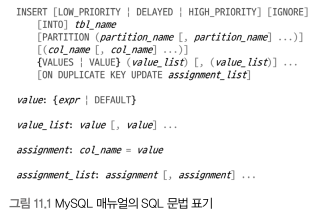
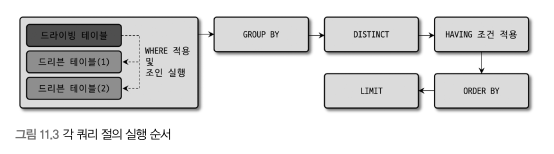
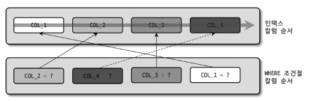
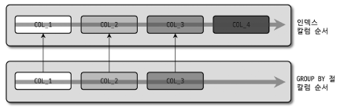
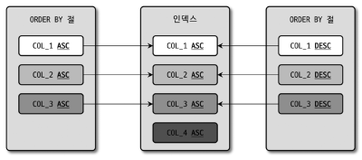
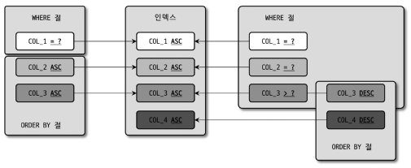

# 11 쿼리 작성 및 최적화
- DDL: 데이터베이스나 테이블의 구조 변경을 위한 문장
- DML: 테이블의 데이터를 조작(읽고, 쓰기) 위한 문장
- SQL은 어떤 데이터를 요청할지에 대한 언어이기 때문에 쿼리가 어떻게 요청을 처리하는지 예측할 수 있어야한다.


## 11.1 쿼리 작성과 연관된 시스템 변수
### 11.1.1 SQL 모드
- sql_mode 시스템 설정에는 여러 값을 동시에 설정 가능
  - `,` 를 이용해 키워드 동시 설정 가능
- sql_mode 설정 값은 문장 작성 규칙, 내부에서 자동 실행되는 데이터 타입 변환 및 기본값 제어 등과 관련된 옵션을 가짐
- 테이블 생성 후 데이터 저장을 시작했다면 해당 설정은 바꾸지 않는게 좋음
  - 변경해야할 경우 영향을 미치는지 확인 후 변경하는게 좋음
- 기본 설정 되어있는 옵션
  - ONLY_FULL_GROUP_BY
    - GROUP BY 절에 포함되지 않아도 SELECT 절이나 HAVING 절에 사용 가능 
  - STRICT_TRANS_TABLES
    - INSERT/UPDATE 시 자동으로 타입 변경
  - NO_ZERO_IN_DATE / NO_ZERO_DATE
    - DATE/DATETIME 타입 컬럼에 잘못된 날짜 저장 불가능
  - ERROR_FOR_DIVISION_BY_ZERO
    - 0으로 나누기 할 때의 처리에 영향을 끼침
    - 8.0 부터는 미사용
  - NO_ENGINE_SUBSTITUTION
    - CREATE TABLE/ALTER TABLE 같은 명령문을 비활성화 하거나 컴파일 되지 않은 스토리지 엔진 지정 시 기본 스토리지 엔진으로 자동 대체할지를 제어
    - 기본적으로 활성화 되어 원하는 엔진을 사용할 수 없을 때 ERROR 가 발생하며 생성/수정 이 되지 않음

### 11.1.2 영문 대소문자 구분
- 윈도우에 설치된 MySQL 에서는 대소문자 구분X
- 유닉스 계열의 운영체제에서는 대소문자 구분O
- OS 변경에 대한 영향을 없애려면 설정 파일에 `lower_case_table_names` 시스템 변수 설정
  - 0: 대소문자 구분 / 1: 소문자 / 2: 저장은 대소문자 구분, 쿼리는 대소문자 구분X
- 가능하다면 초반에 통일해서 진행하는게 좋음

### 11.1.3 MySQL 예약어
- 예약어의 경우 역따옴표나 쌍따옴표로 감싸야 문제가 없음
- 예약어 확인은 감싸지 않고 테이블에 생성 시 에러가 발생함

## 11.2 메뉴얼의 SQL 문법 표기를 읽는 방법
- 상세 문법 확인은 MySQL 메뉴얼의 SQL 문법을 참조

- 이탤릭체: 사용자가 선택해 작성하는 토큰
- 대괄호: 키워드나 표현식이 선택 사항
- 파이프: 앞과 뒤 키워드/표현식 중 하나만 선택해서 사용
- 중괄호: 괄호 내 아이템 중 반드시 하나를 사용해야함
- "...": 키워드/표현식의 조합이 반복될 수 있음

## 11.3 MySQL 연산자와 내장 함수
- SQL의 가독성을 높이기 위해 ANSI 표준 형태의 연산자 사용을 권장

### 11.3.1 리터럴 표기법 문자열
`문자열`
- 문자열은 `'` 를 사용해 표시
- 연속되는 홑따옴표는 두번 연속해서 입력
- SQL 표준 표기법 사용을 강제하려면 `sql_mode` 시스템 변수 값에 `ANSI`설정
  - 이 내용도 초기에 적용하는게 좋음

`숫자`
- 숫자는 그냥 숫자값만 입력
- 문자열, 숫자 타입 비교 시 자동으로 타입 변환
  - 숫자 타입 우선으로 문자열을 숫자로 변환 후 비교
  - 컬럼이 문자열, 조건이 상수인 경우 컬럼 내 문자열이 포함되어있으면 쿼리 실패로 이어짐

`날짜`
- 정해진 형태의 날짜 포맷으로 표기하면 MySQL 서버가 자동으로 DATE/DATETIME 으로 변환
- 포맷이 다르다면 `STR_TO_DATE()` 사용

`불리언`
- BOOLE/BOOLEAN 은 TINYINT 에 대한 동의어
- 숫자타입처럼 사용할 수 있지만 true/false 조회 시 0/1 제외 숫자는 조회 안됨
- 불리언 타입 사용시 ENUM 타입으로 관리하는게 명확함

### 11.3.2 MySQL 연산자
`동등(Equal) 비교(=, <=>)`
- `=`: 동등 비교
- `<=>`: `=` 과 같지만 NULL 을 하나의 값으로 인식해 비교

`부정(Not-Equal) 비교(<>, !=)`
- `<>`, `!=` 혼용 사용시 가독성이 떨어져서 통일하는게 좋음

`NOT 연산자(!)`
- 연산 결과를 반대로 만드는 연산자

`AND(&&), OR(||) 연산자`
- AND 는 &&으로, OR은 ||로 사용이 가능하지만 가독성을 위해 AND, OR 만 사용하는게 좋음
- 처리 우선 순위는 AND 먼저 처리

`나누기(/, DIV), 나머지(%, MOD) 연산자`

`REGEXP 연산자`
- 문자열이 어떤 패턴을 만족하는지 확인
- REGEXP 조건 비교는 인덱스 레인지 스캔 사용 불가능, 가능하다면 조회 범위를 줄일 수 있는 조건과 함게 사용하길 권장

`LIKE 연산자`
- 인덱스를 이용한 처리 가능
- 와일드 카드 문자
  - `%`: 0 또는 1개 이상의 모든 문자에 일치(내용과 관계 없이)
  - `_`: 정확히 1개의 문자에 일치(내용과 관계 없이)
- 와일드카드 문자가 검색어 앞에 사용시 인덱스 레인지 스캔 사용 불가능

`BETWEEN 연산자`
- 범위 비교
- BETWEEN 과 IN의 차이
  - BETWEEN: 크다 작다를 하나로 묶은 느낌
  - IN: 동등 비교 여러개를 묶은 느낌
  - 여러 컬럼으로 만들어진 인덱스의 앞쪽 칼럼의 선택도가 떨어질 때 IN으로 변경 시 쿼리의 성능을 개선할 수 있음
  - 8.0 부터는 `IN (subquery)` 형태로 작성 시 세미 조인 최적화를 이용해 더 빠른 쿼리로 변환해 실행함

`IN 연산자`
- 여러 값에 대해 동등 비교 연산 수행
- NOT IN 의 경우 부정형 비교여서 인덱스를 이용해 처리 범위를 줄이는 조건으로 사용 불가능

### 11.3.3. MySQL 내장함수
- 함수의 이름, 사용법은 표준이 없어서 DBMS 별로 거의 호환되지 않음

`NULL 값 비교 대체(IFNULL, ISNULL)`
- `IFNULL(A, B)`: A가 NULL 인 경우 B로 대체
- `ISNULL(A)`: A가 NULL 이면 TRUE, NULL 이 아니면 FALSE 반환

`현재 시각 조회(NOW, SYSDATE)`
- `NOW`: 하나의 SQL 에서 동일한 값을 가짐
- `SYSDATE`: 호출 시점에 따라 다른 값을 가짐
  - 레플리카 서버에서 안정적으로 복제되지 못함
  - 비교되는 칼럼은 인덱스 효율적 사용 불가능
- SYSDATE() 사용은 지양
  - 이미 사용중인 경우 설정 파일에 sysdate-is-now 변수를 넣어 활성화하는게 좋음

`날짜와 시간의 포맷(DATE_FORMAT, STR_TO_DATE)`
- 날짜는 포맷 설정 지정자는 대소문자 구분

`날짜/시간 연산(DATE_ADD, DATE_SUB)`
- (A, B)
  - A는 연산 수행할 기준일
  - B는 더하거나 빼고자하는 월의 수나 일자

`타임스탬프 연산(UNIX_TIMESTAMP, FROM_UNIXTIME)`
- UNIX_TIMESTAMP: '1970-01-01 00:00:00' 부터 경과된 초의 수 반환
- FROM_UNIXTIME: 인자로 전달한 타임스탬프 값을 DATETIME으로 변환

`문자열 처리(RPAD, LPAD / RTRIM, LTRIM, TRIM)`
- RPAD/LPAD: 문자열 좌측/우측 에 문자를 덧붙여 지정된 길이의 문자열로 변경
- RTRIM/LTRIM: 문자열 좌측/우측 에 연속된 공백 문자를 제거
- TRIM: 문자열의 양쪽에 공백 문자를 제거

`문자열 결합(CONCAT)`
- 여러개 문자열을 하나의 문자열로 반환
- 숫자값 입력 시 자동으로 문자열 변환되지만 CAST() 사용이 안정적

`GROUP BY 문자열 결합(GROUP_CONCAT)`
- 값들을 먼저 정렬 후 연결
- 분자 설정 가능, 중복 제거 후 연결 가능, 정렬 순서 지정 가능
- 제한적 메모리 버퍼 공간 사용으로 지정된 크기 초과시 쿼리에서 경고 메시지 발생
  - JDBC 에서 실행시에는 에러로 취급

`값의 비교와 대체(CASE WHEN ... THEN ... END)`
- 프로그래밍의 SWITCH 구문과 같은 역할
- WHEN 의 조건과 일치할 경우 THEN 으로 진행
- CASE 로 시작해 END 로 종료해야함

`타입의 변환(CAST, CONVERT)`
- 명시적 타입 변환 필요시 사용
- CAST(): 하나의 인자를 두개로 나눠 타입 변환할 값, 변환하고자 하는 데이터 타입 명시
- CONVERT(): 타입 변환 용도, 문자열의 집합 변환 용도로 사용 가능

`이진값과 16진수 문자열(Hex String) 변환(HEX, UNHEX)`

`암호화 및 해시 함수(MD5, SHA, SHA2)`
- 다이제스트(MD5), SHA-1(SHA), SHA 보다 큰 비트의 SHA2 를 이용해 문자열을 암호화
- 문자열 길이를 줄이는 용도로도 사용가능

 `처리대기(SLEEP)`
 
`벤치마크(BENCHMARK)`
- 간단한 함수의 성능 테스트용
- (A, B): A는 반복해서 수행할 횟수, B는 반복할 표현식

`IP 주소 변환(INET_ATON, INET_NTOA)`
- IPv4 주소를 문자열이 아닌 부호 없는 정수 타입에 저장 가능
- INET_ATON(): 문자열 구성된 IPv4를 정수형으로 변환
- INET_NTOA(): 정수형 주소를 문자열로 변환

`JSON 포맷(JSON_PRETTY)`

`JSON 필드 크기(JSON_STORAGE_SIZE)`
- JSON 데이터의 크기를 바이트단위로 알려줌

`JSON 필드 추출(JSON_EXTRACT)`
- JSON 도큐먼트에서 특정 필드 값을 가져옴

`JSON 오브젝트 포함 여부 확인(JSON_CONTAINS)`
- 도큐먼트나 지정된 경로에 JSON 필드를 가지고 있는지 확인

`JSON 오브젝트 생성(JSON_OBJECT)`

`JSON 칼럼으로 집계(JSON_OBJECTAGG & JSON_ARRAYAGG)`
- 칼럼 값을 모아 JSON 배열/도큐먼트 생성

`JSON 데이터 테이블 변환(JSON_TABLE)`

## 11.4 SELECT
- SELECT 는 여러 개의 테이블로부터 데이터를 조합해 빠르게 가져와야해서 어떻게 읽을지 많은 주의가 필요

### 11.4.1 SELECT 절의 처리 순서

- 예외적으로 GROUP BY 절 없이 ORDER BY만 사용된 쿼리에서는 ORDER BY가 조인보다 먼저 실행될 수 있음
- 실행 순서를 바꾸려면 서브쿼리로 작성된 인라인 뷰를 사용
  - 인라인뷰는 임시 테이블이 사용되어 주의 필요
- WITH절(CTE): 항상 제일 먼저 실행되어 임시 테이블로 저장

### 11.4.2 WHERE 절과 GROUP BY 절, ORDER BY 절의 인덱스 사용
`인덱스 사용을 위한 기본 규칙`
- 인덱스 칼럼 변형 비교시 인덱스를 사용할 수 없음
- WHERE 절에서 사용되는 비교 조건의 데이터 타입이 일치해야함

`WHERE 절의 인덱스 사용`
- 작업 범위 결정 조건
  - 동등 비교 조건/IN 구성 조건 에 사용된 칼럼이 인덱스 칼럼 구성과 좌측부터 비교했을 때 얼마나 일치하느냐
  - WHERE 조건에서의 인덱스에 컬럼의 순서는 중요하지 않고 조건이 있는지 없는지가 중요


`GROUP BY 절의 인덱스 사용`
- GROUP BY 절에 명시된 컬럼 순서가 인덱스 순서와 동일
- 인덱스 구성 칼럼 중 뒤쪽에 있는 칼럼이 명시되지 않을땐 사용 O
- 인덱스 앞쪽의 칼럼이 GROUP BY 절에 명시 되지 않으면 사용 X
- WHERE 와 다르게 GROUP BY 절에 명시된 컬럼이 인덱스에 없다면 인덱스 사용 X


`ORDER BY 절의 인덱스 사용`
- GROUP BY 와 거의 흡사
- 정렬되는 각 컬럼의 오름차순 및 내림차순이 인덱스와 같거나 정반대의 경우에만 사용 O
- 

`WHERE 조건과 ORDER BY(GROUP BY) 절의 인덱스 사용`
- WHERE, ORDER BY(GROUP BY) 동시 사용시 하나의 방법으로만 인덱스 사용
  - WHERE 절, ORDER BY 절 동시에 같은 인덱스 사용
    - 가장 좋은 성능을 보이기 때문에 이 방식을 사용하는게 제일 좋음
  - WHERE 절만 인덱스 사용 
    - 인덱스를 통해 검색된 결과를 별도의 처리과정을 통해 정렬 수행
    - WHERE 조건에 일치하는 인덱스가 많을 때 사용
  - ORDER BY 절만 인덱스 사용
    - ORDER BY 의 순서대로 인덱스를 읽으면서 한건씩 WHERE 조건에 일치하는지 비교, 불일치시 버리는 형태
    - 아주 많은 레코드 조회 후 정렬할때 이 방식으로 튜닝하기도 함
    

- WHERE 절에서 동등 비교 조건으로 비교된 칼럼과 ORDER BY 절에 명시된 칼럼이 순서대로 빠짐 없이 인덱스의 칼럼 순서와 일치해야함
- 중간에 칼럼이 중첩된다면 문제가 되지 않음

`GROUP BY 절과 ORDER BY 절의 인덱스 사용`
- GROUP BY 절과 ORDER BY 절에 명시된 칼럼의 순서와 내용이 모두 동일해야함
- 둘 중 하나라도 맞지 않으면 쿼리 자체가 인덱스를 이용하지 못함

`WHERE 조건과 ORDER BY, GROUP BY 절의 인덱스 사용`
- 3개의 절이 모두 포함된 쿼리가 인덱스를 사용하는지 판단하는 방법
  1. WHERE 절이 인덱스를 사용할 수 있는가?
  2. GROUP BY 절이 인덱스를 사용할 수 있는가?
  3. ORDER BY 절/GROUP BY 절이 동시에 인덱스를 사용할 수 있는가?


### 11.4.3 WHERE 절의 비교 조건 사용시 주의 사항
`NULL 비교`
- MySQL 에서는 NULL 값이 포함된 레코드도 인덱스로 관리하지만 NULL은 비교할 수 없는 값으로 인식
- 비교가 필요하다면 IS NULL을 사용해 비교

`문자열이나 숫자 비교`
- 타입에 맞는 상숫값 사용을 권장
- 옵티마이저는 숫자 타입을 우선하기 때문에 비교값이 숫자인 경우 대상 컬럼을 숫자로 변환하면서 성능 저하가 발생한다.

`날짜 비교`
- DATE/DATETIME 과 문자열 비교
  - 문자열을 DATETIME 값으로 바꿔서 비교
  - 컬럼의 포맷을 지정하면 문자열로 변경되기 때문에 인덱스 적용 X
- DATE와 DATETIME 의 비교
  - DATE 타입을 DATETIME으로 변환해서 비교 수행
  - 인덱스 사용 여부에 영향을 미치지 않지만 결과에 주의해야함
- DATETIME과 TIMESTAMP의 비교
- Short-Circuit Evaluation


### 11.4.4 DISTINCT
- 특정 칼럼의 유니크한 값 조회를 위해 사용
- 남용은 성능적 문제, 의도한 바와 다른 결과가 발생할 수 있음

### 11.4.5 LIMIT n
- 결과에서 지정된 순서에 위치한 레코드만 가져올때 사용
- 쿼리의 맨 마지막에 실행
- LIMIT에서 필요한 레코드 건수만 준비되면 즉시 쿼리 종료
- LIMIT 조건의 페이징의 수가 커질 경우 WHERE 절로 위치를 먼저 찾고 10개만 읽는 형태의 쿼리 사용이 좋음

### 11.4.6 COUNT()
- 레코드 건수 반환
- InnoDB 스토리지 엔진 사용 테이블은 WHERE 조건 없는 쿼리에서도 직접 데이터를 읽어야 레코드 건수 확인이 가능
  - 따라서 큰 테이블에서 COUNT() 함수 사용 작업은 주의가 필요
- 컬럼 지정 COUNT는 NULL을 제외한 건수를 조회

### JOIN
`JOIN 순서와 인덱스`
- 드라이빙 테이블은 인덱스 탐색 작업을 한번 진행 후 스캔만 실행
- 드리븐 테이블은 인덱스 작업과 탐색 작업을 드라이빙 테이블의 결과 레코드 건수만큼 반복
- 드리븐 테이블을 읽는 것이 큰 부하를 차지해 옵티마이저는 드리븐 테이블을 최적으로 읽게 계획을 수립
```SQL
 SELECT * FROM employees e, dept_emp de
 WHERE e.emp_no = de.emp_no;
```
- 두 컬럼 모두 인덱스 O: 옵티마이저가 통계 정보를 이용해 적절히 드라이빙 테이블 선택
- employees.emp_no 만 인덱스인 경우: dept_emp 테이블을 드라이빙 테이블로 선택
- dept_emp.emp_no 만 인덱스인 경우: employees 테이블을 드라이빙 테이블로 선택
- 두 컬럼 모두 인덱스 X: 옵티마이저가 적절한 테이블로 선택(레코드가 적은 테이블을 선택하는게 효율적)

`JOIN 칼럼의 테이터 타입`
- 조인 칼럼 간의 비교에서 데이터 타입이 일치해야 인덱스 사용가능
  - CHAR 와 VARCHAR / INT 와 BIGINT 와 SMALINT / DATE 와 DATETIME 에서는 미발생

`OUTER JOIN 의 성능과 주의사항`
- 옵티마이저는 아우터로 조인되는 테이블을 드라이빙 테이블로 선택하지 못함
  - 풀 스캔이 필요한 테이블을 드라이빙 테이블로 선택
- OUTER JOIN 테이블의 조건은 ON 절에 명시되어야 올바르게 실행
  - LEFT JOIN 에서 WHERE 절에 조건 사용시 INNER JOIN 으로 변환되어 실행

`JOIN과 외래키`
- 외래키와 조인은 관계 없음
- 외래키의 목적은 데이터 무결성을 보장하기 위함

`지연된 조인(Delayed Join)`
- 조인이 실행되기 전 GROUP BY나 ORDER BY를 처리하는 방식
- 지연된 조인은 임시 테이블을 사용하지만 저장할 레코드 수가 줄어들어 빠르게 처리가 가능하
- 다음의 조건이 갖춰져야만 지연된 쿼리로 변경해 사용 가능
  - LEFT(OUTER) JOIN의 경우 드라이빙, 드리븐 테이블은 1:1이거나 M:1 관계
  - INNER JOIN의 경우 드라이빙, 드리븐 테이블이 1:1, M:1 이면서 드라이빙 테이블의 레코드는 드리븐 테이블에 모두 존재해야함

`래터럴 조인(Lateral Join)`
- 래터럴 키워드를 가진 서브쿼리는 조인에서 후순위로 밀리고 임시테이블이 생성되기 때문에 꼭 필요한 경우에만 사용

`실행 계획으로 인한 정렬 흐트러짐`
- 네스티드-루프 방식의 조인과 해시 조인 방식이 사용되면서 레코드 정렬 순서가 달라져 정렬이 필요하면 ORDER BY를 이용해 명시해주는게 좋음

### 11.4.8 GROUP BY
`WITH ROLLUP`
- 그룹 별 소계를 출력하는 레코드가 추가되어 표시
- GROUPING() 함수를 통해 주어진 문자열로 표시 가능

### 11.4.9 ORDER BY
- ORDER BY 절 미사용시
  - 인덱스를 사용한 SELECT의 경우 인덱스 정렬 순서로 레코드 조회
  - 인덱스 미사용, 풀스캔 실행시 InnoDB의 경우 프라이머리키 순서대로 레코드 조회
  - SELECT 쿼리가 임시 테이블을 거쳐 처리되면 조회되는 레코드 순서 예측X
- 정렬이 필요한 곳에서는 꼭 ORDER BY를 사용하자

`함수나 표현식을 이용한 정렬`
- 함수 기반의 인덱스 지원으로 연산의 결과 값을 기준으로 정렬하는 작업에 인덱스 사용 가능

### 11.4.10 서브쿼리
`SELECT 절에 사용된 서브쿼리`
- 로우 서브 쿼리(두개 이상의 로우) 사용 불가능, 스칼라 서브(하나의 로우) 쿼리만 사용 가능
- 서브쿼리보다 조인의 속도가 빠르기 때문에 조인을 사용하는게 좋음

`FROM 절에 사용된 서브쿼리`
- 옵티마이저가 FROM 절의 서브쿼리를 외부 쿼리로 병합하는 최적화를 수행
  - 집합 함수 사용/DISTINCT/GROUP BY/HAVING/LIMIT/UNION/SELECT 내 서브쿼리/사용자 변수 사용 시 병합 불가능

`WHERE 절에 사용된 서브쿼리`
- 동등 또는 크다 작다 비교
  - 단일 값의 비교는 서브쿼리 먼저 처리 후 해당 결과로 조건을 검색
  - 단일 값이 아닌 튜플의 경우 외부 쿼리는 풀 테이블 스캔을 진행
- IN 비교(IN (subquery))
  - 세미 조인 방식을 적용
    - 테이블 풀 아웃/퍼스트 매치/루스 스캔/구체화/중복제거
  - MYSQL를 사용한다면 세미 조인 최적화에 익숙해져야함
- NOT IN 비교(NOT IN (subquery))
  - 안티 세미 조인 사용으로 최적화 방법이 많지 않음
    - NOT EXISTS/구체화
  - 쿼리가 다른 조건을 사용해 데이터 범위를 좁히는게 좋음

### 11.4.11 CTE(Common Table Expression)
- 이름을 가지는 임시 테이블로 문장내 한번 이상 사용, 문장 종료시 삭제
`비 재귀적 CTE(Non-Recursive CTE)`
- CTE 임시 테이블은 재사용이 가능해 FROM의 서브쿼리보다 효율적
- CTE로 선언된 임시 테이블은 다른 CTE 쿼리에서 참조 가능
- CTE는 임시 테이블의 생성 부분과 사용부분의 분리로 가독성이 높음

`재귀적 CTE`
- CTE 임시 테이블의 구조는 CTE 쿼리의 비 재귀적 쿼리 파트의 결과로 결정

`재귀적 CTE 활용`
- 값이 증가하는 값을 가지는 임시 테이블 생성, 조직도 조회, BOM 쿼리 등에 활용 가능

### 11.4.12 윈도우 함수
- 결과 집합을 유지하면서 하나의 레코드 연산에 다른 레코드의 칼럼값을 참조
`쿼리 각 절의 실행 순서`
- 윈도우 함수 사용 쿼리 결과에 사용되는 레코드는 FROM, WHERE, GROUP BY, HAVING 절에 의해 결정된 후 윈도우 함수 실행
- SELECT, ORDER BY, LIMIT 이 실행되어 최종 결과 반환
- 따라서 윈도우 함수를 처리 전에 사용할 수 없음
`윈도우 함수 기본 사용법`
- 구글링을 하자,,

`윈도우 함수`
- 윈도우 함수는 집계 함수와 비 집계 함수 모두 사용 가능
- 윈도우 함수에서 자주 사용되는 함수
  - DENSE_RANK()와 RANK(), ROW_NUMBER()
    - ORDER BY 기준으로 매겨진 순위 반환
  - LAG() 와 LEAD()
    - LAG(): 파티션 내 현재 레코드 기준 N번째 이전 레코드 반환
    - LEAD(): N번째 이후 레코드 반환
`윈도우 함수와 성능`
- 인덱스 이용한 최적화가 부족한 부분이 존재해 가능하다면 윈도우 함수에 의존하지 않는게 좋음

### 11.4.13 잠금을 사용하는 SELECT
`잠금 테이블 선택`
- `FOR UPDATE` 뒤에 `OF 테이블` 절을 추가하면 JOIN 시에도 해당 테이블만 잠금 가능

`NOWAIT & SKIP LOCKED`
- NOWAIT: 사용하려는 레코드가 잠겼을 때 기다리지 않고 에러 반환
- SKIP LOCKED: 잠금된 레코드를 제외한 레코드 조회

## 11.5 INSERT
- INSERT와 SELECT 성능을 동시에 빠르게 만들 수 있는 구조는 없음
- INSERT 와 SELECT 를 어느정도 타협하며 테이블 구조를 설꼐해야함

### 11.5.1 고급 옵션
- INSERT IGNORE 옵션
  - 저장하는 레코드의 PK나 유니크 인덱스 칼럼의 값이 이미 존재할 경우, 저장하는 레코드의 칼럼이 테이블 칼럼과 호환되지 않는 경우 해당 쿼리 무시 후 다음 레코드를 처리
  - 여러 레코드를 하나의 INSERT 문장으로 처리할 때 유용
- INSERT ... ON DUPLICATE KEY UPDATE 옵션
  - PK나 유니크 인덱스 중복 시 해당 값에 대한 UPDATE 문장의 역할을 수행
  - 중복된 값이 존재한다면 `INSERT` 대신 `ON DUPLICATE KEY UPDATE` 절 아래의 내용이 실행

### 11.5.2 LOAD DATA 명령 주의 사항
- MySQL 엔진과 스토리지 엔진의 호출을 최소화, 스토리지 엔진의 데이터 직접 적재로 속도가 빠름
- 적재할 데이터가 적다면 괜찮지만 많을 경우 단점 발생
  - 단일 스레드로 실행: 파일이 매우 크다면 시간 딜레이
  - 단일 트랜잭션으로 실행: 언두로그가 유지되어야 하는데 이는 부하 생성 및 레코드를 읽는 쿼리의 오버헤드를 발생
- LOAD DATA 사용시 여러개의 파일로 여러 트랜잭션으로 나눠 실행하는게 좋음

### 11.5.3 성능을 위한 테이블 구조
- INSERT 문장의 성능은 쿼리보다 테이블 구조에 의해 결정

`대량 INSERT 성능`
- 대량의 레코드를 저장한다면 레코드들을 PK 기준으로 미리 정렬해 문장을 구성하는게 성능에 좋음
- 테이블의 세컨더리 인덱스는 SELECT 의 성능은 높이지만 INSERT 의 성능은 떨어뜨림
  - 세컨더리 인덱스도 정렬된 순서로 INSERT 한다면 빠른 성능을 얻을 수 있긴 함

`프라이머리 키 선정`
- INSERT 성능과 SELECT 성능 의 대립되는 요소 중 하나를 선택
  - INSERT 가 많이 실행되는 테이블이라면 프라이머리 키를 단조 증가/감소 하는 패턴의 값 선택
  - INSERT 가 많이 실행되는 경우 인덱스의 개수는 최소화 되는게 좋음
  - SELECT 가 많이 실행되는 테이블이라면 자주 찾는 유니크한 데이터 순으로 선택
  - SELECT 가 많이 실행되는 경우 쿼리에 맞게 필요한 인덱스를 추가

`Auto-Increment 컬럼`
- INSERT 최적화 테이블
  - 단조 증가 또는 단조 감소되는 값으로 프라이머리 키 선정
  - 세컨더리 인덱스 최소화
- Auto Increment 컬럼을 프라이머리키로 생성하는 것이 mysql 에서의 가장 빠른 insert 방법

## 11.6 UPDATE 와 DELETE
### UPDATE ... ORDER BY ... LIMIT n
- UPDATE나 DELETE 문장에 ORDER BY 절과 LIMIT 을 사용해 특정 칼럼 정렬 후 상위 몇 건만 수정/삭제 가 가능
- 경고가 발생할 수 있으니 주의 해서 사용할게 아니면 사용하지 않는게 좋음

### 11.6.2 JOIN UPDATE
- 조인된 결과 레코드를 변경 및 삭제
- 조인되는 모든 테이블에 대해 잠금이 걸리기 때문에 빈번히 사용하는건 피하는게 좋음
- 하지만 배치 프로그램이나 통계용 UPDATE 문장에서는 유용하게 사용 가능

### 11.6.3 여러 레코드 UPDATE
- 하나의 문장으로 여러개의 레코드 업데이트 가능

### 11.6.4 JOIN DELETE
- JOIN DELETE 시 삭제할 테이블을 DELETE 와 FROM 절 사이에 명시해야함
  - DELETE 와 FROM 사이에 명시된 테이블을 삭제하기 때문에 여러개도 가능
