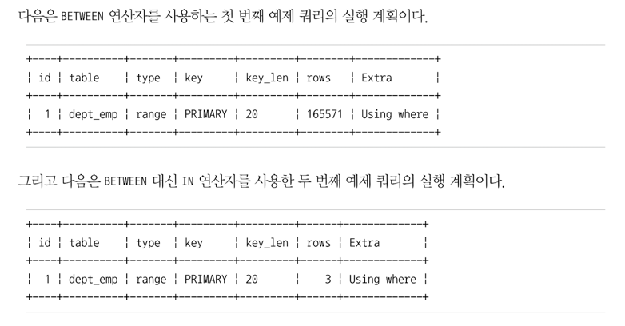
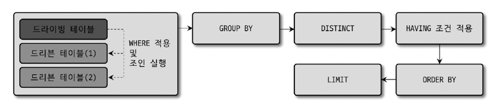
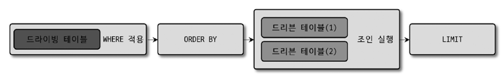
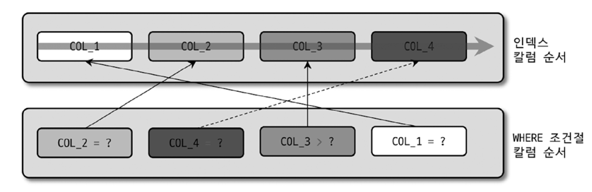
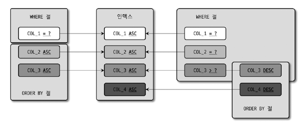
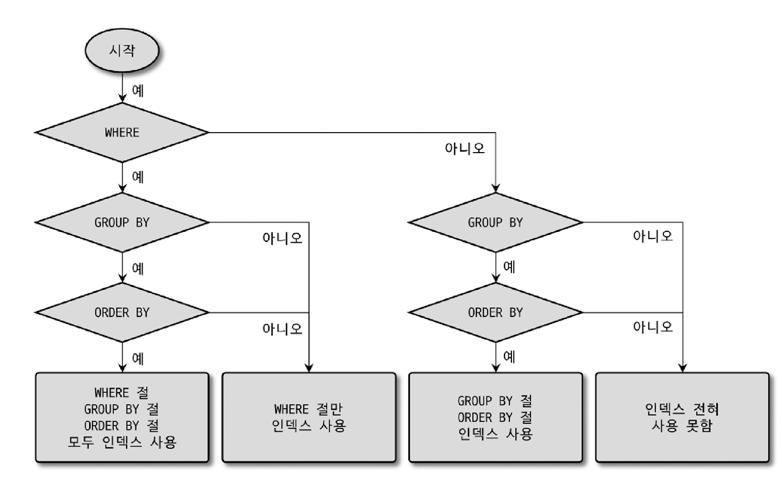
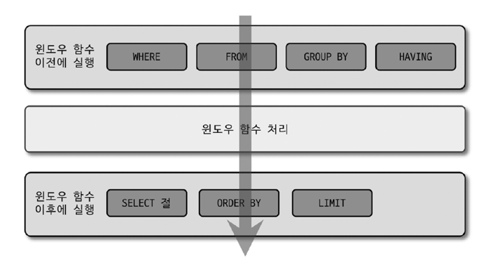

# Introduction
- DDL(Data Definition Language) : 데이터베이스나 테이블의 구조를 변경하기 위한 문장 
- DML(Data Manipulation Language) : 데이터를 조작(읽기/쓰기)하기 위한 문장

# 11.1 쿼리 작성과 연관된 시스템 변수 
## 11.1.1 SQL 모드 
- `sql_mode` 시스템 변수 : MySQL이 SQL을 처리하는 방법을 제어하는 데 사용
  - SQL 작성과 결과에 영향을 미침  
  - 가능한 변경하지 않는 것이 좋음
- 기본값 
  - `ONLY_FULL_GROUP_BY` 
    - GROUP BY 절에 명시되지 않은 컬럼을 SELECT 절이나 HAVING 절에서 사용할 수 없도록 함 
      - 적용하지 않으면 사용할 수 있음 
  - `STRICT_TRANS_TABLES`
    - InnoDB와 같이 트랜잭션을 지원하는 스토리지 엔진에만 엄격한 모드를 적용  
    - Insert, Update, Delete 시에 잘못된 데이터가 발생하면 오류가 발생함 (select는 경고 발생)
      - 적용하지 않으면 경고만 발생 
  - `NO_ZERO_IN_DATE` & `NO_ZERO_DATE`
    - DATE 또는 DATETIME 컬럼에 잘못된 날짜를 저장하는 것을 불가능하게 함 
  - `ERROR_FOR_DIVISION_BY_ZERO`
  - `NO_ENGINE_SUBSTITUTION`


## 11.1.2 영문 대소문자 구분 
- OS에 따라 테이블명의 대소문자를 구분함 
  - Windows : 대소문자 구분하지 않음 
  - Unix 계열 OS : 대소문자 구분함
- `lower_case_table_names`: 이를 1로 설정하면 모두 소문자로만 저장되며, 대소문자를 구분하지 않게 해줌 
  - default는 0임 
- 가능한 경우 대문자 또는 소문자로만 통일해서 사용하자 

## 11.1.3 MySQL 예약어 
- https://dev.mysql.com/doc/refman/8.0/en/keywords.html 참고 
- 테이블을 생성할 때 예약어를 사용하면 오류가 발생함 
  - `로 테이블명을 감싸면 예약어를 사용할 수 있으나, 이렇게 하진 말자 

---

---

# 11.2 매뉴얼의 SQL 문법 표기를 읽는 법 
- `[]`: 해당 키워드나 표현식 자체가 선택 사항임 
- `|` : 앞과 뒤의 키워드나 표현식 중에서 단 하나만 선택해서 사용할 수 있음 
- `{}` : 괄호 내의 아이템 중에서 반드시 하나를 사용해야 함 
- `...` : 표현식이나 키워드를 반복해서 사용할 수 있음

---

---

# 11.3 MySQL 연산자와 내장 함수 
- 될 수 있으면 ANSI 표준을 따르는 것이 좋음

## 11.3.1 리터럴 표기법 문자열 
### 문자열 
- 작은 따옴표(`'`)로 감싸서 표현
  - MySQL은 `"` 사용 가능
- `''`는 문자열 내에서 작은 따옴표를 표현할 때 사용

### 숫자 
- 작은 따옴표(`'`)로 감싸지 않고 숫자 값을 입력 
- 주의할 점 
  - 숫자와 문자열은 서로 자동으로 타입 변환이 발생함 
  - MySQL은 숫자 타입을 우선시함
  - 예시 
    - number_col = '100' → 문자열 '100'을 숫자로 변환해서 비교
    - string_col = 100 → string_col의 값을 숫자로 변환해서 비교 → 인덱스 못탐 (or 비교가 실패 할수도 있음)
- 타입 변환이 발생하지 않도록 주의하자 

### 날짜 
- 정해진 형태의 날짜 포맷으로 표기하면 MySQL 서버가 자동으로 DATE나 DATETIME 값으로 변환함 
  - `'2023-11-23'` → DATE로 변환 

### 불리언 
- `BOOL`, `BOOLEAN`은 사실 `TINYINT` 타입에 대한 동의어일 뿐이다 (0 또는 1)
  - `TRUE`, `FALSE`와 비교하거나 값을 저장할 수 있다. 
    - `TRUE` → 1
    - `FALSE` → 0


## 11.3.2 MySQL 연산자 
### 동등 비교 
- `=` : 두 값이 동일한지 비교할 때 사용
  - `NULL`과 `NULL`, `NULL`과 다른 값을 비교하면 `NULL`을 반환함  
  - `NULL`과 비교할 때는 `IS NULL`을 사용해야 함
- `<=>` : NULL을 포함한 두 값이 동일한지 비교할 때 사용
  - MySQL에서 제공하는 연산자 

### 부정 비교 
- `<>` 또는 `!=` 사용 

### NOT 연산자
- `NOT` : TRUE, FALSE 연산의 결과를 반대로 만드는 연산자 
  - `NOT (a = b)`와 `(a <> b)`는 동일함

### AND, OR 연산자
- `AND`, `OR` : 논리 연산자 
  - `AND`는 `OR`보다 우선순위가 높음 
  - `AND`와 `OR`를 같이 사용할 때는 괄호를 사용해서 우선순위를 명확하게 해주는 것이 좋음

### 나누기(`/`, `DIV`)와 나머지(`%`, `MOD`) 연산자 
- `/` : 나누기 연산자 
- `DIV` : 몫을 구하는 연산자
- `%` or `MOD` : 나머지 연산자

### REGEXP 연산자
- `REGEXP` : 정규 표현식을 사용해서 문자열을 비교할 때 사용 
  - `LIKE`와 달리 정규 표현식을 사용할 수 있음 
  - `RLIKE`는 `REGEXP`와 동일함
- 인덱스 레인지 스캔 사용 불가 

### LIKE 연산자
- 어떤 상수 문자열의 유무를 판단하는 연산자 
- `%` : 0 or 1개 이상의 모든 문자에 일치 (문자 내용 관계 x)
- `_` : 정확히 1개의 문자에 일치 (문자 내용 관계 x)
- `a%` or `a_` : 인덱스 레인지 스캔 사용 가능. 인덱스는 앞쪽을 비교하기 때문에, 앞이 고정되어 있어야 함 
  - `%a` or `_a` : 인덱스 레인지 스캔 사용 불가

### BETWEEN 연산자
- `BETWEEN` : 두 값 사이에 있는지 확인하는 연산자 
  - `a BETWEEN b AND c` : `a >= b AND a <= c`와 동일함
  - `NOT BETWEEN` : `BETWEEN`의 반대
- 인덱스 사용시 주의점 
  ```mysql
  -- pk = (dept_no, emp_no)
  SELECT * FROM dept_emp WHERE dept_no BETWEEN 'd003' AND 'd005' AND emp_no = 10001;
  ```
  - 위 쿼리는 d003부터 d005까지 모두 조회한다. `emp_no`는 비교 범위를 줄이는 역할을 하지 못한다. 
    - 실제 조회되는 데이터가 1건이라고 해도, d003~d005까지의 모든 데이터를 스캔한다.
  - 위 쿼리는 아래와 같이 개선할 수 있다.
    ```mysql
    SELECT * FROM dept_emp WHERE dept_no IN ('d003', 'd004', 'd005') AND emp_no = 10001;
    ```
    - 동등 비교를 수행함으로써 모든 범위를 스캔하지 않게 만든다. 
  - 인덱스 앞쪽에 있는 컬럼의 선택도가 떨어질 때는 IN으로 변경하는 것이 성능을 개선할 수도 있음.
  - 


### IN 연산자
- `IN` : 여러 개의 값에 대해 동등 비교 연산을 수행 
  - 여러 번의 동등 비교로 실행 → 일반적으로 빠르게 처리 
- `IN (?, ?, ?)` : 상수가 사용된 경우
- `IN (SELECT ...)` : 서브쿼리가 사용된 경우
- `NOT IN` : 부정형 비교이기 때문에 인덱스 풀 스캔을 하는 경우가 많음


## 11.3.3 MySQL 내장 함수
### NULL 값 비교 및 대체 
- `IFNULL(expr1, expr2)`
  - expr1: NULL인지 아닌지 비교하려는 컬럼 혹은 표현식. NULL이 아닐 경우 expr1을 반환함
  - expr2: expr1이 NULL인 경우 대체할 값이나 컬럼. NULL이 아닐 경우 expr2를 반환함 
- `ISNULL(expr)` : expr이 NULL이면 1을 반환하고, 그렇지 않으면 0을 반환


### 현재 시각 조회 
- `NOW()` : 현재 시각을 반환함
  - 하나의 SQL 문장 내의 NOW() 함수는 모두 같은 값을 가짐 
- `SYSDATE()` : 현재 시각을 반환함
  - 하나의 SQL 문장 내에서도 호출 시점에 따라 결괏값이 달라짐 
  - 레플리카 서버에서 안정적으로 복제되지 못함 
  - 인덱스를 효율적으로 사용하지 못함 
    - 호출 시점에 따라 값이 달라지기 때문에, 상수가 아님. 인덱스 스캔 시에도 매번 비교되는 레코드마다 함수가 실행돼야 함.
  - 그러니 왠만하면 사용 ㄴㄴ


### 날짜와 시간 포맷 
- `DATE_FORMAT(date, format)` : 날짜를 원하는 포맷으로 변환함
  - date: 날짜 값
  - format: 날짜 포맷 (ex: `%Y-%m-%d`)
- `STR_TO_DATE(str, format)` : 문자열을 날짜로 변환함
  - str: 날짜 형식의 문자열
  - format: 날짜 포맷


### 날짜와 시간 연산 
- `DATE_ADD(date, INTERVAL expr unit)` : 날짜에 일정 기간을 더함
  - date: 날짜 값
  - expr: 더하고자 하는 기간
  - unit: 기간의 단위 (ex: DAY, MONTH, YEAR)
- `DATE_SUB(date, INTERVAL expr unit)` : 날짜에 일정 기간을 뺌
  - date: 날짜 값
  - expr: 빼고자 하는 기간
  - unit: 기간의 단위 (ex: DAY, MONTH, YEAR)


### 타임스탬프 연산
- `UNIX_TIMESTAMP()` : 현재 시각을 타임스탬프로 반환함
  - `1970-01-01 00:00:00`부터 현재 시각까지의 경과된 초를 반환
  - 4바이트 숫자 타입이기 때문에 `1970-01-01 00:00:00` ~ `2038-01-19 03:14:07`까지만 표현 가능
- `FROM_UNIXTIME(unix_timestamp)` : 타임스탬프를 날짜로 변환함


### 문자열 결합 
- `CONCAT(str1, str2, ...)` : 여러 개의 문자열을 결합함
  - str1, str2, ...: 결합할 문자열


### 값의 비교 및 대체 
- `CASE WHEN ... THEN ... END`
  - `SWITCH` 구문과 같은 역할을 함 


---

---

# 11.4 SELECT
## 11.4.1 SELECT 절의 처리 순서 
```mysql
SELECT s.emp_no, COUNT(DISTINCT e. first_name) AS cnt  -- SELECT 절
FROM salaries s  -- FROM 절
INNER JOIN employees e ON e.emp_no=s. emp_no
WHERE s.emp_no IN (100001, 100002)  -- WHERE 절
GROUP BY s.emp_no  -- GROUP BY 절
HAVING AVG(s.salary) > 1000  -- HAVING 절
ORDER BY AVG(s.salary)  -- ORDER BY 절
LIMIT 10;  -- LIMIT 절
```
- 각 쿼리 절의 실행 순서 
  - 
  - 인덱스를 이용해 처리할 때는 GROUP BY, ORDER BY 자체가 불필요하므로 생략됨 
- GROUP BY 절이 없이 ORDER BY 절만 사용된 쿼리에서는 아래와 같이 실행 순서가 적용될 수 있음 
  - 

## 11.4.2 WHERE 절, GROUP BY 절, ORDER BY 절의 인덱스 사용 
### 인덱스를 사용하기 위한 기본 규칙 
- 인덱스된 컬럼 값 자체를 변환하지 않고 그대로 사용해야 함 
- WHERE 절의 비교 조건에서, 두 비교 대상 값은 데이터 타입이 일치해야 함  
  - 저장이든 비교든 타입은 일치시키자. 

### WHERE 절의 인덱스 사용 
- 동등 비교 or IN 으로 구성된 조건에 사용된 컬럼들이 인덱스의 컬럼 구성과 좌측에서 비교했을 때 얼마나 일치하는가에 따라 달라짐
- 
  - 위 예제는 AND 조건에 대한 예제이다. 
  - 인덱스 순서와 WHERE 조건절의 순서는 실제 인덱스 사용 여부와 무관함 
  - COL3이 범위 비교 조건으로 사용됐기 때문에, COL4는 체크 조건으로 사용된다. 
    - 결국, 인덱스 컬럼 순서와 비교 조건이 중요하지, WHERE 조건절의 순서는 중요하지 않다.
 
- WHERE절에 OR가 있으면 주의해야 함 
  - AND로 연결되면 읽어와야 할 레코드 건수를 줄이는 역할을 하지만,
  - OR로 연결되면 읽어서 비교해야 할 레코드가 더 늘어나기 때문 

### GROUP BY 절의 인덱스 사용
- GROUP BY 절에 명시된 컬럼의 순서가 인덱스를 구성하는 컬럼의 순서와 같으면 인덱스를 사용할 수 있음
- 인덱스를 구성하는 컬럼 중, 뒤쪽에 있는 컬럼은 GROUP BY 절에 명시되지 않아도 인덱스를 사용할 수 있음
  - 즉, 다중 컬럼 인덱스 중에서 일부만 명시되어도 되지만, 뒤쪽의 인덱스만 제외될 수 있음   
  - 따라서, 인덱스의 앞쪽에 있는 컬럼은 명시되지 않으면 인덱스를 사용할 수 없음
- GROUP BY 절에 명시된 컬럼이 하나라도 인덱스에 없으면 전혀 인덱스를 이용할 수 없음
- 예제 
  - ex1: 인덱스가 (a, b, c)일 때, GROUP BY a, b, c, d, e, f는 인덱스를 사용할 수 없음
  - ex2: 인덱스가 (a, b, c)일 때, GROUP BY b, c는 인덱스를 사용할 수 없음
  - ex3: 인덱스가 (a, b, c)일 때, GROUP BY a, c는 인덱스를 사용할 수 없음
  - ex4: 인덱스가 (a, b, c)일 때, GROUP BY a는 인덱스를 사용할 수 있음
  - ex5: 인덱스가 (a, b, c)일 때, GROUP BY a, b는 인덱스를 사용할 수 있음
  - ex6: 인덱스가 (a, b, c)일 때, GROUP BY a, b, c는 인덱스를 사용할 수 있음

### ORDER BY 절의 인덱스 사용
- GROUP BY와 상당히 흡사함 
- 정렬되는 각 컬럼의 ASC, DESC 옵션이 인덱스와 같거나 정반대인 경우에만 사용 가능 

### WHERE 절과 ORDER BY(또는 GROUP BY) 절의 인덱스 사용
- WHERE, ORDER(GROUP) BY가 함께 사용된 경우 다음 중 한가지 방법으로만 인덱스를 이용함 
  - WHERE 절과 ORDER BY 절이 동시에 같은 인덱스 이용 (가장 빠름)
    - WHERE 절과 ORDER BY 절에 사용된 인덱스의 순서는 선언된 인덱스 순서와 일치해야 함
      - 
  - WHERE 절만 인덱스를 이용 
    - ORDER BY 절은 인덱스를 이용한 정렬이 불가능 
    - Filesort를 사용해서 정렬을 수행함
    - WHERE 절 조건에 일치하는 레코드 건 수가 많지 않을 때 효율적 
  - ORDER BY 절만 인덱스를 이용 
    - ORDER BY 절의 순서대로 인덱스를 읽으면서 한 건씩 WHERE 절 조건에 일치하는지 비교

### GROUP BY 절과 ORDER BY 절의 인덱스 사용
- GROUP BY 절과 ORDER BY 절에 명시된 컬럼 순서와 내용이 모두 같아야 함 
- 둘 중 하나라도 인덱스를 이용할 수 없을 때는 둘 모두 인덱스 사용 불가 

### WHERE 조건과 GROUP BY 절, ORDER BY 절의 인덱스 사용
- WHERE 절과 GROUP BY 절, ORDER BY 절이 모두 포함된 쿼리가 인덱스를 사용하는 지 판단하는 방법 
  - 
    1. WHERE 절이 인덱스를 사용할 수 있는가?
    2. GROUP BY 절이 인덱스를 사용할 수 있는가?
    3. GROUP BY 절과 ORDER BY 절이 동시에 인덱스를 사용할 수 있는가?


## 11.4.3 WHERE 절의 비교 조건 사용 시 주의사항 
### NULL 비교
- MySQL은 NULL이 포함된 레코드도 인덱스로 관리됨 
  - NULL을 하나의 값으로 인정하여 관리함 
  - SQL 표준에서 NULL은 값이 없음을 의미하며, 비교할 수 없음  
- `IS NULL` 연산자를 사용해서 비교

### 문자열이나 숫자 비교 
- 문자열이나 숫자를 비교할 때는 반드시 그 타입에 맞는 상숫값을 사용할 것 
- 다른 타입을 사용할 경우 인덱스를 이용하지 못할 수 있음 

### 날짜 비교 
- `DATE`, `DATETIME`과 문자열 비교 
  - 문자열 값을 자동으로 DATETIME으로 변환해서 비교를 수행 
  - MySQL이 내부적으로 변환을 수행함 
  - `hire_date > STR_TO_DATE('2000-01-01', '%Y-%m-%d')`, `hire_date > '2000-01-01'` 둘 모두 성능상 문제 X
  - `DATE_FORMAT(hire_date, '%Y-%m-%d') > '2000-01-01'`은 성능상 문제 발생 가능 
    - `hire_date` 컬럼을 변경함 → 인덱스 못탐
    - 컬럼을 타입 변환하지 말고, 비교할 상수 값을 변환하도록 하는게 좋음
  - 컬럼의 변형은 인덱스를 타지 못하게 하는 원인이다 

- `DATE`와 `DATETIME`의 비교 
  - 그냥 비교하면 MySQL 서버가 DATE를 DATETIME으로 변환해서 비교함
  - 인덱스 사용 여부에 영향 X
  - 성능보다는 쿼리의 결과에 주의해서 사용할 것 

- `DATE`와 `TIMESTAMP`의 비교
  - 서로 비교 불가 
  - `TIMESTAMP`를 `DATETIME`으로 변환해서 비교해야 함

### Short-circuit evaluation
- `AND` 또는 `OR` 연산자로 연결된 조건식에서, 앞의 조건식의 결과에 따라 뒤의 조건식을 평가하지 않는 것 
  - `AND` 연산자로 연결된 조건식에서, 앞의 조건식이 FALSE이면 뒤의 조건식을 평가하지 않음 
  - `OR` 연산자로 연결된 조건식에서, 앞의 조건식이 TRUE이면 뒤의 조건식을 평가하지 않음
- 하지만 Where 절의 조건 중에서 인덱스를 사용할 수 있는 조건이 있는 경우, `Short-circuit evaluation`과는 무관하게 해당 조건을 가장 최우선으로 사용함
  - 나열 순서대로 평가하는게 아니라, 인덱스를 사용할 수 있는 조건을 우선적으로 평가함
  - 인덱스를 사용하지 못하는 조건은 순서대로 평가하므로, 위치 조절을 잘 하자 (복잡한건 뒤로 보내셈)

## 11.4.4 DISTINCT
- 남용하면 성능적인 문제 뿐만 아니라, 쿼리 결과도 의도한 바와 다를 수 있음 
- 1:1 조인인지, 1:N 조인인지 업무적인 특성을 잘 이해하는 것이 중요 

## 11.4.5 LIMIT n
- 쿼리 결과에서 지정된 순서에 위치한 레코드만 가져오고자 할 때 사용 
- MySQL에서 해당 문장은 항상 쿼리의 가장 마지막에 실행됨 
- LIMIT에서 필요한 레코드 건수만 준비되면 즉시 쿼리 종료 
  - 정렬, 그루핑, DISTINCT가 없는 경우 쿼리가 상당이 빨리 끝나게 하는 효과를 가져올 수 있음 
  - GROUP BY는 처리가 완료되고 나서야 LIMIT 처리 수행 가능
  - DISTINCT를 위한 중복 제거 작업을 반복적으로 처리하다가 LIMIT 건수만큼 채워지면 쿼리를 멈춤 
  - 정렬을 수행하면서 필요한 LIMIT 건수를 완성하는 순간 쿼리를 종료함
- 인덱스를 탈 수 있으면 LIMIT은 쿼리 작업량을 상당히 줄여주는 효과가 있음 
- 실제 쿼리의 성능은 출력되는 건 수 보다, MySQL 서버가 어떠한 작업들을 했는지가 중요함
  - `LIMIT 20000, 10` 이렇게 쓰기 보다, Where 절로 레코드 건수를 줄인 후 `LIMIT 0, 10`과 같은 형태로 사용하자

## 11.4.6 COUNT()
- `COUNT(*)` : NULL을 포함한 모든 레코드 수를 반환함
- 큰 테이블에서 COUNT() 함수를 사용하는 작업은 주의하자 
- 대략적인 건수만 알아도 될 경우 `SHOW TABLE STATUS`를 사용하는 것이 좋음
- `ORDER BY`는 아무 필요도 없으므로 함께 쓰지 말자
- `COUNT(col1)`은 col1이 NULL인 레코드는 제외하고 카운트함

## 11.4.7 JOIN 
### JOIN 순서와 인덱스 
- 인덱스 레인지 스캔 = 인덱스 탐색 + 인덱스 스캔 
- 드라이빙 테이블은 인덱스 탐색 작업을 1회 수행하고, 그 이후부터는 스캔만 수행 
  - 드리븐 테이블은 인덱스 탐색과 스캔 작업을 드라이빙 테이블에서 읽은 레코드 건수만큼 반복 
  - 즉, 부하 자체가 드리븐 테이블이 훨씬 큼 
    - 옵티마이저는 드리븐 테이블을 최적으로 읽을 수 있도록 실행 계획을 수립함 
- 드라이빙 테이블, 드리븐 테이블 모두 인덱스가 있는 경우가 가장 빠름 
- 한쪽만 인덱스가 있는 경우, 인덱스가 없는 쪽을 드라이빙 테이블로 선택함 
- 모두 인덱스가 없는 경우 레코드 건수가 적은 테이블을 드라이빙 테이블로 선택함 (해시 조인)

### JOIN 컬럼의 데이터 타입 
- 조인 컬럼 간의 비교에서는 각 데이터 타입이 일치해야 인덱스를 효율적으로 이용할 수 있음 
  - 문제가 될 수 있는 타입 비교 패턴
    - 데이터 타입 종류가 완전히 다른 경우  
    - 같은 CHAR 타입이더라도 문자 집합이나 콜레이션이 다른 경우 
    - 같은 INT 타입이라도 Sign 존재 여부가 다른 경우 

### OUTER JOIN의 성능과 주의 사항 
- 이너 조인은 조인 대상 테이블에 모두 존재하는 레코드만 결과 집합으로 반환함 
- 아우터 조인은 조인 대상 테이블을 드라이빙 테이블로 선택하지 못함 
  - 이너 조인이 더 효율적으로 처리됨 
  - 그러니 이너 조인으로 사용해도 되는 쿼리는 아우터 조인으로 작성하지 말자 
- 아우터 조인에 WHERE 절 함께 명시 → 이너 조인으로 처리됨
  - 아우터 조인을 쓰고싶다면 이러지 말자 
  - 조건을 ON 절에 작성해라 
- 안티 조인 효과를 기대할 때는 Where를 써도 됨 

### JOIN과 FK 
- FK는 조인과 아무런 연관이 없음 
- FK는 데이터 무결성을 보장하기 위함 

### 지연된 조인 
- 조인 + GROUP BY / ORDER BY 를 사용할 때 
  - 인덱스를 사용하는 경우 최적으로 처리되고 있을 가능성이 높음 
  - 인덱스를 사용할 수 없는 경우, 조인을 모두 실행한 후 GROUP BY / ORDER BY를 수행함
    - 조인은 대체로 결과 레코드 건수가 늘어난다는 특징이 있음 
    - 조인 결과를 GROUP BY, ORDER BY를 하면 조인 전보다 더 많은 레코드를 처리해야 할 수 있음 
    - 지연된 조인이란, 조인 실행 전에 GROUP BY, ORDER BY를 수행하는 것을 의미함
    - 지연된 조인은 LIMIT이 함께 사용되면 더 큰 효과를 얻을 수 있음 

### 래터럴 조인 
- 특정 그룹별로 서브쿼리를 실행해서 그 결과와 조인

### 실행 계획으로 인한 정렬 흐트러짐 
- 네스티드 루프 조인은 드라이빙 테이블에서 읽은 레코드의 순서가 모두 조인돼도 그대로 유지됨
- 해시 조인이 사용되는 경우, 쿼리 결과와 레코드 정렬 순서가 달라짐 
  - 드라이빙 테이블을 읽는 순서와 정렬 순서가 다르게 출력됨  
  - 정렬된 결과가 필요한 경우, ORDER BY를 사용해서 정렬을 수행해야 함


## 11.4.8 GROUP BY 
### WITH ROLLUP
- 그루핑된 그룹별로 소계/총계를 가져오는 기능 

### 레코드를 컬럼으로 변환해서 조회 
- 하나의 레코드를 여러 개의 컬럼으로 나누거나 변환하는 SQL 문법은 없음 
- 집합 함수 + `CASE WHEN ... END` 구문을 이용해서 변환하는 것은 가능


## 11.4.9 ORDER BY
- ORDER BY 절이 없는 경우
  - 인덱스를 사용한 SELECT 쿼리는 인덱스의 정렬 순서대로 결과를 반환함
  - 풀 테이블 스캔 SELECT 쿼리는 InnoDB의 경우, 항상 PK로 클러스터링 되어있기 때문에 PK 순서대로 레코드를 가져옴 
  - SELECT 쿼리가 임시 테이블을 거쳐 처리되면, 조회되는 레코드 순서를 예측하기는 어려움 
  - ORDER BY 절이 없으면 어떠한 정렬도 보장되지 않으니, 정렬이 필요하다면 ORDER BY 절을 반드시 명시하자
- 인덱스를 사용하지 못하는 ORDER BY
  - 추가 정렬 작업 수행 
  - `Using filesort`

### 사용법 및 주의사항 
- 1개 또는 그 이상의 컬럼으로 정렬 수행 가능 
  - 정렬 순서는 컬럼 별로 다르게 명시 가능 

### 여러 방향으로 동시 정렬 
- `ORDER BY col1 ASC, col2 DESC`와 같이 여러 컬럼을 동시에 정렬할 수 있으며, MySQL 8.0 부터는 인덱스도 사용 가능 
  - 혼용해서 정렬할 경우, 옵션을 섞어서 인덱스를 만들면 됨 
    - `col1, col2 DESC`로 인덱스를 생성


## 11.4.10 서브쿼리 
- SELECT 절에 사용되는 서브쿼리는 반환 결과가 0건 or 1건이어야 한다 
- 조인으로 처리해도 되는 쿼리를 굳이 서브쿼리를 쓰지 말자 
  - 조인으로 처리할 떄가 좀 더 빠르다 
  - 가능하면 조인으로! 
- FROM 절에 사용되는 서브쿼리 
  - 외부 쿼리와 병합하는 최적화 수행 
  - 병합되지 못하는 경우 
    - 집합 함수
    - DISTINCT 
    - GROUP BY or HAVING
    - LIMIT
    - UNION
    - SELECT 절에 서브쿼리가 사용된 경우 
    - 사용자 변수를 사용하는 경우
- WHERE 절에 사용되는 서브쿼리
  - `= (subquery)` or 크다 작다 비교 
    - 서브쿼리를 먼저 상수로 변환 
  - `IN (subquery)`
    - 세미 조인의 한 형태 
    - 테이블 풀 아웃, 퍼스트 매치, 루스 스캔, 구체화, 중복 제거 등의 방법으로 처리  
  - `NOT IN (subquery)`
    - 안티 세미 조인 
    - Not-Equal은 인덱스를 제대로 활용할 수 없듯, 안티 세미 조인 또한 최적화 방법이 많지 않음
    - NOT EXISTS 또는 구체화 방법 사용 
    - 성능 향상에 도움이 안되니까 다른 조건을 활용해서 데이터 검색 범위를 좁힐 수 있게 하자 


## 11.4.11 CTE(Common Table Expression)
- 이름을 가지는 임시 테이블 
- SQL 문장 내에서 한 번 이상 사용 가능 & SQL 문장 종료 시 임시 테이블 삭제


## 11.4.12 윈도우 함수(Window Function)
- 조회하는 현재 레코드를 기준으로 연관된 레코드 집합의 연산을 수행 
- GROUP BY → 그룹 별로 하나의 레코드로 묶어서 출력
- 윈도우 함수 → 조건에 일치하는 레코드 건수는 변하지 않고 그대로 유지
- 실행 순서
  - 


## 11.4.13 잠금을 사용하는 SELECT 
- `FOR SHARE` : 읽기 잠금 
  - Shared Lock 사용 
  - 다른 세션에서 읽는 것은 가능하나, 변경하지 못하게 함 
- `FOR UPDATE` : 쓰기 잠금 
  - Exclusive Lock 사용
  - 레코드 변경 뿐만 아니라, FOR SHARE 를 사용하는 SELECT도 수행할 수 없음
    - Q. FOR SHARE 를 사용하지 않는 SELECT는 수행할 수 있나..?
      - A. 가능함. [공식문서 SELECT FOR UPDATE 참고](https://dev.mysql.com/doc/refman/8.0/en/innodb-locking-reads.html)
      - InnoDB 스토리지 엔진을 사용하는 테이블에서는 잠금 없는 읽기를 지원
        - 특정 레코드가 잠겨진 상태라 하더라도, `FOR SHARE`나 `FOR UPDATE`를 사용하지 않는 SELECT 문장은 아무런 대기 없이 실행 가능 

### 잠금 테이블 선택 
- 여러 테이블을 조인해서 읽으면서 `FOR UPDATE`를 사용할 때 
  - 여러 테이블에서 읽은 레코드에 대해 모두 Exclusive Lock을 걸게 됨 
- 선택적으로 잠글 수 있는 옵션 제공
  - `FOR UPDATE OF {테이블 이름 | 테이블 별칭}`

### NOWAIT & SKIP LOCKED
- `NOWAIT` : 대기 없이 바로 에러를 반환함
- `SKIP LOCKED` : 잠금이 걸린 레코드는 건너뛰고 읽음
  - 잠긴 레코드는 무시하고, 잠금이 걸리지 않은 레코드만 가져옴 
  - 확정적이지 않은 쿼리가 됨 (NOT-DETERMINISTIC)
    - 확정적: 입력이 동일하면 시점에 관계 없이 동일한 결과를 반환함 
    - 비확정적: 입력이 동일해도 시점에 따라 결과가 달라질 수 있음
      - 비확정적 쿼리는 소스 서버와 레플리카 서버의 데이터를 다르게 만들 수도 있으니 복제의 바이너리 로그 포맷은 ROW나 MIXED를 사용하자 
- 해당 기능은 Queue와 같은 기능을 MySQL 서버에서 구현하고자 할 때 유용함 


