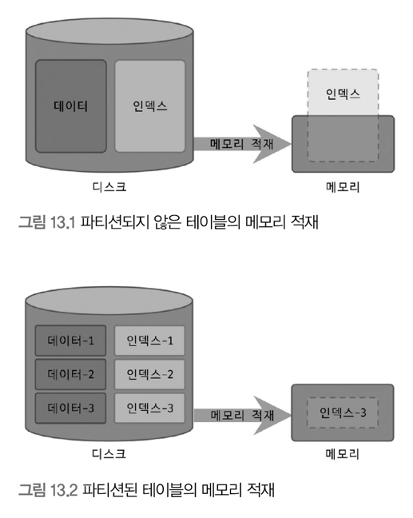
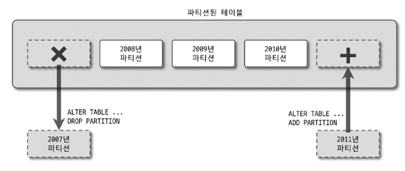
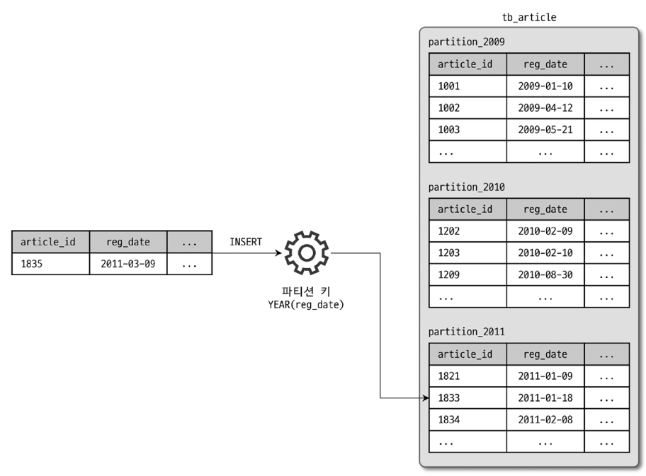
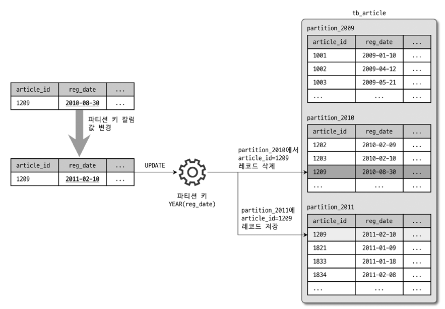
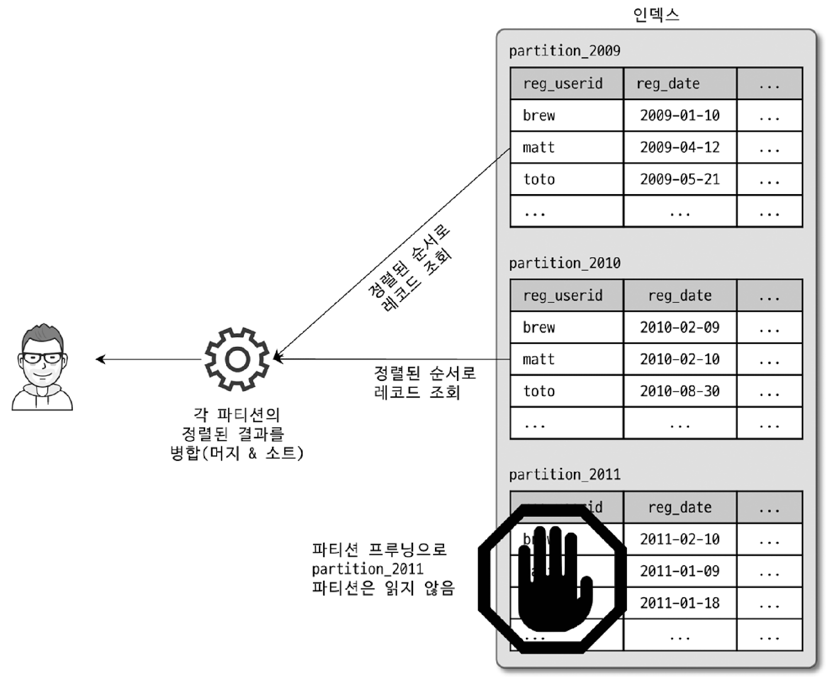
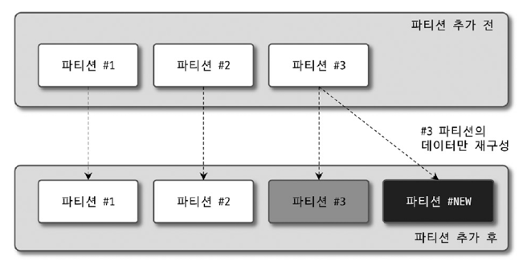
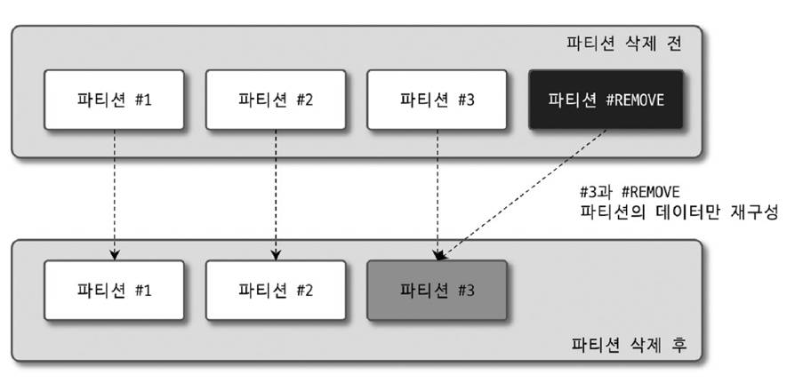

# 13 파 티 션!

## 13.1 개요

### 13.1.1 파티션 사용하는 이유

- 대표적인 예
  - 하나의 테이블이 너무 커서 인덱스의 크기가 물리 메모리보다 큼
  - 주기적인 삭제 작업이 필요함

#### 단일 INSERT와 단일 / 범위 SELECT의 빠른 처리

- 인덱스의 워킹 셋이 물리 메모리보다 크면 쿼리가 느려진다.
  - 워킹 셋: 활발하게 사용되는 데이터
- 테이블을 파티션해서 데이터와 인덱스를 조각화 하고, 메모리를 효율적으로 사용할 수 있게 된다.
  - 인덱스를 사용할때 전부 메모리에 올리지 않을텐데.. 파티션이 무슨 소용이지? (짝수만 사용하는 경우 / 홀수만 사용하는 경우 문제가 되려나?)
  - 

#### 데이터의 물리적인 저장소를 분리

- 데이티 파일이나 인덱스 파일이 너무 크면 백업이나 관리가 어려워진다.
- 이럴때 파티션을 통해 파티션별 파일들로 나누어 크기를 조절할 수 있다. (디스크를 별개로 지정할 수도 있고)
- _MySQL은 테이블의 파티션 단위로 인덱스를 생성하거나 파티션별로 다른 인덱스를 가질 수 없다._

#### 로그의 효율적인 관리

- 너무 오래된 로그는 아카이빙하거나, 삭제할 필요가 있다.
- 한 테이블에서 로그를 관리할 경우, 동시성 문제나 성능 문제가 생길 수 있다.
- 파티션 별로 나누어 로그를 관리하면 삭제 추가가 간단하다.
  

### 13.1.2 MySQL 파티션 내부 처리

- 선행 테이블
  ```sql
  CREATE TABLE tb_article (
      article_id INT NOT NULL,
      reg_date DATETIME NOT NULL,
      PRIMARY KEY(article_id, reg_date)
  ) PARTITION BY RANGE ( YEAR(reg_date) ) (
      PARTITION p2009 VALUES LESS THAN (2010),
      PARTITION p2010 VALUES LESS THAN (2011),
      PARTITION p2011 VALUES LESS THAN (2012),
      PARTITION p9999 VALUES LESS THAN MAXVALUE
  );
  ```

#### 파티션 테이블의 레코드 INSERT

파티션 키인 reg_date로 파티션 표현식(YEAR(reg_date))을 평가하고 적절한 파티션을 결정한다.



#### 파티션 테이블의 UPDATE

- WHERE 절에 파티션 키 칼럼이 조건으로 있다면 그 값으로 파티션을 찾고, 레코드를 찾는다.
  ex) `UPDATE reg_date='1234-12-12' WHERE reg_date='2023-12-01'`
- 조건이 없으면 변경 대상 레코드를 검색하기 위해 모든 파티션을 검색한다.
  ex) `UPDATE reg_date='1234-12-12' WHERE article_id=12`
- 저장되는 파티션이 변경될 경우에는 삭제 -> 추가 과정을 거친다.



#### 파티션 테이블의 검색

파티션 테이블을 검색할때 성능에 영향을 미치는 조건은 다음과 같음

- WHERE 절의 조건으로 검색해야 할 파티션을 선택할 수 있나?
- WHERE 절의 조건이 인덱스를 효율적으로 사용(인덱스 레인지 스캔)할 수 있는가?

두 조합의 결과는 아래와 같다.

- 파티션 선택 가능 + 인덱스 효율적 사용 가능: 필요한 파티션들에 대해서 인덱스 레인지 스캔한다.
  - BEST
  - 해당 파티션들의 레인지 스캔 결과를 병합해서 가져옴
- 파티션 선택 불가 + 인덱스 효율적 사용 가능: 모든 파티션에 대해서 인덱스 레인지 스캔한다.
- 파티션 선택 가능 + 인덱스 효율적 사용 불가: 필요한 파티션들에 대해서 풀 테이블 스캔한다.
  - 파티션이 너무 크면 느리니까 파티션이 크기가 작으면 좋을듯
- 파티션 선택 불가 + 인덱스 효울적 사용 불가: 모든 파티션에 대해서 풀 테이블 스캔한다.

#### 파티션 테이블의 인덱스 스캔과 정렬

(파티셔닝했을때, 인덱스가 어떻게 되는지 왜 나중에 알려줌? ㅡㅡ)

- 모든 인덱스는 파티션 단위로 생성된다.

  - _파티션단위로 다른 인덱스를 생성할 수 있다는 의미가 아니다!_
  - _인덱스도 테이블과 마찬가지로 쪼개진다는 의미._

- 여러개의 파티션에 대해서 질의할때는 병합해서 정렬해온다.
  

- 병합 정렬 방식
  - filesort 이 아닌 **우선순위 큐**방식으로 처리한다.
  - 인덱스를 스캔하면서 우선순위 큐에 넣고, 결과를 가져올때 큐를 팝해서 반환한다.

#### 파티션 프루닝

- 필요한 파티션만 골라내고 불필요한 것을 실행계획에서 배제하는 것을 파티션 프루닝(Partition pruning)이라고 한다.

## 13.2 주의사항

### 파티션이 가지는 제약 사항

- 파티션 표현식에 일부 함수는 불가능 하거나, 파티션 프루닝을 지원하지 않을 수 있음
- 프라이머리 키를 포함해서 테이블의 모든 유니크 인덱스는 **파티션 키 칼럼을 포함해야 함**
  - 위의 예시 테이블에서 `(article_id, reg_date)를 pk로 선정한 것 처럼, pk에 파티션키가 포함되어야 한다.`
- 파티션된 테이블의 인덱스는 모두 로컬 인덱스이며, 파티션 개별로 인덱스를 변경하거나 추가할 수 없음
  - 로컬 인덱스: 파티션 마다 별도의 인덱스가 있음
  - 글로벌 인덱스: 하나의 인덱스가 여러개의 파티션에 매핑됨
- 동일 테이블에 속한 파티션은 동인 스토리지 엔진만 가짐
- 최대 8192개의 파티션
- 파티션 테이블에서는 외래키 사용 불가
- 파티션 테이블은 전문 검색 인덱스 / 전문 검색 쿼리 사용 불가

### 유니크 인덱스와 파티션 키

다음과 같은 유니크 키는 생성할 수 없다.

1. 유니크 키에 파티션 키가 없음

   ```sql
   CREATE TABLE tb (
      fd1 INT NOT NULL,
      fd2 INT NOT NULL,
      fd3 INT NOT NULL,
      UNIQUE KEY (fd1, fd2)
   ) PARTITION BY HASH (fd3)
    PARTITIONS 4;
   ```

2. 유니크 키 칼럼만으로 파티션을 결정할 수 없다. (포함되어 있지도 않고; 일부가 빠짐)

   ```sql
   CREATE TABLE tb (
       fd1 INT NOT NULL,
       fd2 INT NOT NULL,
       fd3 INT NOT NULL,
       UNIQUE KEY (fd1)
       UNIQUE KEY (fd2)
   ) PARTITION BY HASH (fd1 + fd2)
   PARTITIONS 4;
   ```

3. 프라이머리 키 칼럼만으로 파티션 판단이 되지 않음 (사실 유니크도 같은 이유, 일부가 빠짐)
   ```sql
   CREATE TABLE tb (
       fd1 INT NOT NULL,
       fd2 INT NOT NULL,
       fd3 INT NOT NULL,
       PRIMARY KEY (fd1)
       UNIQUE KEY (fd2, fd3)
   ) PARTITION BY HASH (fd1 + fd2)
       PARTITIONS 4;
   ```

다음과 같은 유니크 키는 가능하다.

1. 유니크 키에 파티션 키 fd1가 포함되어 있다.

   ```sql
   CREATE TABLE tb (
      fd1 INT NOT NULL,
      fd2 INT NOT NULL,
      fd3 INT NOT NULL,
      UNIQUE KEY (fd1, fd2, fd3)
   ) PARTITION BY HASH (fd1)
    PARTITIONS 4;
   ```

2. 유니크 키에 파티션 키 fd1, fd2가 포함되어 있다.

   ```sql
   CREATE TABLE tb (
       fd1 INT NOT NULL,
       fd2 INT NOT NULL,
       fd3 INT NOT NULL,
       UNIQUE KEY (fd1, fd2)
   ) PARTITION BY HASH (fd1 + fd2)
   PARTITIONS 4;
   ```

3. 유니크 키와 프라이머리 키에 파티션 키 fd3가 포함되어 있다.
   ```sql
   CREATE TABLE tb (
      fd1 INT NOT NULL,
      fd2 INT NOT NULL,
      fd3 INT NOT NULL,
      PRIMARY KEY (fd2, fd3)
      UNIQUE KEY (fd1)
   ) PARTITION BY HASH (fd3)
      PARTITIONS 4;
   ```

## 13.3 MySQL 파티션의 종류

4가지 기본 파티션 기법을 제공하고 있다.

- 레인지 파티션
- 리스트 파티션
- 해시 파티션
- 키 파티션

### 13.3.1 레인지 파티션

`MAXVALUE` 키워드를 사용할 수 있고 파티션 키를 기준으로 범위로 파티션을 나눈다.

#### 용도

- 날짜 기반으로 범위를 지정해야 할때
- 여러 파티션에 균등하고 나누고 싶을때
- 파티션 키 위주로 검색이 자주 실행될때

#### 사용법

```sql
CREATE TABLE employees (
    id INT NOT NULL,
    first_name VARCHAR(30),
    last_name VARCHAR(30),
    hired DATE NOT NULL DEFAULT '1970-01-01'
) PARTITION BY RANGE( YEAR(hired) ) (
    PARTITION p0 VALUES LESS THAN (1991),
    PARTITION p1 VALUES LESS THAN (1996),
    PARTITION p2 VALUES LESS THAN (2001),
    PARTITION p3 VALUES LESS THAN MAXVALUE
);
```

#### 파티션 추가

```sql
ALTER TABLE employees
    ADD PARTITION (PARTITION p4 VALUE LASS THAN (2011));
```

- `LESS THAN MAXVALUE`파티션이 있으면 에러가 발생한다.
- 이럴때는 `REORGANIZE PARTITION` 명령을 사용해야 한다.

```sql
ALTER TABLE employees
    REORGANIZE PARTITION p3 INTO (
        PARTITION p3 VALUES LESS THAN (2011),
        PARTITION p4 VALUE LASS THAN MAXVALUE
    );
```

- p3 파티션의 레코드를 모두 새로운 두 개의 파티션으로 복사한다.
- INPLACE, 읽기 잠금이 걸리게 된다.
- `LESS THAN MAXVALUE` 파티션을 추가하지 않는 방법도 있다.
  - 필요할 때마다 새 파티션을 추가하는 방법이 있다.
  - 다만, 배치 스크립트의 오류로 파티션이 추가되지 않을 수도 있다.
- `LESS THAN MAXVALUE` 파티션을 추가하고, 데이터를 저장하지 않는 방법도 있다.
  - 필요할 때마다 `REORGANIZE PARTITION`을 해도 된다. (데이터가 없으니 빨리 처리됨)

#### 파티션 삭제

```sql
ALTER TABLE employees DROP PARTITION p0;
```

- 빠르게 삭제된다.
- 가장 오래된 파티션 순서로만 삭제가 가능하다.

#### 파티션 분리

`REORGANIZE PARTITION`명령을 사용하자. 위에서 설명한 것과 같다.

#### 파티션 병합

`REORGANIZE PARTITION`명령을 사용하면 된다.  
마찬가지로 읽기 잠금이 필요하다.

```sql
ALTER TABLE employees
REORGANIZE PARTITION p2, p3 INTO (
    PARTITION p23 VALUES LESS THAN (2011)
);
```

### 13.3.2 리스트 파티션

리스트 파티션은 파티션 키 값 하나하나를 리스트로 나열해 관리한다.

#### 용도

- 파티션 키 값이 코드 값이나 카테고리 값일 때
- 키 값이 연속되지 않고 정렬순서와 관계 없을 때
- 파티션 키 값을 기준으로 레코드의 건수가 균일하고 검색 조건에 파티션 키가 자주 사용될 때

#### 사용법

문자열도 가능하다.

```sql
CREATE TABLE product(
    id INT NOT NULL,
    name VARCHAR(30),
    category_id INT NOT NULL
) PARTITION BY LIST( category_id ) (
    PARTITION p_appliance VALUES IN (3),
    PARTITION p_computer VALUES IN (1, 9),
    PARTITION p_sports VALUES IN (2, 6, 7),
    PARTITION p_etc VALUES IN (4, 5, 8, NULL)
);
```

#### 병합과 분리

- 레인지 파티션과 동일하다.

### 13.3.3 해시 파티션

- 해시 함수에 의해 파티션을 결정하는 방법이다.
- 해시 함수는 나머지 연산으로 결정한다.
- 파티션 키는 정수 타입 칼럼이나 정수 타입만 반환하는 표현식만 가능하다.

#### 용도

- 레인지 / 리스트 파티션으로 데이터를 균등하게 나누는 것이 어려울때 (기준이 애매할때?)
- 모든 레코드가 비슷한 사용 빈도를 보이는데, 테이블을 나누고 싶을때
- ex) 회원 테이블

#### 사용법

```sql
CREATE TABLE empllyees (
    id INT NOT NULL,
    frist_name VARCHAR(30),
    last_name VARCHAR(30),
    hired DATE NOT NULL DEFAULT '1970-01-01'
) PARTITION BY HASH(id) PARTITIONS 4;
-- 파티션 이름을 지정하고 싶으면..
) PARTITION BY HASH(id) PARTITIONS 4 (
    PARTITION p0 ENGINE=INNODB,
    PARTITION p1 ENGINE=INNODB,
    PARTITION p2 ENGINE=INNODB,
    PARTITION p3 ENGINE=INNODB
);
```

#### 파티션 추가

나머지 연산으로 파티션을 나누기 때문에, 새로운 파티션이 추가되면 모든 파티션을 재구성 해야한다.

```sql
ALTER TABLE employees
ADD PARTITION(PARTITION p5 ENGINE=INNODB);

ALTER TABLE employees
ADD PARTITION PARTITIONS 1;
```

#### 해시 파티션 삭제 / 분할 / 병합

- 그런거 없다!
- 파티션의 개수를 줄이는 것은 가능하다.
  ```sql
  -- 1개 만큼 줄이기
  ALTER TABLE employees
      COALESCE PARTITION 1;
  ```
  - 이 명령을 실행하면, 다시 파티션이 재구성된다.

### 13.3.4 키 파티션

- 해시 파티션과 다르게 대부분의 데이터 타입을 파티션 키로 활용할 수 있다.
- MD5() 함수를 통해 해시 값을 계산하고 그 값에 나머지 연산을 취해서 파티션을 결정한다.
- 해시 파티션에 비해 더 균등하게 레코드를 나눌 수 있기 때문에 효율적이다.

#### 사용법

프라이머리 키가 있는 경우, 자동으로 파티션 키를 pk로 설정한다.

```sql
CREATE TABLE k1 (
    id INT NOT NULL,
    PRIMARY KEY (id)
) PARTITION BY KEY()
    PARTITIONS 2;
```

### 13.3.5 리니어 해시 파티션 / 리니어 키 파티션

- 해시 / 키 파티션은 파티션을 추가하거나 통합할때, 모든 파티션이 재구성된다. 이런 문제를 해결하기 위해 등장!
- 2의 승수 알고리즘을 이용해 다른 파티션에 미치는 영향을 최소화한다. (너무 어렵다 누가 알려줘요)

#### 파티션 추가 및 통합

- 파티션을 나눌때 "2의 승수"를 사용하기 때문에, 특정 파티션의 데이터에 대해서만 이동 작업을 하면 된다.
- 추가
  
- 통합
  

#### 주의사항

- 2의 승수 알고리즘 때문에, 파티션들이 키/해시보다 균등하지 않을 수 있다.
- 파티션의 개수를 자주 조절해야 한다면 리니어를 쓰고, 필요가 없다면 키/해시 파티션을 사용하자.
