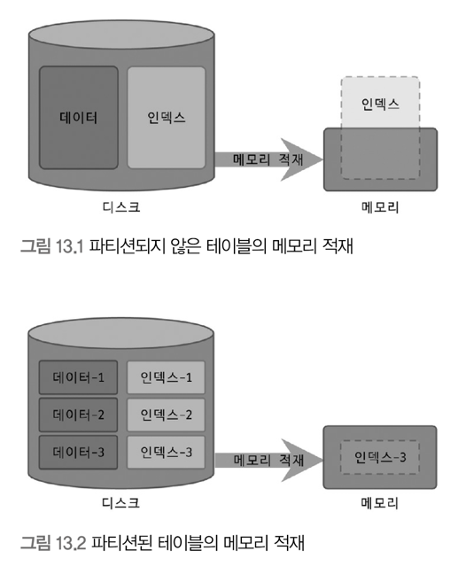
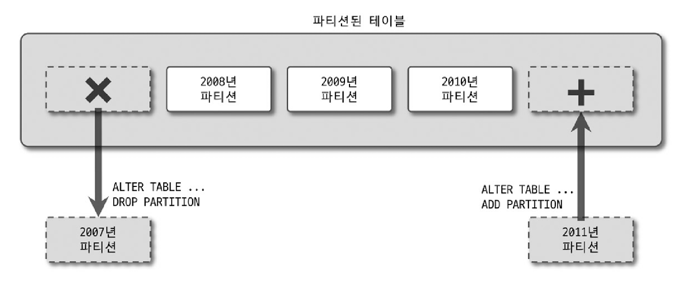
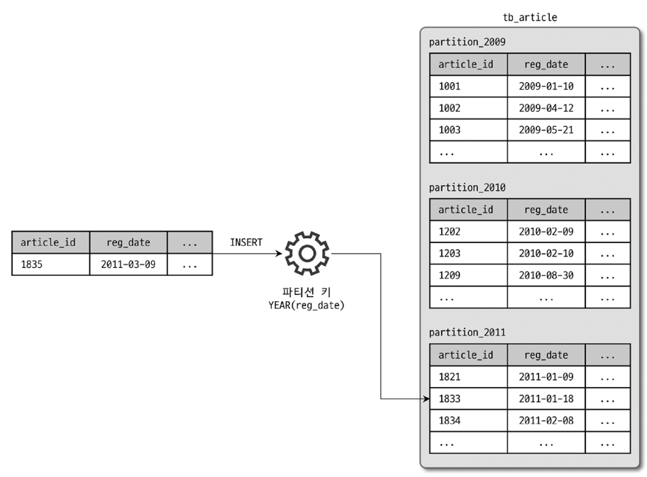
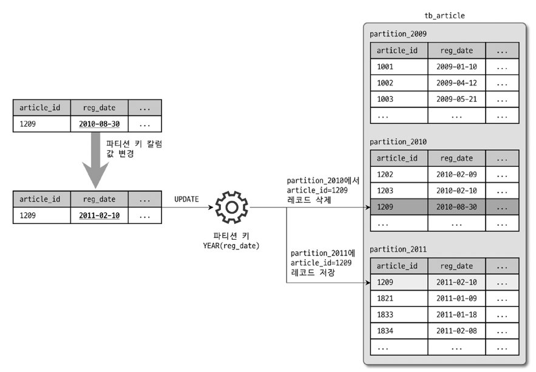
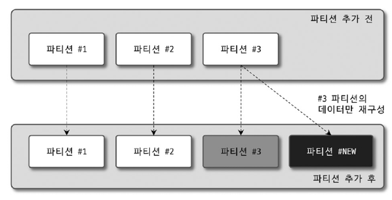
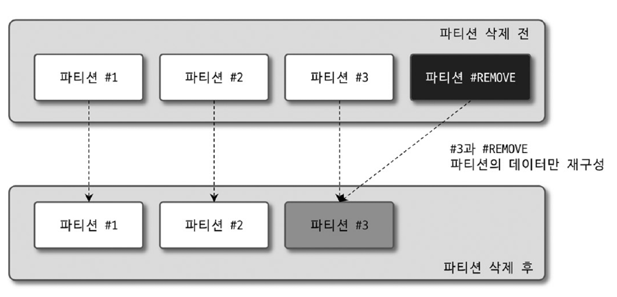

# Introduction
- 파티션이란?
  - 테이블을 물리적으로 분리해서 관리할 수 있게 해주는 기능
  - 논리적으로는 하나의 테이블로 취급 
- 목적 
  - 대용량 테이블을 물리적으로 여러 개의 소규모 테이블로 분산하기 위함 
- 특이사항
  - 어떤 쿼리를 사용하느냐에 따라 오히려 성능이 더 나빠지는 경우가 있을 수 있음 

---
---

# 13.1 개요 
## 13.1.1 파티션을 사용하는 이유 
### 필요할 때 
- 하나의 테이블이 너무 커서 인덱스의 크기가 물리적인 메모리보다 훨씬 큰 경우 
- 데이터 특성상 주기적인 삭제 작업이 필요한 경우

### 단일 INSERT와 단일 또는 범위 SELECT의 빠른 처리 
- 인덱스는 SELECT 뿐만 아니라, UPDATE/DELETE에도 필요할 때가 있음 
  - 변경을 위해 대상 레코드를 검색해야 하는 경우 필수적임 
- 인덱스가 커지면 커질수록...
  - SELECT는 말할 것도 없고, INSERT/UPDATE/DELETE도 느려짐
  - 특히, 한 테이블의 인덱스 크기가 물리적인 메모리보다 훨씬 큰 경우 영향이 심각할 것 
    - 인덱스의 Working set이 물리 메모리보다 크다면 쿼리 처리가 상당히 느려질 것
    - Working set의 크기를 줄여야 함
- 이럴 때 파티션이 필요
  - 
  - 파티션은 데이터와 인덱스를 조각화해서 물리적 메모리를 효율적으로 사용할 수 있게 도와줌 
- Working set?
  - 활발하게 사용되는 데이터를 표현하는 단어 
    - ex: 테이블 데이터가 10GB, 인덱스가 3GB
      - 테이블은 항상 13GB를 사용하는 게 아니라, 그중에서 일정 부분만 활발하게 사용함
      - 100만건이 저장된 테이블이더라도, 그중에서 최신 20~30%의 게시물만 활발하게 조회될 것임 
  - 워킹셋과 그렇지 않은 부분을 나눠서 파티셔닝한다면 효과적으로 성능을 개선할 수 있음 

### 데이터의 물리적인 저장소를 분리 
- 데이터 파일이나 인덱스 파일이 파일 시스템에서 차지하는 공간이 큰 경우
  - 백업, 관리가 어려워짐 
  - MySQL은 데이터나 인덱스를 파일 단위로 관리 → 치명적인 문제가 될 수 있음 
  - 파티션을 통해 파일 크기를 조절하거나, 파티션 별 파일들이 저장 될 위치나 디스크를 구분해서 지정하여 해결 가능 
- MySQL은 파티션 단위로 인덱스를 생성하거나, 다른 인덱스를 가지는 형태는 지원하지 않음

### 이력 데이터의 효율적인 관리 

- 로그는 단기간에 대량으로 누적됨 & 일정 기간이 지나면 쓸모 없어져 주기적인 삭제 필요 
- 다른 데이터들에 비해 라이프 사이클이 상당히 짧음 
- 로그 테이블에서 불필요해진 데이터를 백업하거나 삭제하는 작업은 상당히 고부하 작업에 속함 
  - 로그 테이블을 파티션으로 관리할 필요성이 있음 
  - 파티션 형태로 관리하면 불필요한 데이터 삭제 작업은 단순히 파티션을 추가/삭제하는 방식으로 빠르게 해결 가능 

## 13.1.2 파티션의 내부 처리 
### INSERT

1. 파티션 키에 해당하는 컬럼 값을 이용해 파티션 표현식 평가 
2. 레코드가 저장될 적절한 파티션 결정
3. 해당 파티션에 레코드 저장

### UPDATE
- `WHERE` 조건에 파티션 키 컬럼이 조건으로 존재하는 경우
  - 그 값을 이용해 레코드가 저장된 파티션에서 빠르게 대상 레코드를 검색하여 UPDATE 수행
- 존재하지 않는 경우
  - 모든 파티션을 검색해야 함 
- UPDATE 쿼리가 어떤 컬럼을 변경하느냐에 큰 차이 발생 
  - 파티션 키 이외의 컬럼이 변경되는 경우 
    - 파티션이 적용되지 않은 일반 테이블과 마찬가지로 컬럼 값만 변경
  - 파티션 키 컬럼이 변경되는 경우 
    - 
    1. 기존 레코드가 저장된 파티션에서 해당 레코드를 삭제
    2. 변경되는 파티션 키 컬럼의 표현식 평가 
    3. 이동시킬 새로운 파티션을 결정
    4. 해당 파티션에 레코드 저장

### 검색 
- 파티션 테이블 검색 성능에 영향을 미치는 조건
  - `WHERE` 절의 조건으로 검색해야 할 파티션을 선택할 수 있는지 
  - `WHERE` 절의 조건이 인덱스를 효율적으로 사용(인덱스 레인지 스캔)할 수 있는지
 
- 파티션 선택 가능 + 인덱스 효율적 사용 가능
  - 쿼리가 가장 효율적으로 처리됨 
  - 파티션 개수와 관계 없이 꼭 필요한 파티션의 인덱스만 레인지 스캔
- 파티션 선택 불가 + 인덱스 효율적 사용 가능 
  - 모든 파티션을 대상으로 검색
    - 파티션이 많은 경우 부하가 높아짐 
  - 각 파티션에 대해서는 인덱스 레인지 스캔 사용 가능 
  - 최종적으로 테이블에 존재하는 모든 파티션의 개수만큼 인덱스 레인지 스캔을 수행하여 검색함 
- 파티션 선택 가능 + 인덱스 효율적 사용 불가 
  - 검색을 위해 필요한 파티션만 읽음 
  - 해당 파티션을 풀 테이블 스캔함
  - 파티션의 레코드 건수가 많으면 느릴것임
- 파티션 선택 불가 + 인덱스 효율적 사용 불가 
  - 모든 파티션을 대상으로 검색
  - 각 파티션에 대해서는 풀 테이블 스캔 수행 

### 파티션 테이블의 인덱스 스캔과 정렬
- 파티션 테이블의 인덱스는 전부 로컬 인덱스임 
  - 로컬 인덱스 = 개별 파티션에 속한 인덱스 
  - 모든 인덱스는 파티션 단위로 생성 
    - 개별 파티션에 속한 인덱스는 모든 파티션에 대해 공통적으로 생성됨 
  - 파티션과 관계 없이 테이블 전체 단위로 글로벌하게 하나로 통합된 인덱스는 지원하지 않음


- `reg_userid`로 만들어진 인덱스 
- 인덱스 또한 연도별로 파티션되어 저장됨 
- 파티션 순서대로 정렬 돼있지 않음?? -> 뭔말이여  
  - 파티션되지 않은 테이블에서는 `reg_userid` 순서대로 읽으면 `reg_date`는 정렬되어 있을 것이라는 의미 같음 
    - ex: brew, 2009-01-10 → brew, 2010-02-09 → ... → mat 2009-xx-xx → mat 2010-xx-xx → .... 이렇게 정렬이 되어있다는 말 같음 
  - 하지만 파티션된 테이블은 `reg_userid` 순서대로 읽는다 해도, `reg_date`는 정렬되어 있지 않다는 의미..?
    - ex: brew, 2009-xx-xx → mat, 2009-xx-xx → toto, 2009-xx-xx → brew, 2010-xx-xx → mat, 2010-xx-xx → toto, 2010-xx-xx → ... 이렇게 파티션별로 구성되어 버려서 정렬이 되어있지 않다는 말 같음 

    
- 인덱스 레인지 스캔을 수행하는 쿼리가 여러 개의 파티션을 읽어야 하는 경우
  - 결과가 인덱스 컬럼으로 정렬이 될까?
```mysql
select *
from tb_article
where reg_userid between 'brew' and 'toto'
  and reg_date between '2009-01-01' and '2010-12-31'
order by reg_userid;
```
- 여러 파티션에 대해 인덱스 스캔을 수행할 때 
  1. 각 파티션으로 부터 조건에 일치하는 레코드를 정렬된 순서대로 읽으면서 Priority Queue에 임시로 저장
  2. Priority Queue에 저장된 레코드를 정렬된 순서대로 읽어서 결과를 반환
- 이는 각 파티션에서 읽은 데이터가 이미 정렬돼 있는 상태라서 가능한 방법 
  - 일반 테이블의 인덱스 스캔처럼 결과를 바로 반환하는 것이 아니라, 내부에서 큐 처리가 한번 필요함  


### 파티션 프루닝 
- 필요한 파티션만 골라내고 불필요한 것들은 실행 계획에서 배제하는 것 
  - N개의 파티션 가운데 일부 파티션만 읽어도 쿼리 결과를 만족할 수 있는 경우 불필요한 파티션에는 전혀 접근하지 않음 
- 실행 계획을 통해 확인 가능 (`partitions` 컬럼)


---

---

# 13.2 주의사항 
- 파티션에 태생적인 한계가 있음 

## 13.2.1 제약 사항
- 스토어드 루틴이나 UDF, 사용자 변수 등을 파티션 표현식에 사용할 수 없음 
- 파티션 표현식은 일반적으로 컬럼 그 자체 또는 MySQL 내장 함수를 사용할 수 있음 
  - 일부 함수들은 파티션 생성은 가능하나, 파티션 프루닝을 지원하지 않을 수 있음 
- **PK를 포함하여 테이블의 모든 유니크 인덱스는 파티션 키 컬럼을 포함해야 함**
  - **가장 큰 제약사항**임 
- 파티션된 테이블의 인덱스는 모두 로컬 인덱스 
  - 동일 테이블에 소속된 모든 파티션은 같은 구조의 인덱스만 가질 수 있음 
  - 파티션 개별로 인덱스 변경/추가 불가능 
- 동일 테이블에 속한 파티션은 동일 스토리지 엔진만 가질 수 있음 
- 최대 파티션 개수는 8192개 (서브 파티션 포함)
- 파티션 생성 후 `sql_mode` 변경은 데이터 파티션 일관성을 깨뜨릴 수 있음 
- 파티션 테이블에서는 외래 키를 사용할 수 없음 
- 파티션 테이블에서는 전문 검색 인덱스 생성이나 전문 검색 쿼리 사용 불가
- 공간 데이터를 저장하는 컬럼 타입(POINT, GEOMETRY, ...)은 파티션 테이블에서 사용 불가 
- 임시 테이블은 파티션 기능 사용 불가 


## 13.2.2 주의 사항 
- PK를 포함한 유니크 키에 대한 제약 사항 
  - 파티션 목적이 작업 범위를 좁히는 것인데, 유니크 인덱스는 중복 레코드에 대한 체크 작업 때문에 범위가 좁혀지지 않음..
- 파티션은 일반 테이블과 같이 별도의 파일로 관리
  - MySQL 서버가 조작할 수 있는 파일 개수와 연관된 제약도 존재함 

### 파티션과 유니크 키 (PK 포함)
- 테이블에 PK를 포함한 유니크 인덱스가 있는 경우
  - 파티션 키는 모든 유니크 인덱스의 일부 또는 모든 컬럼을 포함해야 함 
- 파티션 키가 제대로 설정됐는지 체크할 수 있는 방법
  - 각 유니크 키에 대해 값이 주어졌을 때, 해당 레코드가 어느 파티션에 저장 돼있는지 계산할 수 있어야 함 
  - 계산이 불가능한 경우 파티션 키가 제대로 설정되지 않은 것

### `open_files_limit` 시스템 변수
- MySQL 서버는 테이블을 파일 단위로 관리함 
  - 동시에 오픈된 파일 개수가 상당히 많아질 수 있음 
  - 이를 제한하기 위한 시스템 변수 
- 파티션 되지 않은 일반 테이블
  - 테이블 1개 당 오픈 파일 수준이 2~3개 정도임 
- 파티션 테이블
  - 파티션 개수 * 2~3
  - 파티션이 1,024개인 경우, 파티션 프루닝으로 최적화되어 2개만 접근해도 된다 하더라도, 동시에 모든 파티션의 데이터 파일을 오픈해야 함 
  - 파티션을 많이 사용해야 하는 경우 `open_files_limit`를 높여야 함

---

---

# 13.3 파티션의 종류
- 레인지 파티션 
- 리스트 파티션
- 해시 파티션
- 키 파티션

## 13.3.1 레인지 파티션
- 파티션 키의 연속된 범위로 파티션을 정의 
- `MAXVALUE`를 사용하면 파티션 키의 최대값까지 파티션을 정의할 수 있음
  - 명시되지 않은 범위의 키 값이 담긴 레코드를 저장하는 파티션을 정의 가능 

### 용도 
- 다음과 같은 성격을 지닌 테이블에 사용 
  - 날짜를 기반으로 데이터가 누적되고 연도나 월, 또는 일 단위로 분석하고 삭제해야 할 때 
  - 범위 기반으로 데이터를 여러 파티션에 균등하게 나눌 수 있을 때 
  - 파티션 키 위주로 검색이 자주 실행될 때
    - 모든 파티션에 일반적으로 적용되나, 레인지나 리스트 파티션에 더 필요한 요건 
- 파티션의 장점
  - 큰 테이블을 작은 크기의 파티션으로 분리
  - 필요한 파티션만 접근 (읽기/쓰기 모두)
    - 이 효과가 매우 큼 
- 로그 저장 테이블에 레인지 파티션을 사용하기 딱 좋음 (위 두 가지 장점을 취하기가 편함)

### 생성 
- `CREATE TABLE` 문에서 `PARTITION BY RANGE`를 사용하면 레인지 파티션을 생성할 수 있음
  - 컬럼 또는 내장 함수를 이용해 파티션 키를 명시 
  - `PARTITION {파티션명} VALUES LESS THAN {파티션 키 값}` 형태로 파티션을 정의
    - `LESS THAN` 절에 명시된 값은 파티션에 포함되지 않음 
  - `VALUES LESS THAN MAXVALUE`를 사용하면 파티션 키의 최대값까지 파티션을 정의할 수 있음
    - 이게 정의되지 않으면, 파티션이 없다는 에러 메세지가 표시됨

### 분리와 병합 
#### 단순 파티션 추가 
- `ALTER TABLE` 문에서 `ADD PARTITION`을 사용하면 파티션을 추가할 수 있음
- `MAXVALUE`가 지정된 경우 
  - 하나의 레코드는 하나의 파티션에만 저장되어야 하기 때문에 재조정 필요 
  - `ALTER TABLE` 문에서 `REORGANIZE PARTITION`을 사용
  - `MAXVALUE`가 지정된 파티션의 레코드를 모두 새로운 두 개의 파티션으로 복사 
    - 데이터가 많을 경우 시간이 오래 걸림 
- 레인지 파티션에서는 일반적으로 `MAXVALUE` 절을 사용하는 파티션은 추가하지 않음 
  - 미래에 사용될 파티션을 미리 2~3개 더 만들어두는 형태로 테이블을 생성하기도 함
  - 배치 스크립트를 이용해 주기적으로 파티션 테이블의 여유 기간을 판단해서 자동 추가하는 방법을 사용함 
- 레인지 파티션은 가장 마지막 파티션만 새로 추가할 수 있음

#### 삭제 
- `ALTER TABLE` 문에서 `DROP PARTITION`을 사용하면 파티션을 삭제할 수 있음
- 레인지 파티션 삭제, 리스트 파티션 삭제는 아주 빠르게 처리됨 
  - 날짜 단위로 파티션된 테이블에서 오래된 데이터를 삭제하는 용도로 자주 사용 
- 가장 오래된 파티션 순서로만 삭제 가능

#### 기존 파티션의 분리 
- `ALTER TABLE` 문에서 `REORGANIZE PARTITION`을 사용하면 기존 파티션을 분리할 수 있음
- 기존 파티션에 저장 돼있던 데이터는 파티션 키에 의해 적절히 재배치되어 저장 됨 
  - 기존 파티션 레코드 건수에 따라 시간이 오래 걸릴 수도 있음 
  - 기존 파티션의 레코드가 많을 경우, 온라인 DDL로 실행할 수 있게 ALGORITHM과 LOCK 절을 사용하자 
- 파티션 재구성은 
  - `INPLACE` 알고리즘을 사용할 수 있다
  - 최소한 `SHARED LOCK`이 필요하다 
  - 서비스 점검 시간대나 쿼리 처리가 많지 않은 시간대에 진행하자 

#### 기존 병합 
- `ALTER TABLE` 문에서 `REORGANIZE PARTITION`을 사용하면 기존 파티션을 병합할 수 있음
- 읽기 잠금 필요


## 13.3.2 리스트 파티션
- 파티션 키 값 하나 하나를 리스트로 나열해야 함 (범위가 아님)
- `MAXVALUE`를 사용할 수 없음

### 용도 
- 테이블이 다음과 같은 특성을 지닐 때 사용 
  - 파티션 키 값이 코드 값, 카테고리와 같이 고정적인 경우 
  - 키 값이 연속되지 않고, 정렬 순서와 관계 없이 파티셔닝을 해야할 경우 
  - 파티션 키 값을 기준으로 레코드 건수가 균일하고 검색 조건에 파티션 키가 자주 사용될 경우
    - 공통적인 사항이나, 레인지/리스트 파티션에 더 필요한 사항임 

### 생성 
- `CREATE TABLE` 문에서 `PARTITION BY LIST`를 사용하면 리스트 파티션을 생성할 수 있음
  - `PARTITION {파티션명} VALUES IN ({파티션 키 값1, 파티션 키 값2, ...})` 형태로 파티션을 정의
  - `NULL` 명시 가능 

### 분리와 병합 
- 레인지 파티션의 추가, 삭제, 병합 작업이 모두 같음 

### 주의 사항 
- 명시되지 않은 나머지 값을 저장하는 `MAXVALUE` 사용 불가 
- `NULL`을 저장하는 파티션 별도 생성 가능 


## 13.3.3 해시 파티션
- 해시 함수에 의해 레코드가 저장될 파티션을 결정하는 방법 
- MySQL에서 정의한 해시 함수
  - 파티션 표현식의 결괏값을 파티션의 개수로 나눈 나머지 값을 이용해 저장될 파티션을 결정 
- 파티션 키가 항상 정수 타입의 컬럼이거나, 정수를 반환하는 표현식이어야 함 
- 해시 파티션의 개수 
  - 레코드를 각 파티션에 할당하는 알고리즘과 연관 
  - 파티션 추가/삭제 작업에 대해, 테이블 전체적으로 레코드를 재분배하는 작업이 따름 

### 용도
- 다음과 같은 특성을 지닌 테이블에 적합
  - 레인지 파티션이나 리스트 파티션으로 데이터를 균등하게 나누는 것이 어려울 때 
  - 테이블의 모든 레코드가 비슷한 사용 빈도를 보이지만, 테이블이 너무 커서 파티션을 적용해야 할 때
    - ex: 회원 정보 테이블 

### 생성
```mysql
CREATE TABLE tb_member (
    id INT NOT NULL
    PRIMARY KEY(id)
) PARTITION BY HASH(id) 
    PARTITIONS 4 (  
        PARTITION p0,  -- 파티션 이름을 부여하는 것이 큰 의미가 있지는 않음 
        PARTITION p1,
        PARTITION p2,
        PARTITION p3
    );
```
- `PARTITION BY HASH`를 사용 
- `PARTITIONS {파티션 개수}`를 사용해 파티션 개수를 지정

### 분리와 병합 
- 대상 테이블의 모든 파티션에 저장된 레코드를 재분배하는 작업이 필요함 
- `파티션 개수 변경 = 해시 함수 알고리즘 변경` 이기 때문

#### 해시 파티션 추가 
- 파티션 결정 조건 
  - 파티션 키 값 % 파티션 개수
- 파티션 개수에 의해 알고리즘이 변하게 되어 모든 레코드의 재배치 필요 
- 파티션 추가 작업이 `INPLACE` 알고리즘으로 실행된다고 하더라도... 
  - 레코드 리빌드 작업이 필요
  - 테이블에 대한 읽기 잠금 필요 
  - 해시 파티션 추가/생성 작업은 많은 부하 발생 
  - 다른 트랜잭션에서 테이블 데이터 변경 작업 비허용

#### 해시 파티션 삭제
- 파티션 단위로 레코드를 삭제할 수 있는 방법이 없음 
- 각 파티션에 저장된 레코드가 어떤 부류의 데이터인지 예측 불가능
  - 의미가 없으며, 해서도 안될 작업임 

#### 해시 파티션 분할 
- 분할 기능이 없으며, 개수 늘리기만 가능

#### 해시 파티션 병합
- 2개 이상의 파티션을 통합하는 기능을 제공하지 않음
- 파티션 개수를 줄이는 것만 가능

### 주의사항 
- 특정 파티션만 삭제하는 것은 불가능
- 새로운 파티션 추가는 기존 모든 데이터의 재배치 작업이 요구됨 
- 해시 파티션이 용도에 적합한 해결책인가를 확인해야 함

## 13.3.4 키 파티션
- 해시 파티션과 사용법과 특성이 거의 같음 
  - 해시 파티션은 사용자가 명시하여 생성 
  - 키 파티션은 해시값 계산 자체도 MySQL 서버가 수행
    - 선정된 파티션의 키 값을 MD5() 함수를 이용해 해시 값을 계산하고, 그 값을 MOD 연산해서 데이터를 각 파티션에 분배 
- 대부분의 데이터 타입에 대해 파티션 키 적용 가능 

### 생성
- `PARTITION BY KEY({컬럼명을 적거나 적지않아도됨}) PARTITIONS N;`
- PK가 있는 경우 자동으로 PK가 파티션 키로 사용됨 
- PK가 없는 경우, 유니크 키(존재한다면)가 파티션 키로 사용됨 

### 주의사항
- 해시 파티션으로 파티션이 어려울 경우 키 파티션을 고려 
  - 정수 타입이 아니어도 적용 가능하기 때문 
- PK, 유니크 키를 구성하는 컬럼 중 일부만으로도 파티셔닝 가능 
- 유니크 키를 파티션 키로 사용하기 위해서는 NOT NULL이어야 함 
- 해시 파티션에 비해 레코드를 더 균등하게 분할할 수 있기 때문에 더 효율적임 


## 13.3.5 리니어 해시 파티션/리니어 키 파티션 
- 해시 파티션과 키 파티션은 파티션을 추가하거나 개수를 줄일 때 레코드 재분배 작업이 발생함 
- 이러한 작업을 최소화 하기 위해 리니어 해시/키 파티션이 고안된 것 
- 레코드 분배를 위해 2의 거듭제곱(Power-of-two) 알고리즘을 이용 
  - 추가/통합 시 다른 파티션에 미치는 영향 최소화 

### 추가 및 통합 
- 나머지 연산을 사용하지 않음 
- Power-of-two 분배 방식을 사용
  - 파티션의 추가나 통합 시 특정 파티션의 데이터에 대해서만 이동 작업 수행 
  - 나머지 파티션의 데이터는 재분배 대상이 되지 않음 

#### 추가 

- 특정 파티션의 레코드만 재분배 

#### 통합 

- 일부 파티션에 대해서만 레코드 통합 작업 수행

### 주의사항 
- 파티션이 가지는 레코드 건수가 일반 해시/키 파티션보다 덜 균등해질 수 있음 
- 새로운 파티션이 추가되거나 삭제해야 할 요건이 많은 경우, 리니어 해시/키 파티션을 사용할 것 
  - 파티션을 조정할 필요가 거의 없다면 일반 해시/키 파티션을 사용할 것

## 13.3.6 파티션 테이블의 쿼리 성능 
- 모든 파티션을 읽는지, 일부 파티션만 읽을지가 성능에 아주 큰 영향
- 파티션 프루닝(Partition pruning)
  - 쿼리 실행 계획이 수립될 때 불필요한 파티션은 모두 배제하고 꼭 필요한 파티션만 걸러내는 과정 
- 얼마나 많은 파티션을 프루닝 할 수 있는지가 관건  
  - 10개로 파티션하고 1~3개 정도의 파티션만 읽고 씀 → 성능 향상에 도움 
  - 10개로 파티션하고 10개를 균등하게 사용한다면 오버헤드가 심해지는 결과를 초래
- 대용량 테이블을 10개로 쪼개서 서로 다른 MySQL 서버에 저장(샤딩) 한다면 매우 효율적일 것임 
  - 하지만 MySQL 서버의 파티션은 샤딩이 아니다
  - 파티셔닝을 할 때는 파티션 프루닝이 얼마나 도움될지를 먼저 예측해보고 적용하자 
  - 레인지 파티션 이외의 파티션을 적용할 떄는 파티션 프루닝을 더 많이 고민해보고 적용해야 한다. 