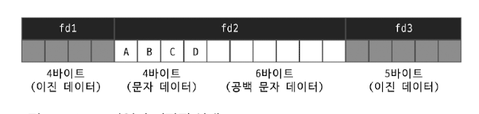
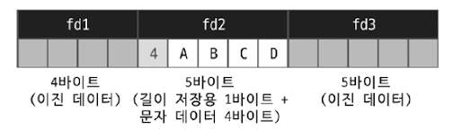
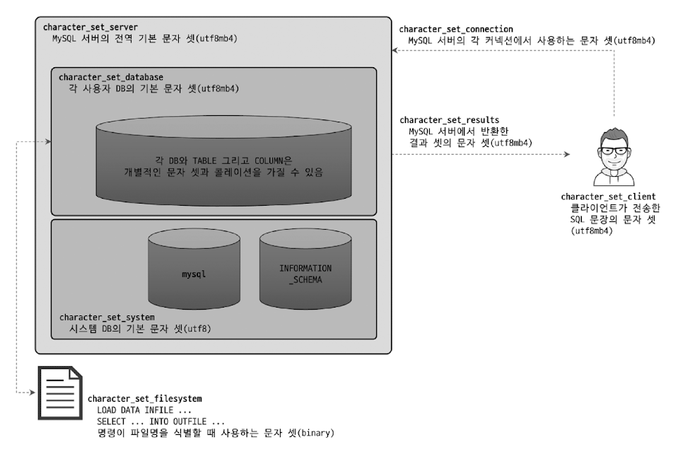

# Introduction
- 데이터 타입과 길이를 선정할 때 가장 주의할 사항
  - 저장되는 값의 성격에 맞는 최적의 타입을 선정 
  - 가변 길이 컬럼은 최적의 길이를 선정
  - 조인 조건으로 사용되는 컬럼은 똑같은 데이터 타입으로 선정 

---

---

# 15.1 문자열(CHAR, VARCHAR)
- CHAR
  - 문자열 
  - 고정 길이
- VARCHAR
  - 문자열
  - 가변 길이
- 1문자와 1byte는 다르다 
  - 문자 집합에 따라 문자는 1~4byte까지 공간을 사용하기 때문 

## 15.1.1 저장 공간
- VARCHAR는 저장된 값의 유효 크기가 얼마인지를 별도로 저장해야 함
  - 1~2byte의 저장 공간이 추가로 더 필요
    - 이는 길이를 관리하기 위한 공간 
  - 255byte 이하의 문자열은 1byte 
  - 256byte 이상의 문자열은 2byte
  - 즉, varchar는 2byte로 표현할 수 있는 길이 이상은 사용 불가능 
    - 65,536byte 이상으로 설정 불가 

### CHAR 타입과 VARCHAR 타입을 결정할 때 중요한 판단 기준 
- 저장되는 문자열의 길이가 대개 비슷한가?
- 컬럼의 값이 자주 변경되는가? 

- CHAR

- VARCHAR

- 차이 
  - ABCD → ABCDE 로 값을 변경할 경우
    - CHAR(10) : 10byte가 준비돼 있으므로 변경되는 컬럼 값을 업데이트하기만 하면 됨 
    - VARCHAR(10) : 4byte밖에 저장할 수 없는 구조로 만들어져 있음. 레코드 자체를 다른 공간으로 옮겨서 저장해야 함.

- 따라서, 길이가 고정적이거나 자주 변경될 수 있는 값은 CHAR 타입을 사용하는 것이 좋음
  - 자주 변경돼도 레코드가 물리적으로 다른 위치로 이동하거나 분리되지 않아도 되기 때문 

### CHAR, VARCHAR 키워드 뒤의 숫자 값의 의미 
- byte가 아니라 문자의 개수를 의미함
  - CHAR(10) = 10 글자(문자)를 저장할 수 있음 
  - 따라서 디스크나 메모리에서 실제로 사용하는 공간은 문자마다 달라짐 
    - ex: 영어를 포함한 서구권 언어 → 각 문자가 1byte → CHAR(10)은 10byte를 사용
    - ex: 한국어, 일본어 → 각 문자가 최대 2byte → CHAR(10)은 20byte까지 사용
    - ex: UTF-8과 같은 유니코드 → 각 문자가 최대 4byte → CHAR(10)은 40byte까지 사용

### utf8 vs utf8mb4
- utf-8 인코딩을 저장하기 위해 사용
  - utf-8 인코딩에서는 각 문자가 다음과 같이 구분 
    - 1byte : ascii 문자
    - 2byte : 추가 알파벳 문자
    - 3byte : bmp 문자 ([유니코드 평면 참고](https://ko.wikipedia.org/wiki/%EC%9C%A0%EB%8B%88%EC%BD%94%EB%93%9C_%ED%8F%89%EB%A9%B4))
    - 4byte : smp & sip & ... ([유니코드 평면 참고](https://ko.wikipedia.org/wiki/%EC%9C%A0%EB%8B%88%EC%BD%94%EB%93%9C_%ED%8F%89%EB%A9%B4))

- utf8 (== utf8mb3, deprecated)
  - 1~3 byte까지만 저장을 지원 
  - smp, sip, 그 이후 문자는 저장 불가 
  - 이모티콘 저장 불가 🥲

- utf8-mb4 (추후 utf8로 변경될 예정)
  - 최대 4byte 문자까지 저장 가능 
  - 유니코드에서 지원하는 대부분의 문자 지원 
  - utf8의 수퍼 셋(상위 셋)이기 때문에 utf8 → utf8-mb4로 전환하는 것은 아무런 문제를 유발하지 않음 

## 15.1.2 저장 공간과 스키마 변경(Online DDL)
- varchar 컬럼의 길이를 늘리는 작업은 길이에 따라 매우 빠르게 처리될 수도 있음
  - 하지만, 어떤 경우에는 테이블에 대해 읽기 잠금을 걸고 레코드를 복사하는 작업이 필요할 수도 있음 
- varchar 타입 컬럼이 가지는 길이 저장 공간의 크기 때문 
  - varchar(60)
    - utf8mb4를 사용할 경우, 최대 길이가 240(60 * 4)byte
      - 문자열 값의 길이를 저장하는 공간이 1byte면 됨
  - varchar(64)
    - utf8mb4를 사용할 경우, 최대 길이가 256(64 * 4)byte
      - 문자열 값의 길이를 저장하는 공간이 2byte로 바뀌어야 함 
  - 문자열 길이를 저장하는 공간의 크기가 바뀌게 되면, MySQL 서버는 스키마 변경을 하는 동안 읽기 락을 걸어 데이터 변경을 막고, 테이블 레코드를 복사한다 
    - 따라서, varchar 타입 길이가 크게 변경될 것으로 예상된다면 저장 공간의 크기가 바뀌지 않도록 미리 조금 크게 설계하자 

## 15.1.3 문자 집합(Character set)
- 컬럼은 서로 다른 문자 집합을 사용해서 문자열을 저장할 수 있음 
  - 테이블 단위로도 설정 가능
  - 테이블 default를 설정해도 컬럼마다 다른 문자 집합 사용 가능 
- 한글 기반 서비스
  - euckr or utf8mb4 
- 여러 나라의 언어를 지원하기 위해 utf8mb4가 주로 사용됨 
- ANSI 표준 
  - NCHAR,NATIONAL CHAR 컬럼 타입 정의 
    - NCHAR : MySQL 기준으로는 UTF-8 문자 집합을 사용하는 CHAR 타입으로 생성됨 
  - MySQL은 컬럼 단위로 문자 집합을 선택할 수 있기 때문에 잘 사용하진 않음 
- 적용 범위
  - 

### 클라이언트로부터 쿼리를 요청했을 떄의 문자 집합 변환 