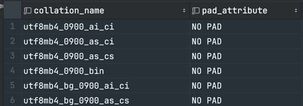
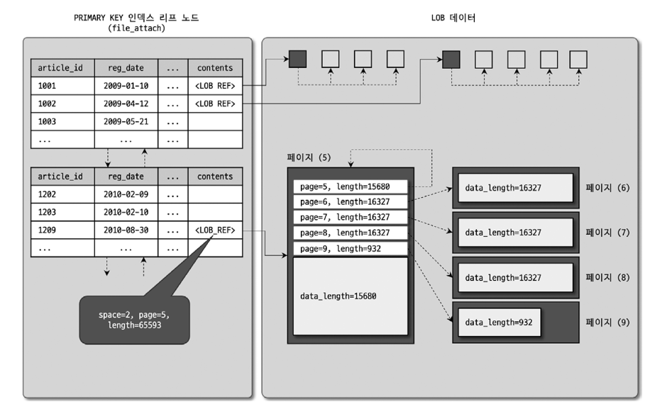

# Introduction
- 데이터 타입과 길이를 선정할 때 가장 주의할 사항
  - 저장되는 값의 성격에 맞는 최적의 타입을 선정 
  - 가변 길이 컬럼은 최적의 길이를 선정
  - 조인 조건으로 사용되는 컬럼은 똑같은 데이터 타입으로 선정 

---

---

# 15.1 문자열(CHAR, VARCHAR)
- CHAR
  - 문자열 
  - 고정 길이
- VARCHAR
  - 문자열
  - 가변 길이
- 1문자와 1byte는 다르다 
  - 문자 집합에 따라 문자는 1~4byte까지 공간을 사용하기 때문 

## 15.1.1 저장 공간
- VARCHAR는 저장된 값의 유효 크기가 얼마인지를 별도로 저장해야 함
  - 1~2byte의 저장 공간이 추가로 더 필요
    - 이는 길이를 관리하기 위한 공간 
  - 255byte 이하의 문자열은 1byte 
  - 256byte 이상의 문자열은 2byte
  - 즉, varchar는 2byte로 표현할 수 있는 길이 이상은 사용 불가능 
    - 65,536byte 이상으로 설정 불가 

### CHAR 타입과 VARCHAR 타입을 결정할 때 중요한 판단 기준 
- 저장되는 문자열의 길이가 대개 비슷한가?
- 컬럼의 값이 자주 변경되는가? 


- CHAR


- VARCHAR

- 차이 
  - ABCD → ABCDE 로 값을 변경할 경우
    - CHAR(10) : 10byte가 준비돼 있으므로 변경되는 컬럼 값을 업데이트하기만 하면 됨 
    - VARCHAR(10) : 4byte밖에 저장할 수 없는 구조로 만들어져 있음. 레코드 자체를 다른 공간으로 옮겨서 저장해야 함.

- 따라서, 길이가 고정적이거나 자주 변경될 수 있는 값은 CHAR 타입을 사용하는 것이 좋음
  - 자주 변경돼도 레코드가 물리적으로 다른 위치로 이동하거나 분리되지 않아도 되기 때문 


### CHAR, VARCHAR 키워드 뒤의 숫자 값의 의미 
- byte가 아니라 문자의 개수를 의미함
  - CHAR(10) = 10 글자(문자)를 저장할 수 있음 
  - 따라서 디스크나 메모리에서 실제로 사용하는 공간은 문자마다 달라짐 
    - ex: 영어를 포함한 서구권 언어 → 각 문자가 1byte → CHAR(10)은 10byte를 사용
    - ex: 한국어, 일본어 → 각 문자가 최대 2byte → CHAR(10)은 20byte까지 사용
    - ex: UTF-8과 같은 유니코드 → 각 문자가 최대 4byte → CHAR(10)은 40byte까지 사용


### utf8 vs utf8mb4
- utf-8 인코딩을 저장하기 위해 사용
  - utf-8 인코딩에서는 각 문자가 다음과 같이 구분 
    - 1byte : ascii 문자
    - 2byte : 추가 알파벳 문자
    - 3byte : bmp 문자 ([유니코드 평면 참고](https://ko.wikipedia.org/wiki/%EC%9C%A0%EB%8B%88%EC%BD%94%EB%93%9C_%ED%8F%89%EB%A9%B4))
    - 4byte : smp & sip & ... ([유니코드 평면 참고](https://ko.wikipedia.org/wiki/%EC%9C%A0%EB%8B%88%EC%BD%94%EB%93%9C_%ED%8F%89%EB%A9%B4))

- utf8 (== utf8mb3, deprecated)
  - 1~3 byte까지만 저장을 지원 
  - smp, sip, 그 이후 문자는 저장 불가 
  - 이모티콘 저장 불가 🥲

- utf8-mb4 (추후 utf8로 변경될 예정)
  - 최대 4byte 문자까지 저장 가능 
  - 유니코드에서 지원하는 대부분의 문자 지원 
  - utf8의 수퍼 셋(상위 셋)이기 때문에 utf8 → utf8-mb4로 전환하는 것은 아무런 문제를 유발하지 않음 


## 15.1.2 저장 공간과 스키마 변경(Online DDL)
- varchar 컬럼의 길이를 늘리는 작업은 길이에 따라 매우 빠르게 처리될 수도 있음
  - 하지만, 어떤 경우에는 테이블에 대해 읽기 잠금을 걸고 레코드를 복사하는 작업이 필요할 수도 있음 
- varchar 타입 컬럼이 가지는 길이 저장 공간의 크기 때문 
  - varchar(60)
    - utf8mb4를 사용할 경우, 최대 길이가 240(60 * 4)byte
      - 문자열 값의 길이를 저장하는 공간이 1byte면 됨
  - varchar(64)
    - utf8mb4를 사용할 경우, 최대 길이가 256(64 * 4)byte
      - 문자열 값의 길이를 저장하는 공간이 2byte로 바뀌어야 함 
  - 문자열 길이를 저장하는 공간의 크기가 바뀌게 되면, MySQL 서버는 스키마 변경을 하는 동안 읽기 락을 걸어 데이터 변경을 막고, 테이블 레코드를 복사한다 
    - 따라서, varchar 타입 길이가 크게 변경될 것으로 예상된다면 저장 공간의 크기가 바뀌지 않도록 미리 조금 크게 설계하자 


## 15.1.3 문자 집합(Character set)
- 컬럼은 서로 다른 문자 집합을 사용해서 문자열을 저장할 수 있음 
  - 테이블 단위로도 설정 가능
  - 테이블 default를 설정해도 컬럼마다 다른 문자 집합 사용 가능 
- 한글 기반 서비스
  - euckr or utf8mb4 
- 여러 나라의 언어를 지원하기 위해 utf8mb4가 주로 사용됨 
- ANSI 표준 
  - NCHAR,NATIONAL CHAR 컬럼 타입 정의 
    - NCHAR : MySQL 기준으로는 UTF-8 문자 집합을 사용하는 CHAR 타입으로 생성됨 
  - MySQL은 컬럼 단위로 문자 집합을 선택할 수 있기 때문에 잘 사용하진 않음 
- 적용 범위
  - 

### 클라이언트로부터 쿼리를 요청했을 때의 문자 집합 변환 
- 클라이언트로 받은 메세지(SQL 문장과 변수값)를 `character_set_connection`에 정의된 문자 집합으로 변경
  - SQL 문장의 별도의 문자 집합이 지정된 리터럴(문자열)은 변환 대상에 포함되지 않음
    - ex: `first_name=_latin1'Matt'` → 정의된 문자 집합으로 변경되지 않고, latin1으로 사용 (인트로듀서)

### 처리 결과를 클라이언트로 전송할 때의 문자 집합 변환 
- `character_set_results`에 정의된 문자 집합으로 변경해서 전송 
- 변환 전의 문자 집합과 변환 후의 문자 집합이 똑같은 경우 별도의 문자 집합 변환 작업은 생략함 
  - ex: `character_set_client`와 `character_set_connection`이 utf8mb4로 동일한 경우
  - ex: `character_set_results`와 `컬럼의 문자 집합`이 utf8mb4로 동일한 경우


## 15.1.4 콜레이션(Collation)
- 문자열 컬럼의 값에 대한 비교나 정렬 순서를 위한 규칙 
  - 비교나 정렬 작업에서 영문 대소문자를 같은 것으로 처리할 것인지, 더 크거나 작은 것으로 판단할지에 대한 규칙을 정의
  - 문자열 컬럼의 값을 비교하거나 정렬할 때는 문자 집합 뿐만 아니라 콜레이션 일치 여부에 따라 결과가 달라지고, 쿼리 성능에도 영향 

### 이해 
- 문자 집합은 2개 이상의 콜레이션을 가짐 
  - 하나의 문자 집합에 속한 콜레이션은 다른 문자 집합과 공유해서 사용할 수 없음 
- 문자 집합만 지정하면, 해당 문자 집합의 디폴트 콜레이션이 해당 컬럼의 콜레이션으로 지정됨 
  - 콜레이션만 지정하면, 해당 콜레이션이 소속된 문자 집합이 묵시적으로 해당 컬럼의 문자 집합으로 사용됨 
- 3개의 파트로 구성된 콜레이션 
  - `{문자 집합}_{하위 분류}_{대소문자 구분 여부}`
    - ex: utf8mb4_general_ci
      - utf8mb4 : 문자 집합의 이름 
      - general : utf8mb4 문자 집합의 하위 분류
      - ci : 대소문자 구분 여부
        - ci : 대소문자 구분하지 않음 (case insensitive)
        - cs : 대소문자 구분함 (case sensitive)
  - `utf8mb4_0900_...` 
    - 0900(9.0.0 버전): Unicode Collection Algorithm의 버전을 의미 (문자 비교 규칙)
    - 버전이 올라갈수록 문자 비교 규칙이 더 정교해지고 언어별 특성이 더 잘 반영돼있음 
  - `utf8mb4_..._ai_...`
    - ai 또는 as 등을 포함
    - ai : 액센트를 구분하지 않음 (accent insensitive)
    - as : 액센트를 구분함 (accent sensitive)
- 2의 파트로 구성된 콜레이션
  - `{문자 집합}_bin`
    - ex: utf8mb4_bin
      - utf8mb4 : 문자 집합의 이름 
      - bin : 항상 사용되는 키워드
        - binary 데이터를 의미함 
        - binary로 관리되는 문자열 컬럼은 별도의 콜레이션을 가지지 않음 
  - `xxx_bin`은 비교 및 정렬은 실제 문자 데이터의 byte 값을 기준으로 수행됨
- MySQL의 문자열 컬럼은 콜레이션 없이 문자 집합만 가질 수는 없음 
- 타입의 이름, 문자열의 길이, 문자 집합, 콜레이션까지 일치해야 똑같은 타입이다 
- 문자열 컬럼에서는 문자 집합, 콜레이션이 모두 일치해야 조인과 Where 조건이 인덱스를 효율적으로 사용할 수 있다 
- `NO PAD`
  - 문자열 뒤에 존재하는 공백도 유효 문자로 취급되어 비교 대상에 포함됨


## 15.1.5 비교 방식 

- MySQL의 문자열 컬럼 비교 방식은 CHAR, VARCHAR가 거의 같음
- 원래는 뒤에 공백 문자를 붙여서 두 문자열의 길이를 동일하게 만든 후 비교를 수행함 (PAD SPACE)
  - ex: `select 'ABC'='ABC    ' is_equal` → `true` → 뒤에 있는 공백은 없는 것처럼 비교
  - ex: `select 'ABC'='    ABC' is_equal` → `false` → 앞에 있는 공백은 유효한 문자로 비교 
- 하지만, `utf8mb4_0900_bin` 콜레이션을 사용하는 경우 공백이 비교 결과에 영향 
  - 즉, MySQL 8.0 이상부터는 공백 문자 또한 유효 문자로 취급 (NO PAD)
- PAD SPACE
  - 비교 대상 문자열의 길이가 같아지도록 문자열 뒤에 공백을 추가해서 비교 수행
- NO PAD
  - 별도로 문자열의 길이를 일치시키지 않고 그대로 비교 


## 15.1.6 문자열 이스케이프 처리 
- `\ `를 이용해서 이스케이프 처리 가능 

---

---

# 15.2 숫자 
- 숫자는 정확도에 따라 참값(Exact value)과 근사값 타입으로 나뉨 
  - 참값 : 소수점 이하 값의 유무와 관계없이 정확히 그 값을 그대로 유지 
    - INTEGER, XXXINT, DECIMAL
  - 근사값 : 부동 소수점이라고 불리는 값. 처음 컬럼에 저장한 값과 조회된 값이 정확하게 일치하지 않고 최대한 비슷한 값으로 관리하는 것 
    - 유효 자릿수를 넘어서는 소수점 이하의 값이 계속 바뀔 수 있음 
      - STATEMENT 포맷을 사용하는 복제 서버에서는 소스 서버와 레플리카 서버 간 데이터 차이가 발생할 수 있음 
    - FLOAT, DOUBLE
      - 잘 사용하지 않음 
- 저장되는 포맷에 따라 십진 표기법(DECIMAL)과 이진 표기법으로 나뉨 
  - 이진 표기법 : 정수나 실수 타입. 1byte로 256까지의 양수를 표현할 수 있음. 
    - 숫자 값을 적은 메모리나 디스크 공간에 저장 가능 
    - INTEGER, BIGINT, 등 대부분의 숫자 타입은 모두 이진 표기법 이용
  - 십진 표기법 : 숫자의 각 자릿값을 표현하기 위해 4bit나 1byte를 이용하여 표기하는 방법 
    - 십진수가 아니라, 십진 표기법으로 저장된다는 것을 의미 
    - DECIMAL 타입만 십진 표기법을 사용
      - 65자리까지 저장 가능 → BIGINT로 저장 불가능한 값을 사용할 때도 사용됨 
    - 금액(돈)처럼 정확하게 소수점까지 관리되어야하는 값을 저장할 때 사용 
- 일반적으로...
  - 매우 큰 숫자 값이나 고정 소수점을 저장해야 하는 것이 아니면 일반적으로 INTEGER나 BIGINT 타입을 자주 사용함 


## 15.2.1 정수
| 데이터 타입    | 저장 공간(Bytes) | 최솟값(Signed) | 최솟값(Unsigned) | 최댓값(Signed) | 최댓값(Unsigned) |
|-----------|--------------|-------------|---------------|-------------|---------------|
| TINYINT   | 1            | -128        | 0             | 127         | 255           |
| SMALLINT  | 2            | -32768      | 0             | 32767       | 65535         |
| MEDIUMINT | 3            | -8388608    | 0             | 8388607     | 16777215      |
| INT       | 4            | -2147483648 | 0             | 2147483647  | 4294967295    |
| BIGINT    | 8            | -263        | 0             | 263-1       | 264-1         |


## 15.2.2 부동 소수점
- 부동 소수점(Float point)
  - 소수점의 위치가 고정적이지 않다는 의미 
  - 숫자 값의 길이에 따라 유효 범위의 소수점 자릿수가 바뀜 
  - 동등 비교 사용불가 
- Float
  - 정밀도를 명시하지 않는 경우 4byte를 사용해 유효 자릿수를 8개까지 유지함 
  - 정밀도를 명시한 경우 최대 8byte까지 사용 
- Double
  - 8byte의 저장 공간을 필요로 하며, 최대 유효 자릿수를 16개까지 유지 
- 부동 소수점 사용 시 복제 서버와 소스 서버간 데이터가 달라질 수 있음을 주의
  - STATEMENT 포맷을 사용 시 주의 


## 15.2.3 DECIMAL
- 소수점의 위치가 가변적이지 않은 고정 소수점 타입을 제공 
- 금액, 대출이자 등 고정된 소수점까지 정확하게 관리해야 할 때 사용 
- 숫자 하나를 저장하는 데 1/2byte 필요
  - (숫자의 자릿수)/2 의 결괏값을 올림 처리한 만큼의 byte 수 필요 


## 15.2.5 자동 증가(AUTO_INCREMENT) 옵션 사용
- AUTO_INCREMENT 옵션을 사용한 컬럼은 PK나 유니크 키의 일부로 정의해야 함 
- 컬럼값 증가 패턴
  - MyISAM : PK나 유니크 키의 아무 위치에나 사용 가능 
  - InnoDB : AUTO_INCREMENT 컬럼으로 시작되는 인덱스(PK or 세컨더리 인덱스)를 생성해야 함. 
    - 뒤쪽에 배치하면 오류 발생 
- AUTO_INCREMENT 컬럼은 테이블 당 하나만 사용 가능
- `SHOW CREATE TABLE` 명령에 지금 사용중인 최종 AUTO_INCREMENT 값이 포함됨 

---

---

# 15.3 날짜와 시간
- 날짜와 시간 데이터 타입 별 차지하는 저장 공간 크기
| 데이터 타입    | 저장 공간 크기(byte)     |
|-----------|--------------------|
| YEAR      | 1                  |
| DATE      | 3                  |
| TIME      | 3 + (밀리초 단위 저장 공간) |
| DATETIME  | 5 + (밀리초 단위 저장 공간) |
| TIMESTAMP | 4 + (밀리초 단위 저장 공간) |


- 밀리초 단위 자릿수 당 차지하는 저장 공간 크기
  - 두 자리 당 1byte씩 공간이 더 필요함 
| 밀리초 단위 자릿수 | 저장 공간 크기(byte) |
|------------|----------------|
| 없음         | 0              |
| 1,2        | 1              |
| 3,4        | 2              |
| 5,6        | 3              |

- 밀리초 단위 데이터 저장 시
  - DATETIME, TIME, TIMESTAMP 타입 뒤에 괄호와 함께 숫자를 표기 
    - ex: DATETIME(3), TIME(2), TIMESTAMP(6), NOW(3)...

- MySQL의 날짜 타입은 컬럼 자체에 **타임존 정보가 저장되지 않음**
  - DATETIME, DATE 타입은 현재 dbms의 커넥션의 타임존과 관계 없이 틀라이언트로부터 입력된 값을 그대로 저장하고, 조회할 때도 변환 없이 그대로 출력 
- TIMESTAMP
  - UTC 타임존으로 저장됨 
  - 타임존이 달라지면 값이 자동으로 보정 됨 

- JDBC와 MySQL
  - JDBC 드라이버는 날짜 및 시간 정보를 MySQL 타임존에서 JVM의 타임존으로 변환해서 출력함 (`getTimestamp()` 사용 시 타임존 자동 변환)
  - 다른 방식으로 가져오면 타임존 변환이 되지 않을수도 있음 

## 15.3.1 자동 업데이트 
- DATETIME, TIMESTAMP 타입은 자동으로 업데이트되는 기능을 제공 
  - `DEFAULT CURRENT_TIMESTAMP` : INSERT 시 자동으로 현재 시간으로 설정 
  - `ON UPDATE CURRENT_TIMESTAMP` : UPDATE 시 자동으로 현재 시간으로 설정

---

---

# 15.4 ENUM과 SET
- 내부적으로 숫자 값으로 매핑해서 관리하는 타입

## 15.4.1 ENUM
- 테이블에 구조(메타데이터)에 나열된 목록 중 하나의 값을 가질 수 있음 
- 주 용도 : 코드화된 값을 관리하는 것 
- 최대 65,535개의 값을 가질 수 있음
  - 아이템 개수가 255개 미만 : 1byte
  - 아이템 개수가 255개 이상 : 2byte
- 단점
  - ENUM 컬럼에 저장되는 문자열 값이 테이블의 구조(메타 정보)가 되어버림
    - 새로운 타입을 추가해야 할 경우, 테이블 구조를 변경해야 함
    - 맨 마지막에 추가할 경우에는 테이블 리빌드가 필요 없음 
      - ex: `ENUM('A','B','C')` → `ENUM('A','B','C','D')` 테이블 리빌드 필요 X (INSTANT)
      - ex: `ENUM('A','B','C')` → `ENUM('A','D','B','C')` 테이블 리빌드 필요 O (COPY, SHARED LOCK)
- ENUM 타입으로 정렬할 경우
  - 문자열 값 기준이 아니라, 매핑된 코드 값으로 정렬이 수행됨 
    - ex: `ENUM('A','C','B')`인 경우, `A`, `C`, `B` 순으로 정렬됨
  - 문자열 값 기준으로 하고싶다면 문자열로 타입 캐스팅하여 수행해야 됨
    - 인덱스를 이용한 정렬 사용 불가. 주의해서 사용해야 함. 
- 장점
  - 테이블 메타데이터에 정의된 코드 값만 사용할 수 있게 강제화 
  - 서버의 디스크 저장 공간 크기 감소 
    - ENUM 타입은 내부적으로 숫자 값으로 매핑해서 관리하기 때문에 저장 공간 크기가 작음
    - InnoDB 버퍼 풀 관리 측면에서도 효율적 (메모리를 효율적으로 사용)


## 15.4.2 SET
- ENUM과 동일하게 구조에 정의된 아이템을 정숫값으로 매핑해서 저장
- 차이점
  - ENUM은 컬럼에 1개 값만 저장 가능
  - SET은 컬럼에 1개 이상의 값을 저장 가능 (내부적으로 BIT-OR 연산 → 1개 이상의 선택된 값 저장)
    - 여러 개의 값을 저장하나, 실제 여러 개의 값을 저장하는 공간을 가지는게 아님
- 각 아이템 값에 매핑되는 정숫값은 1씩 증가하는 정숫값이 아니라 2n의 값을 가짐 
- 8개 이하 : 1byte
- 9개 이상 ~ 16개 이하 : 2byte
- ... 최대 8byte까지 사용 


```mysql
CREATE TABLE `tb_set` (
  `fd_set` set('TENNIS', 'BASKETBALL', 'BASEBALL', 'FOOTBALL', 'SOCCER', 'GOLF') 
);
    
insert into tb_set values ('SOCCER'), ('TENNIS,BASKETBALL');

+-------------------+
| fd_set            |
|-------------------|
| SOCCER            |
| TENNIS,BASKETBALL |
+-------------------+

select * from tb_set where find_in_set('TENNIS', fd_set);
+-------------------+
| fd_set            |
|-------------------|
| TENNIS,BASKETBALL |
+-------------------+

select * from tb_set where fd_set like '%TENNIS%';
+-------------------+
| fd_set            |
|-------------------|
| TENNIS,BASKETBALL |
+-------------------+
```

- SET 타입 아이템 중간에 새로운 아이템이 추가될 경우 리빌드 작업 필요 (COPY, SHARED LOCK)
  - 맨 마지막에 추가할 경우 INSTANT로 처리 
- 아이템 개수가 바뀔 때, 저장공간이 바뀌는 경우(ex: 8개 → 9개) 리빌드 필요


---

---

# 15.5 TEXT와 BLOB
- 대량의 데이터를 저장하는 경우 사용되는 타입 
  - TEXT: 문자열을 저장하는 대용량 컬럼 (문자 집합, 콜레이션을 가짐)
  - BLOB: 이진 데이터 타입 (문자 집합, 콜레이션을 가지지 않음)

| 데이터 타입                 | 필요 저장 공간 <br/> (L = 저장하고자 하는 데이터의 byte 수) | 저장 가능한 최대 byte 수         |
|------------------------|-------------------------------------------|--------------------------|
| TINYTEXT, TINYBLOB     | L + 1byte                                 | 2^8  - 1 (255)           |
| TEXT, BLOB             | L + 2byte                                 | 2^16 - 1 (65,535)        |
| MEDIUMTEXT, MEDIUMBLOB | L + 3byte                                 | 2^24 - 1 (16,777,215)    |
| LONGTEXT, LONGBLOB     | L + 4byte                                 | 2^32 - 1 (4,294,967,295) |

- TEXT, BLOB은 대용량 데이터 타입이다. 사용 시 주의해야 하고 남용해서는 안된다.
  - 다음과 같은 상황에 주로 사용
    - 컬럼 하나에 저장되는 문자열이나 이진 데이터값의 길이가 예측할 수 없이 큰 경우
    - 일반적으로 MySQL에서는 하나의 레코드의 전체 크기가 64kb를 넘을 수 없다. 즉, 64kb 이하로는 varchar, varbinary 타입도 사용할 수 있다.
      - 따라서, 64kb를 넘어 서서 더 큰 컬럼을 추가할 수 없는 경우 일부 컬럼을 text나 blob 타입으로 전환해야 할 수도 있다. 
      - 실무 팁: 전문 검색 인덱스(full text index)는 사용하지 말자 

### TEXT와 BLOB을 다른 레코드와 같이 저장하기 어려운 이유 
- COMPACT 포맷 기준 설명
  - 저장 가능한 레코드 하나의 최대 길이 = 데이터 페이지 크기인 16kb의 절반인 8126byte
  - MySQL은 blob, text 컬럼을 가능한 레코드에 같이 포함해서 저장하려고 함
  - 하지만, 레코드 전체 길이가 8126byte를 넘어설 경우, 용량이 큰 컬럼 순서대로 외부 페이지(Off-page or External-page)로 옮기면서 레코드를 8126byte 이하로 맞추려고 할 것임
    - 각 페이지를 체인으로 연결 
    - 
  - 외부 페이지로 저장하는 경우
    - COMPACT, REDUNDANT: 외부 페이지로 저장된 TEXT, BLOB 컬럼의 앞쪽 768byte(blob prefix)만 잘라서 PK 페이지에 같이 저장 
    - DYNAMIC, COMPRESSED: blob prefix를 프라이머리 키 페이지에 저장하지 않음.
      - prefix가 인덱스 생성 시 도움이 되기도 하지만, blob, text 컬럼을 가진 테이블의 저장 효율을 낮추게 될 수도 있음 
      - prefix는 pk 페이지에 저장할 수 있는 레코드의 건수를 줄이지만, blob, text를 참조하지 않는 쿼리는 성능이 더 떨어짐 

| blob의 길이 | text의 길이 | blob의 저장 위치 | text의 저장 위치 |
|----------|----------|-------------|-------------|
| 3000     | 3000     | 프라이머리 키 페이지 | 프라이머리 키 페이지 |
| 3000     | 10000    | 프라이머리 키 페이지 | 외부 페이지      |
| 10000    | 10000    | 외부 페이지      | 외부 페이지      |


---

---

# 15.6 공간 데이터 타입 
- OpenGIS 표준을 준수함 
  - WKT(Well-Known Text), WKB(Well-Known Binary)를 이용해 공간 데이터 관리 
- 데이터 타입
  - POINT, LINESTRING, POLYGON
    - 하나의 단위 정보만 가질 수 있음 
      - POINT → 하나의 점
      - LINESTRING → 하나의 라인 
      - POLYGON → 하나의 다각형 
  - GEOMETRY
    - POINT, LINESTRING, POLYGON의 수퍼 타입 
      - 3개 객체 모두 저장 가능 
    - 하나의 객체만 저장 → 결국 하나의 점이나 선, 다각형만 저장 가능
    - BLOB 객체로 관리됨 
  - MULTIPOINT, MULTILINESTRING, MULTIPOLYGON
    - 종류 별로 여러 개의 객체를 저장할 수 있음 
      - MULTIPOINT → 여러 개의 POINT
      - MULTILINESTRING → 여러 개의 LINESTRING
      - MULTIPOLYGON → 여러 개의 POLYGON
  - GEOMETRYCOLLECTION
    - MULTIPOINT, MULTILINESTRING, MULTIPOLYGON의 수퍼 타입
      - 3개 객체 모두 저장 가능

---

---

# 15.7 JSON 타입
- BSON(Binary JSON) 타입으로 저장 

## 15.7.1 저장 방식
- 내부적으로 JSON 타입 값은 BLOB에 저장함 
  - JSON → BSON으로 변환해서 저장 
  - JSON 자체를 저장하는 것 보다 공간 효율이 높은 편 

## 15.7.2 부분 업데이트 성능 
- JSON 타입은 부분 업데이트가 가능함 
  - JSON_SET, JSON_REPLACE, JSON_REMOVE 함수를 이용한 부분 업데이트만 가능 

## 15.7.4 JSON 컬럼 선택
### 정규화된 컬럼 vs JSON 컬럼 
- 정규화된 컬럼을 추천함 
  - 컬럼이 차지하는 파일 공간 
    - 정규화된 컬럼: 컬럼 이름을 메타 정보로만 저장 → 컬럼 이름이 별도로 데이터 파일의 공간을 차지하지 않음 
    - JSON 컬럼: 각 필드 이름이 데이터 파일에 매번 저장돼야 함
  - BLOB, TEXT의 관리 
    - 정규화된 컬럼: 대용량 데이터를 외부 페이지로 관리 
      - 메모리 효율, 쿼리 성능을 끌어올릴 수 있음 
    - JSON 컬럼: 하나의 컬럼에 저장 
      - 응용 프로그램의 요건이나 쿼리가 필요한 데이터 등을 선별적으로 접근함으로써 얻을 수 있는 성능 효과를 기대하기 어려움 
      - 레코드를 통째로 하나의 JSON 컬럼에 저장하기 때문에, 정숫값 하나만 참조하더라도 JSON 컬럼에 저장된 도큐먼트를 모두 읽어봐야 하기 때문 

---

---

# 15.8 가상 컬럼(파생 컬럼)
- 컬럼을 정의하는 한 가지 방법 
- MySQL의 가상 컬럼의 구분 
  - Virtual Column
    - 컬럼 값이 디스크에 저장되지 않음
      - 인덱스가 생성된 가상 컬럼의 경우, 필요 시 인덱스 리빌드 작업 필요 
    - 컬럼 구조 변경이 테이블 리빌드를 필요로 하지 않음 
    - 컬럼의 값은 레코드가 읽히기 전, 또는 before 트리거 실행 직후에 계산되어 만들어짐 
  - Stored Column
    - 컬럼의 값이 물리적으로 디스크에 저장됨
    - 컬럼의 구조 변경 시, 다른 일반 테이블과 동일하게 "필요 시 테이블 리빌드" 방식으로 처리됨 
    - INSERT, UPDATE 시점에만 컬럼의 값이 계산됨 
- 가상 컬럼은 다른 컬럼의 값을 참조해서 계산된 값을 관리함 
- 사용자 변수, NOT-DETERMINISTIC 옵션의 함수나 표현식 사용 불가 
- 선택 기준
  - CPU 사용량을 조금 높여서 디스크 부하를 낮출 것인지 → 가상 컬럼 
  - 디스크 사용량을 조금 높여서 CPU 사용량을 낮출 것인지 → 스토어드 컬럼 