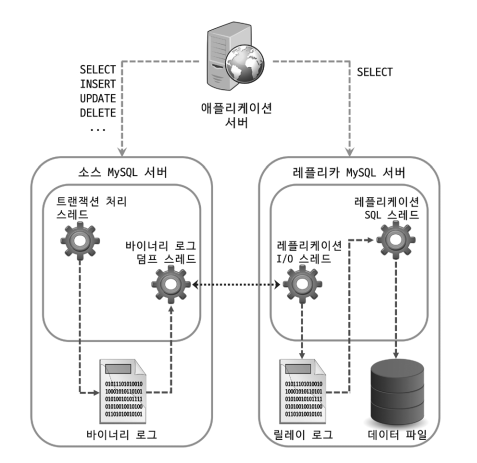
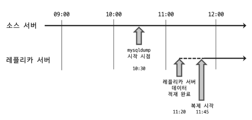

# 16장 복제

- DB 사용시 가장 중요한 두가지 요소는 **확장성** 과 **가용성**이다.

# 16.1 개요
- 복제: 다른 서버로 데이터가 동기화 되는 것을 의미
  - 소스 서버: 원본 데이터를 가진 서버, 데이터와 스키마에 대한 변경이 최초로 발생
  - 레플리카 서버: 복제된 데이터를 가진 서버, 소스 서버로부터 변경 내역을 전달받아 가지고 있는 데이터에 반영해 소스서버와 동기화
- 복제를 통한 레플리카 서버 구축 목적
  1. 스케일 아웃(Scale-out)
     - DB 서버의 트래픽이 늘어 서버 부하가 높아졌을 때 애플리케이션으로 부터 실행되는 쿼리를 분산
     - 스케일 업 방식보다 트래픽 대응에 유연한 구조
       - 스케일 업: 서버 사양 업그레이드
  2. 데이터 백업
     - 동일한 서버 내에서 실행되어 발생할 수 있는 문제점을 방지
     - 소스 서버에 문제가 생겼을 때 저장된 레플리카 서버 데이터로 복구하거나 대체 서버의 역할을 담당
  3. 데이터 분석
     - 대량의 데이터나 복잡한 연산을 수행하는 경우 서비스에 영향을 줄 수 있는데 이때 레플리카 서버를 사용해 분석용 쿼리만 전용으로 실행
  4. 데이터의 지리적 분산
     - DB 서버와 애플리케이션 서버가 서로 떨어져이쓴 경우 두 서버 간 통신 시간이 길어지는데 레플리사 서버를 애플리케이션 서버 가깝게 두어 응답속도를 개선한다.

# 16.2 복제 아키텍처
- 서버에서 발생하는 변경사항을 별도의 로그파일에 순서대로 기록하는데, 이를 **바이너리 로그** 라고 한다.
- 바이너리 로그에 기록된 각 변경 정보들을 **이벤트** 라고 한다.
- 복제는 바이너릐 코드를 기반으로 소스 서버에서 생성된 바이너리 로그가 레플리카 서버로 전송되고, 레플리카 서버에서 해당 내용을 로컬 디스크에 반영해 소스 서버와 레플리카 서버 간 데이터를 동기화한다.

  - 바이너리 로그 덤프 스레드(Binary Log Dump Thread)
    - 레플리카 서버와 연결될때 소스 서버에 생성되는 스레드
    - 바이너리 로그를 레플리카 서버에 전송
    - 레플리카 서버로 보낼 이벤트를 읽을 때 일시적으로 잠금 수행, 읽고난 후 잠금을 해제
    - 소스 서버에서 `SHOW PROCESSLIST` 명령으로 확인이 가능하다.
  - 레플리케이션 I/O 스레드(Replication I/O Thread)
    - 복제 시작시 레플리카 서버에서 생성, 복제가 멈추면 스레드도 종료된다.
    - 소스 서버의 바이너리 로그 이벤트를 가져와 로컬 서버의 파일(릴레이 로그)로 저장하는 역할을 담당
  - 레플리케이션 SQL 스레드(Replication SQL Thread)
    - I/O 스레드에 의해 저장된 릴레이 로그 파일의 이벤트를 읽고 실행

- 복제가 시작되면 레플리카 서버에서 생성하고 관리하는 데이터
  - 릴레이 로그: 소스 서버의 바이너리 로그에서 읽은 이벤트(트랜잭션) 정보가 저장
  - 커넥션 메타데이터: 소스 서버 연결에 사용하는 DB 계정정보, 소스 서버의 바이너리 파일명과 위치 등을 가지고 있다.
  - 어플라이어 메타데이터: 최근 저장된 이벤트에 대한 릴레이 로그 파일명과 파일 내 위치 정보를 가지고 있음
    - 어플라이어: 릴레이 로그에 저장된 소스 서버 이벤트를 레플리카 서버에 적용하는 컴포넌드를 의미

- 책에 나와있는 설정 값들은 더이상 사용되지 않고 다른 설정들이 추가됨  [문서](https://dev.mysql.com/doc/refman/8.0/en/replication-options-replica.html)

# 16.3 복제 타입
- 소스 서버의 바이너리 로그 이벤트를 어떻게 식별해 가져오냐에 따라 두가지 방식으로 분류된다.
## 16.3.1 바이너리 로그 파일 위치 기반 복제
> 일반적인 복제 구축 과정
> - 소스서버에서 레플리카 서버로 데이터를 어떤 순서로 가져올지 정한다.
> - 설정된 레플리카 소스는 어느 이벤트까지 가져왔고, 적용했는지에 대한 정보를 관리한다.
> - 관리된 데이터를 바탕으로 다시 소스 서버로 부터 데이터를 가져온다.
> - 따라서 각 이벤트에 대한 식별이 반드시 필요하다.

- 바이너리 로그 파일 위치 기반 복제에서는 이벤트 하나하나를 바이너리 로그 파일 명과 파일 내 위치 값의 조합으로 식별한다.
  - 각 이벤트로 관리되기 때문에 복제를 일시적으로 중지했다 재개하는게 가능하다.
- 복제에 참여한 서버는 고유한 server_id 를 가지고 있어야하고, 소스 서버와 레플리카 서버 아이디가 중복되지 않아야한다.
  - server_id는 MySQL 서버의 시스템 변수로 사용자 변경이 가능한데, 기본값이 1이기 때문에 복제시 주의해야한다.

### 16.3.1.1 바이너리 로그 파일 위치 기반의 복제 구축
`설정 준비`
- 소스 서버
  - 바이너리 로그 활성화 확인
  - server_id 가 고유한지 확인
  - `SHOW MASTER STATUS;` 명령어로 바이너리 로그가 정상 저장되고 있는지 확인이 가능
- 레플리카 서버
  - 고유한 server_id 확인
  - 릴레이 서버는 적용된 후 자동으로 제거되는데 유지하고자 한다면 `relay_log_purge` 변수를 OFF 로 설정
  - 보통은 읽기 전용으로 `read_only` 를 설정하는게 좋다
  - 소스 서버 장애로 레플리카 서버가 대체될 수 있는 점을 고려해 `log_slave_updates` 변수도 명시하는게 좋다

`복제 계정 준비`
- 복제에 사용되는 계정 정보는 레플리카 서버 메타데이터에 평문으로 저장되기 때문에 보안을 위해 별도의 계정을 생성하는게 좋다
- 계정은 반드시 `REPLICATION SLAVE` 권한을 가지고 있어야한다.

`데이터 복사`
- 일반적으로 데이터가 크지 않다면 mysqldump를 많이 사용
- mysqldump 를 사용한 데이터 복사시 필수 설정 옵션
  - `--single-transaction`: 덤프시 하나의 트랜잭션 사용으로 잠금없는 일관된 데이터를 읽어 덤프할 수 있게 설정해줌
  - `--master-data`: 덤프 시작 시점의 바이너리 로그 파일명과 위치 정보를 포함한 설정 구문이 덤프파일 헤더에 기록해줌
    - 옵션 1 설정시 덤프 파일 내 복제 설정 구문이 실제 실행 가능 형태로 기록
    - 옵션 2 설정시 주석으로 처리되어 참조만 할 수 있게 기록
- 데이터 덤프 후 덤프된 파일을 레플리카 서버로 옮겨 적재를 진행

`복제 시작`

- 