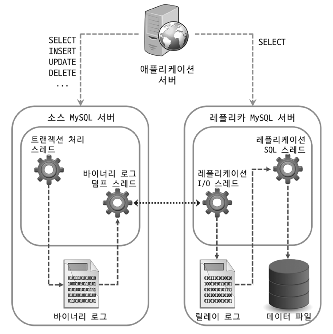
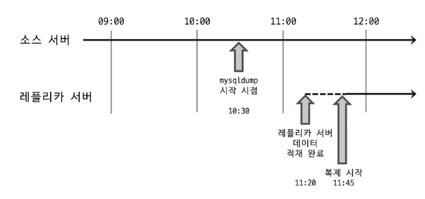

# Introduction
- DB를 사용하고 운영할 때 가장 중요한 두 가지 요소
  - 확장성(Scalability)
    - 대용량 트래픽을 안정적으로 처리하기 위해서는 db 서버의 확장이 필수적임
  - 가용성(Availability)
    - 사용자가 안정적인 서비스를 이용할 수 있게 하려면 이것이 뒷받침 되어야 함 
- 이를 위해 일반적으로 이용되는 기술이 복제(Replication)임 

---

---

# 16.1 개요 
- 복제란?
  - 한 서버에서 다른 서버로 데이터가 동기화되는 것 
  - 소스 서버: 원본 데이터를 가진 서버
  - 복제 서버: 레플리카 서버. 복제된 데이터를 가지는 서버 
- 소스 서버에서 데이터 및 스키마에 대한 변경이 발생하면 → 레플리카 서버에서 변경 내역을 전달받아 데이터에 반영 → 동기화!
- 대부분의 DBMS에서는 복제 기능을 제공함 
  - DB 서버 구축 시, 소스 서버 한대와 레플리카 서버 N대를 함께 구축함 

## 레플리카 서버 구축 목적 
### 1. 스케일 아웃(Scale-out)
- 사용자↑ → 트래픽↑ → DB 서버 부하↑ → DB 서버 확장 필요
- 확장 방법 
  - 스케일 업(Scale-up)
    - 사양을 업그레이드함 
    - 애플리케이션 단의 변화 없이 DB 서버의 성능을 향상시킬 수 있음
    - 하지만 일시적임 
      - 한 대에서 처리할 수 있는 양에는 한계가 있기 때문 
  - 스케일 아웃(Scale-out)
    - 동일한 데이터를 가진 DB 서버를 한 대 이상 더 사용하여 애플리케이션으로 부터 실행되는 쿼리들을 분산하는 방법
    - 갑자기 늘어난 트래픽을 대응하는 데 훨씬 더 유연한 구조
    - 좀 더 안정적인 운영 가능 
    - 복제를 사용해 스케일 아웃 가능

### 2. 데이터 백업 
- 데이터를 주기적으로 백업하는 작업이 필수임 
- 동일한 서버 내에서 백업이 실행되는 경우, 백업 프로그램과 DBMS가 서버의 자원을 공유해서 사용함 
  - 백업으로 인해 실행 중인 쿼리들이 영향을 받을 수 있음 
  - 심각한 경우, 처리 속도가 느려져 서비스에 문제가 발생할 수도 있음 
- 이를 해결하기 위해 복제를 사용해 레플리카 서버를 구축 
  - 데이터 백업은 레플리카 서버에서 실행 
  - 백업용 레플리카 서버는 소스 서버에 문제가 발생할 경우 대체 서버로 활용될 수 있음

### 3. 데이터 분석 
- 소스 서버에서는 기본적으로 서비스에서 사용되는 쿼리들이 실행됨 
- 차세대 비즈니스 모델을 발굴하기 위해서나, 좀 더 서비스를 발전시킬만한 인사이트를 얻기 위해 분석용 쿼리 실행이 필요할 수 있음 
  - 분석용 쿼리는 대용량 데이터를 조회하는 경우가 많고, 집계 연산을 하는 등 쿼리 자체가 굉장히 복잡하고 무거운 경우가 대부분임 
  - 서버의 리소스가 많이 필요 → 서비스에서 사용되는 쿼리에 영향을 미칠 수 있음 
- 서비스에서 사용되는 서버에 영향을 주지 않기 위해, 레플리카 서버에서 분석용 쿼리만 실행될 수 있는 환경을 구축하는 것이 좋음 

### 4. 데이터의 지리적 분산 
- 애플리케이션 서버와 DB 서버는 지리적으로 근접한 위치에 존재 할수도 있고, 장거리로 떨어져 있을 수도 있음 
  - 서로 떨어져 있는 경우, 두 서버 간의 통신 시간은 떨어진 거리만큼 비례해서 늘어나버림 
  - 서비스 응답 속도는 애플리케이션 서버의 처리 속도 뿐만 아니라, 서버 간 통신 속도에도 영향을 받음 
  - 빠른 응답 속도 제공을 위해, 애플리케이션 서버와 DB 서버가 가깝게 위치하는 것이 좋음 
- 레플리카 서버를 구축해 지리적으로 가깝게 두고, 애플리케이션 서버가 이를 사용하게 하여 응답 속도를 개선할 수 있음 

---

---

# 16.2 복제 아키텍처
### 바이너리 로그
- 모든 변경 사항을 기록하는 로그 파일 
- 데이터 변경 내역 뿐만 아니라, db나 테이블 구조 변경, 계정이나 권한 변경 정보까지 모두 저장함 
  - 각 변경 정보들을 이벤트라고 함
- MySQL의 복제 기반이 되는 로그  

### 복제 동기화 과정 

- 소스 서버 → 바이너리 로그 생성 → 레플리카 서버로 전송 → 저장 및 데이터 반영 (동기화)
  - 레플리카 서버는 바이너리 로그를 읽어 따로 로컬 디스크에 저장함 = 릴레이 로그 
- 복제에는 세 개의 스레드가 관여 
  - 소스 서버
    - 바이너리 로그 덤프 스레드
  - 레플리카 서버
    - 레플리케이션 I/O 스레드 
    - 레플리케이션 SQL 스레드

### 각 스레드의 역할  
- 바이너리 로그 덤프 스레드 
  - 소스 서버에서 레플리카 서버가 연결될 때 생성되는 스레드 
  - 과정 
    - 레플리카 서버가 데이터 동기화를 위해 소스 서버에 접속 → 바이너리 로그 정보 요청 → 소스 서버가 바이너리 로그 덤프 스레드 생성 → 바이너리 로그 정보를 레플리카 서버로 전송 
  - 레플리카 서버에 보낼 각 이벤트를 읽을 때, 일시적으로 바이너리 로그에 잠금을 수행 
    - 읽고난 후 바로 잠금 해제 

- 레플리케이션 I/O 스레드
  - 복제가 시작되면 레플리카 서버에서 생성되는 스레드
    - 복제가 멈추면 종료됨 
  - 소스 서버의 바이너리 로그 덤프 스레드로부터 바이너리 로그 이벤트를 가져와 릴레이 로그에 저장

- 레플리케이션 SQL 스레드 
  - 릴레이 로그 파일의 이벤트들을 읽고 실행하는 스레드

### 특징
- 레플리카 서버에서 레플리케이션 I/O 스레드와 SQL 스레드는 서로 독립적으로 동작함 
- 레플리카 서버에서 소스 서버의 변경 사항들이 적용되는 것은 소스 서버의 동작과 별개로 진행됨 
  - 레플리카 서버에 문제가 생기더라도 소스 서버는 전혀 영향을 받지 않음
- 소스 서버에 문제가 생겨 레플리카 서버의 I/O 스레드가 정상적으로 동작하지 않게 되면, 복제는 에러를 발생시키고 바로 중단됨 
  - 레플리카 서버의 복제 기능만 중단된 것임 
  - 쿼리 처리는 아무런 문제가 없음 
  - 동기화가 되지 못하기 때문에 예전 상태의 데이터를 가지고있을 수 있음 

### 복제 관련 데이터 
- 릴레이 로그 
  - 레플리케이션 I/O 스레드에 의해 작성되는 로그 파일 
  - 소스 서버의 바이너리 로그에서 읽어온 이벤트(트랜잭션) 정보가 저장됨 
  - "현재 존재하는 릴레이 로그 파일들의 목록이 담긴 인덱스 파일 + 실제 이벤트 정보가 저장돼 있는 로그 파일"로 구성
  - 저장된 트랜잭션 이벤트들은 레플리케이션 SQL 스레드에 의해 레플리카 서버에 적용됨 

- 커넥션 메타데이터 
  - 레플리케이션 I/O 스레드에서 소스 서버에 연결할 때 사용하는 정보 
  - DB 계정 정보, 현재 읽고 있는 소스 서버의 바이너리 파일명, 파일 내 위치 값 등이 담겨있음 

- 어플라이어(Applier) 메타데이터
  - 어플라이어 
    - 레플리케이션 SQL 스레드에서 릴레이 로그에 저장된 소스 서버의 이벤트들을 레플리카 서버에 적용하는 컴포넌트
  - 어플라이어 메타데이터
    - 최근 적용된 이벤트에 대해 해당 이벤트가 저장돼 있는 릴레이 로그 파일명과 파일 내 위치 정보 등을 담고 있음 
    - 레플리케이션 SQL 스레드는 이 정보들을 바탕으로 레플리카 서버에 나머지 이벤트들을 적용함 

---

---

# 16.3 복제 타입
- 소스 서버의 바이너리 로그에 기록된 변경 내역(바이너리 로그 이벤트)들을 식별하는 방식에 따라 타입을 구분
  - 바이너리 로그 파일 위치 기반 복제(Binlog Position Based Replication)
  - 글로벌 트랜잭션 ID 기반 복제(Global Transaction ID Based Replication)

## 16.3.1 바이너리 로그 파일 위치 기반 복제
- 레플리카 서버에서 소스 서버의 바이너리 로그 파일명과 파일 내에서의 위치(Offset or Position)로 개별 바이너리 로그 이벤트를 식별해서 복제가 진행되는 형태 
  - 복제 처음 구축 시, 레플리카 서버에 소스 서버의 어떤 이벤트부터 동기화를 수행할 것인가에 대한 정보를 설정해야 함 
  - 레플리카 서버는 소스 서버의 어느 이벤트까지 로컬 디스크로 가져왔고 적용했는지에 대한 정보를 관리함 
    - 소스 서버에 해당 정보를 전달 → 그 이후의 바이너리 로그 이벤트들을 가져옴
    - 소스 서버에서 발생한 이벤트에 대한 식별이 반드시 필요 
- 이벤트 식별 방식
  - 소스 서버의 바이너리 로그 파일명과 파일 내에서의 위치 값(File Offset) 조합으로 식별 
- 복제에 참여한 MySQL 서버들은 **고유한 `server_id`값을 가져야** 함 
  - 바이너리 로그에 각 이벤트별로 이벤트가 최초 발생한 MySQL 서버를 식별하기 위함
- 바이너리 로그 파일에 기록된 이벤트가 레플리카 서버에 설정된 `server_id`값과 동일한 `server_id`값을 가지는 경우 이벤트를 적용하지 않음 

### 바이너리 로그 파일 위치 기반 복제 구축
- 복제 설정 과정과 구축 방법에 영향을 주는 요소
  - 각 서버에 데이터가 이미 존재하는지 여부
  - 복제를 어떻게 활용할 것인지 
- `Position`: 바이너리 로그의 위치 (실제 파일의 바이트 수를 의미)
- 소스 서버의 바이너리 로그가 활성화 되어있어야 함 
- 레플리카 서버의 `server_id`값은 소스 서버와 다른 값을 가져야 함
- 레플리카 서버의 릴레이 로그 파일은 자동 생성되며, 레플리카 서버에 적용된 후에는 필요하지 않게 되어 자동으로 삭제함 
- 레플리카 서버는 읽기 전용인 경우가 많으므로, `read_only` 옵션을 설정하는 것이 좋음
- 소스 서버로 승격될 수 있음을 고려해야 하는 경우 `log_slave_updates` 시스템 변수도 명시할 것 
- 레플리카 서버는 복제에 의한 데이터 변경 사항은 자신의 바이너리 로그에 기록하지 않음 

### 데이터 복사 
- 데이터 복사 시 필수 옵션
  - `--single-transaction`
    - 데이터를 덤프할 때 하나의 트랜잭션을 사용하여 덤프를 진행함 
    - 테이블이나 레코드에 락을 걸지 않고 InnoDB 테이블들에 대해 일관된 데이터를 덤프받을 수 있게 함 
  - `--master-data`
    - 덤프 시작 시점의 소스 서버의 바이너리 로그명과 위치 정보를 포함하는 복제 설정 구문이 덤프 파일 헤더에 기록될 수 있게 함
      - 바이너리 로그를 순간적으로 고정하기 위해 `flush tables with read lock` 명령을 실행해 글로벌 락(모든 테이블 읽기 잠금)을 건다
      - 사용 전 장시간 실행되는 쿼리가 있는지 확인 필수 
        - 장시간 실행되는 쿼리가 있다면 글로벌 락이 대기하고, 그 뒤로 다른 쿼리들도 지연되게 됨 
    - 복제 연결을 위해 반드시 필요한 옵션임 
- 데이터 복사가 완료되면 `source_date.sql`파일을 레플리카 서버로 옮겨 데이터 적재를 진행함 

### 복제 시작

## 16.3.2 글로벌 트랜잭션 ID(GTID) 기반 복제
