# Introduction
- DB를 사용하고 운영할 때 가장 중요한 두 가지 요소
  - 확장성(Scalability)
    - 대용량 트래픽을 안정적으로 처리하기 위해서는 db 서버의 확장이 필수적임
  - 가용성(Availability)
    - 사용자가 안정적인 서비스를 이용할 수 있게 하려면 이것이 뒷받침 되어야 함 
- 이를 위해 일반적으로 이용되는 기술이 복제(Replication)임 

---

---

# 16.1 개요 
- 복제란?
  - 한 서버에서 다른 서버로 데이터가 동기화되는 것 
  - 소스 서버: 원본 데이터를 가진 서버
  - 복제 서버: 레플리카 서버. 복제된 데이터를 가지는 서버 
- 소스 서버에서 데이터 및 스키마에 대한 변경이 발생하면 → 레플리카 서버에서 변경 내역을 전달받아 데이터에 반영 → 동기화!
- 대부분의 DBMS에서는 복제 기능을 제공함 
  - DB 서버 구축 시, 소스 서버 한대와 레플리카 서버 N대를 함께 구축함 

## 레플리카 서버 구축 목적 
### 1. 스케일 아웃(Scale-out)
- 사용자↑ → 트래픽↑ → DB 서버 부하↑ → DB 서버 확장 필요
- 확장 방법 
  - 스케일 업(Scale-up)
    - 사양을 업그레이드함 
    - 애플리케이션 단의 변화 없이 DB 서버의 성능을 향상시킬 수 있음
    - 하지만 일시적임 
      - 한 대에서 처리할 수 있는 양에는 한계가 있기 때문 
  - 스케일 아웃(Scale-out)
    - 동일한 데이터를 가진 DB 서버를 한 대 이상 더 사용하여 애플리케이션으로 부터 실행되는 쿼리들을 분산하는 방법
    - 갑자기 늘어난 트래픽을 대응하는 데 훨씬 더 유연한 구조
    - 좀 더 안정적인 운영 가능 
    - 복제를 사용해 스케일 아웃 가능

### 2. 데이터 백업 
- 데이터를 주기적으로 백업하는 작업이 필수임 
- 동일한 서버 내에서 백업이 실행되는 경우, 백업 프로그램과 DBMS가 서버의 자원을 공유해서 사용함 
  - 백업으로 인해 실행 중인 쿼리들이 영향을 받을 수 있음 
  - 심각한 경우, 처리 속도가 느려져 서비스에 문제가 발생할 수도 있음 
- 이를 해결하기 위해 복제를 사용해 레플리카 서버를 구축 
  - 데이터 백업은 레플리카 서버에서 실행 
  - 백업용 레플리카 서버는 소스 서버에 문제가 발생할 경우 대체 서버로 활용될 수 있음

### 3. 데이터 분석 
- 소스 서버에서는 기본적으로 서비스에서 사용되는 쿼리들이 실행됨 
- 차세대 비즈니스 모델을 발굴하기 위해서나, 좀 더 서비스를 발전시킬만한 인사이트를 얻기 위해 분석용 쿼리 실행이 필요할 수 있음 
  - 분석용 쿼리는 대용량 데이터를 조회하는 경우가 많고, 집계 연산을 하는 등 쿼리 자체가 굉장히 복잡하고 무거운 경우가 대부분임 
  - 서버의 리소스가 많이 필요 → 서비스에서 사용되는 쿼리에 영향을 미칠 수 있음 
- 서비스에서 사용되는 서버에 영향을 주지 않기 위해, 레플리카 서버에서 분석용 쿼리만 실행될 수 있는 환경을 구축하는 것이 좋음 

### 4. 데이터의 지리적 분산 
- 애플리케이션 서버와 DB 서버는 지리적으로 근접한 위치에 존재 할수도 있고, 장거리로 떨어져 있을 수도 있음 
  - 서로 떨어져 있는 경우, 두 서버 간의 통신 시간은 떨어진 거리만큼 비례해서 늘어나버림 
  - 서비스 응답 속도는 애플리케이션 서버의 처리 속도 뿐만 아니라, 서버 간 통신 속도에도 영향을 받음 
  - 빠른 응답 속도 제공을 위해, 애플리케이션 서버와 DB 서버가 가깝게 위치하는 것이 좋음 
- 레플리카 서버를 구축해 지리적으로 가깝게 두고, 애플리케이션 서버가 이를 사용하게 하여 응답 속도를 개선할 수 있음 

---

---

# 16.2 복제 아키텍처
### 바이너리 로그
- 모든 변경 사항을 기록하는 로그 파일 
- 데이터 변경 내역 뿐만 아니라, db나 테이블 구조 변경, 계정이나 권한 변경 정보까지 모두 저장함 
  - 각 변경 정보들을 이벤트라고 함
- MySQL의 복제 기반이 되는 로그  

### 복제 동기화 과정 

- 소스 서버 → 바이너리 로그 생성 → 레플리카 서버로 전송 → 저장 및 데이터 반영 (동기화)
  - 레플리카 서버는 바이너리 로그를 읽어 따로 로컬 디스크에 저장함 = 릴레이 로그 
- 복제에는 세 개의 스레드가 관여 
  - 소스 서버
    - 바이너리 로그 덤프 스레드
  - 레플리카 서버
    - 레플리케이션 I/O 스레드 
    - 레플리케이션 SQL 스레드

### 각 스레드의 역할  
- 바이너리 로그 덤프 스레드 
  - 소스 서버에서 레플리카 서버가 연결될 때 생성되는 스레드 
  - 과정 
    - 레플리카 서버가 데이터 동기화를 위해 소스 서버에 접속 → 바이너리 로그 정보 요청 → 소스 서버가 바이너리 로그 덤프 스레드 생성 → 바이너리 로그 정보를 레플리카 서버로 전송 
  - 레플리카 서버에 보낼 각 이벤트를 읽을 때, 일시적으로 바이너리 로그에 잠금을 수행 
    - 읽고난 후 바로 잠금 해제 

- 레플리케이션 I/O 스레드
  - 복제가 시작되면 레플리카 서버에서 생성되는 스레드
    - 복제가 멈추면 종료됨 
  - 소스 서버의 바이너리 로그 덤프 스레드로부터 바이너리 로그 이벤트를 가져와 릴레이 로그에 저장

- 레플리케이션 SQL 스레드 
  - 릴레이 로그 파일의 이벤트들을 읽고 실행하는 스레드

### 특징
- 레플리카 서버에서 레플리케이션 I/O 스레드와 SQL 스레드는 서로 독립적으로 동작함 
- 레플리카 서버에서 소스 서버의 변경 사항들이 적용되는 것은 소스 서버의 동작과 별개로 진행됨 
  - 레플리카 서버에 문제가 생기더라도 소스 서버는 전혀 영향을 받지 않음
- 소스 서버에 문제가 생겨 레플리카 서버의 I/O 스레드가 정상적으로 동작하지 않게 되면, 복제는 에러를 발생시키고 바로 중단됨 
  - 레플리카 서버의 복제 기능만 중단된 것임 
  - 쿼리 처리는 아무런 문제가 없음 
  - 동기화가 되지 못하기 때문에 예전 상태의 데이터를 가지고있을 수 있음 

### 복제 관련 데이터 
- 릴레이 로그 
  - 레플리케이션 I/O 스레드에 의해 작성되는 로그 파일 
  - 소스 서버의 바이너리 로그에서 읽어온 이벤트(트랜잭션) 정보가 저장됨 
  - "현재 존재하는 릴레이 로그 파일들의 목록이 담긴 인덱스 파일 + 실제 이벤트 정보가 저장돼 있는 로그 파일"로 구성
  - 저장된 트랜잭션 이벤트들은 레플리케이션 SQL 스레드에 의해 레플리카 서버에 적용됨 

- 커넥션 메타데이터 
  - 레플리케이션 I/O 스레드에서 소스 서버에 연결할 때 사용하는 정보 
  - DB 계정 정보, 현재 읽고 있는 소스 서버의 바이너리 파일명, 파일 내 위치 값 등이 담겨있음 

- 어플라이어(Applier) 메타데이터
  - 어플라이어 
    - 레플리케이션 SQL 스레드에서 릴레이 로그에 저장된 소스 서버의 이벤트들을 레플리카 서버에 적용하는 컴포넌트
  - 어플라이어 메타데이터
    - 최근 적용된 이벤트에 대해 해당 이벤트가 저장돼 있는 릴레이 로그 파일명과 파일 내 위치 정보 등을 담고 있음 
    - 레플리케이션 SQL 스레드는 이 정보들을 바탕으로 레플리카 서버에 나머지 이벤트들을 적용함 

---

---

# 16.3 복제 타입
- 소스 서버의 바이너리 로그에 기록된 변경 내역(바이너리 로그 이벤트)들을 식별하는 방식에 따라 타입을 구분
  - 바이너리 로그 파일 위치 기반 복제(Binlog Position Based Replication)
  - 글로벌 트랜잭션 ID 기반 복제(Global Transaction ID Based Replication)

## 16.3.1 바이너리 로그 파일 위치 기반 복제
- 레플리카 서버에서 소스 서버의 바이너리 로그 파일명과 파일 내에서의 위치(Offset or Position)로 개별 바이너리 로그 이벤트를 식별해서 복제가 진행되는 형태 
  - 복제 처음 구축 시, 레플리카 서버에 소스 서버의 어떤 이벤트부터 동기화를 수행할 것인가에 대한 정보를 설정해야 함 
  - 레플리카 서버는 소스 서버의 어느 이벤트까지 로컬 디스크로 가져왔고 적용했는지에 대한 정보를 관리함 
    - 소스 서버에 해당 정보를 전달 → 그 이후의 바이너리 로그 이벤트들을 가져옴
    - 소스 서버에서 발생한 이벤트에 대한 식별이 반드시 필요 
- 이벤트 식별 방식
  - 소스 서버의 바이너리 로그 파일명과 파일 내에서의 위치 값(File Offset) 조합으로 식별 
- 복제에 참여한 MySQL 서버들은 **고유한 `server_id`값을 가져야** 함 
  - 바이너리 로그에 각 이벤트별로 이벤트가 최초 발생한 MySQL 서버를 식별하기 위함
- 바이너리 로그 파일에 기록된 이벤트가 레플리카 서버에 설정된 `server_id`값과 동일한 `server_id`값을 가지는 경우 이벤트를 적용하지 않음 

### 바이너리 로그 파일 위치 기반 복제 구축
- 복제 설정 과정과 구축 방법에 영향을 주는 요소
  - 각 서버에 데이터가 이미 존재하는지 여부
  - 복제를 어떻게 활용할 것인지 
- `Position`: 바이너리 로그의 위치 (실제 파일의 바이트 수를 의미)
- 소스 서버의 바이너리 로그가 활성화 되어있어야 함 
- 레플리카 서버의 `server_id`값은 소스 서버와 다른 값을 가져야 함
- 레플리카 서버의 릴레이 로그 파일은 자동 생성되며, 레플리카 서버에 적용된 후에는 필요하지 않게 되어 자동으로 삭제함 
- 레플리카 서버는 읽기 전용인 경우가 많으므로, `read_only` 옵션을 설정하는 것이 좋음
- 소스 서버로 승격될 수 있음을 고려해야 하는 경우 `log_slave_updates` 시스템 변수도 명시할 것 
- 레플리카 서버는 복제에 의한 데이터 변경 사항은 자신의 바이너리 로그에 기록하지 않음 

### 데이터 복사 
- 데이터 복사 시 필수 옵션
  - `--single-transaction`
    - 데이터를 덤프할 때 하나의 트랜잭션을 사용하여 덤프를 진행함 
    - 테이블이나 레코드에 락을 걸지 않고 InnoDB 테이블들에 대해 일관된 데이터를 덤프받을 수 있게 함 
  - `--master-data`
    - 덤프 시작 시점의 소스 서버의 바이너리 로그명과 위치 정보를 포함하는 복제 설정 구문이 덤프 파일 헤더에 기록될 수 있게 함
      - 바이너리 로그를 순간적으로 고정하기 위해 `flush tables with read lock` 명령을 실행해 글로벌 락(모든 테이블 읽기 잠금)을 건다
      - 사용 전 장시간 실행되는 쿼리가 있는지 확인 필수 
        - 장시간 실행되는 쿼리가 있다면 글로벌 락이 대기하고, 그 뒤로 다른 쿼리들도 지연되게 됨 
    - 복제 연결을 위해 반드시 필요한 옵션임 
- 데이터 복사가 완료되면 `source_date.sql`파일을 레플리카 서버로 옮겨 데이터 적재를 진행함 

### 복제 시작

## 16.3.2 글로벌 트랜잭션 ID(GTID) 기반 복제
- 바이너리 로그명 + 파일 내 위치 로 식별하는 것은 다음과 같은 문제가 있음
  - 바이너리 로그 파일이 저장돼 있는 소스 서버에서만 유효함
  - 동일한 이벤트가 레플리카 서버에서도 동일한 파일명의 동일한 위치에 저장된다는 보장이 없음 
    - 복제에 투입된 서버마다 동일한 이벤트에 대해 서로 다른 식별 값을 갖게 될 수 있음 
  - 서로 호환되지 않는 정보를 이용한 복제 
    - 복제의 토폴로지를 변경하는 작업이 거의 불가능함
    - 복제를 이용한 장애 복구(Failover)가 어렵다는 뜻
  
- 소스 서버에서 발생한 각 이벤트들이 복제에 참여한 모든 MySQL 서버들에서 동일한 고유 식별 값을 가져야 할 필요성이 생김 
  - 이를 위해 MySQL 5.6부터 글로벌 트랜잭션 ID(GTID)라는 개념이 도입됨 

### GTID의 필요성
#### 바이너리 로그 파일 기반 복제를 이용한 경우 
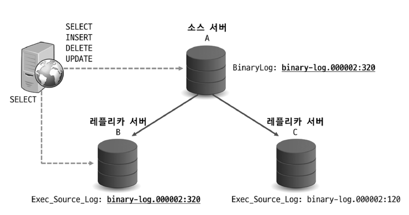
- 상황 설명 
  - 소스 서버 A의 바이너리 로그 위치 : `binary-log.000002:320`
  - 레플리카 서버 B의 바이너리 로그 위치 : `binary-log.000002:320` (완전히 동기화)
  - 레플리카 서버 C의 바이너리 로그 위치 : `binary-log.000002:120` (일부만 동기화)
- 문제 발생
  - 소스 서버 A에 장애가 발생하여 서버가 비정상 종료됨 
  - B, C 중에서 하나를 소스 서버로 승격(Promotion)
  - A 서버로 연결돼 있던 클라이언트 커넥션을 승격된 소스 서버로 교체 

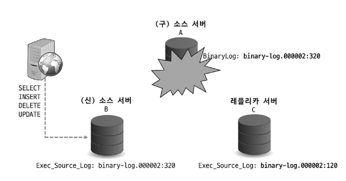
- 장애 발생 후 B를 소스 서버로 승격
  - 복제 토폴로지는 모두 끊어지고 B 서버로 사용자 트래픽 유입  
  - B 서버는 select 쿼리 부하 분산용이었기 때문에 과부하 상태가 될 것임 
  - C 서버는 동기화 되지 않은 상태 → select 용도로 사용 불가
    - 이런 상태에서 A가 종료되어 복제를 최종 시점까지 동기화할 방법이 없음

#### GTID 기반 복제를 이용한 경우

- 상황 설명
  - 소스 서버 A의 GTID : `{gtid값}:120`
  - 레플리카 서버 B의 GTID : `{gtid값}:120` (완전히 동기화)
  - 레플리카 서버 C의 GTID : `{gtid값}:98` (일부만 동기화)
- 문제 발생
  - 소스 서버 A에 장애가 발생하여 서버가 비정상 종료됨 
  - B, C 중에서 하나를 소스 서버로 승격(Promotion)
  - A 서버로 연결돼 있던 클라이언트 커넥션을 승격된 소스 서버로 교체

- 장애 발생 후 B를 소스 서버로 승격
  - B 서버를 C 서버의 소스 서버로 설정 (복제 연결) 
    - gtid는 변경되지 않으므로, C 서버의 동기화는 B 서버 기준으로 문제없이 수행됨 
  - 쿼리 요청을 B 서버와 C 서버가 나눠서 받게 됨 
- 복제 토폴로지(연결) 변경 시 동기화에 대한 문제가 아주 간단히 해결됨 

### GTID
- 바이너리 로그 파일 방식: 물리적인 방식 
  - GTID는 논리적인 의미를 가짐 
- 서버에서 커밋된 각 트랜잭션과 연결된 고유 식별자 
  - 해당 트랜잭션이 발생한 서버 뿐만 아니라, 그 서버가 속한 복제 토폴로지 내 모든 서버에서 고유함 
- 커밋되어 바이너리 로그에 기록된 트랜잭션에 한해서만 할당됨 
- 소스 아이디 + 트랜잭션 아이디 조합 
  - `[source_id]:[transaction_id]`
  - `source_id`: 트랜잭션이 발생된 소스 서버를 식별하기 위한 값 (`server_uuid` 값 사용)
    - `server_uuid`: MySQL 서버가 처음 시작될 때 자동으로 생성되는 값
  - `transaction_id`: 서버에서 커밋된 트랜잭션 순서대로 부여되는 값 
    - 1부터 1씩 단조 증가하는 형태로 발급됨 
- GTID Sets
  - 하나 이상의 GTID 값으로 구성돼 있는 것 
- `mysql.gtid_excuted` 테이블 
  - 현재 실행된 GTID 값을 저장하는 역할 
  - 레플리카 서버에서 바이너리 로그가 비활성화돼 있는 상태에서 GTID 기반의 복제를 사용할 수 있게 함
  - 예기치 못한 문제로 바이너리 로그가 손실됐을 때 GTID 값이 보존될 수 있게 함 
  - MySQL 8.0.17 부터는 매 트랜잭션이 커밋될 때마다 GTID 값이 바로 저장됨
  - 압축 : 여러 레코드를 연속된것 들끼리 모아서 1건의 레코드로 만드는 것
    - 바이너리 로그 활성화 O : 바이너리 로그 파일이 로테이션될 때 자동 압축
    - 바이너리 로그 활성화 X : `thread/sql/compress_gtid_table`이라는 포그라운드 스레드가 압축 수행 
      - `gtid_executed_compression_period` 시스템 변수에 지정된 수까지 도달할 경우 스레드가 압축을 수행 
      - 0으로 설정될 경우 스레드는 압축을 수행하지 않으며, 필요에 따라 자동으로 실행함 

### GTID 기반 복제 구축
- GTID 활성화가 필요함 
  - `gtid_mode` 시스템 변수를 `ON`으로 설정
  - `enforce_gtid_consistency` 시스템 변수를 `ON`으로 설정
- `server_id`, `server_uuid`가 복제 그룹 내에서 고유해야 함

### 데이터 복사
- 소스 서버에서 `mysqldump`로 데이터를 덤프 받아 레플리카 서버를 구축하려는 경우
  - 덤프가 시작된 시점의 소스 서버 GTID 값을 레플리카 서버에서 다음 2개의 시스템 변수에 설정해야 복제 시작 가능 
    - `gtid_executed`: MySQL 서버에서 실행되어 바이너리 로그 파일에 기록된 모든 트랜잭션들의 GTID 셋
      - 해당 값을 기반으로 다음 복제 이벤트를 소스 서버로부터 가져옴
    - `gtid_purged`: 현재 MySQL 서버의 바이너리 로그 파일에 존재하지 않는 모든 트랜잭션들의 GTID 셋
      - 덤프가 시작된 시점의 소스 서버의 GTID 값을 여기에 설정해주면 `gtid_executed`에도 동일하게 설정됨 

- `sql_log_bin` 시스템 변수 비활성화 (단순 마이그레이션 시에는 활성화가 되어있어야 함)
  - 덤프 파일을 실행할 때 적용되는 트랜잭션들이 레플리카 서버에서 새로운 GTID를 발급받는 것을 방지
  - 덤프 파일 적재하는 작업은 바이너리 로그에 기록되지 않음 

### Non-GTID → GTID 온라인 변경 
- MySQL 8.0부터 온라인으로 전환할 수 있는 기능 제공 
- `enforce_gtid_consistency`
  - GTID 기반 복제에서 소스 서버와 레플리카 서버 간 데이터 일관성을 해칠 수 있는 쿼리들이 실행되는 것을 허용할지를 제어하는 시스템 변수 
  - GTID 복제 환경에서 안전하지 않은 쿼리
    - 복제되어 적용될 때 단일 트랜잭션으로 처리되지 않을 수 있는 쿼리
      - 트랜잭션을 지원하는 테이블과 지원하지 않는 테이블을 함께 변경하는 쿼리/트랜잭션
      - CREATE TABLE ... SELECT ... 구문 
      - 트랜잭션 내에서 CREATE TEMPORARY TABLE, DROP TEMPORARY TABLE 구문 사용 
  - GTID 기반 복제에서는 GTID가 트랜잭션 단위로 올바르게 할당돼야 복제가 정상적으로 동작함 
  - 소스 서버에서 단일 트랜잭션으로 처리된 쿼리가 바이너리 로그에 기록 → 레플리카 서버로 복제하는 과정에서 하나의 트랜잭션이 아닌 개별적인 이벤트로 분류 → 각각에 대해 GTID 할당 → **레플리카 서버에서 해당 트랜잭션이 원자적으로 처리되지 못할 수 있음**
    - 바이너리 로그 포맷이 ROW, MIXED인 경우 CREATE TEMPORARY TABLE, DROP TEMPORARY TABLE 구문 사용 가능
    - Atomic DDL을 지원하는 InnoDB 스토리지 엔진 테이블에 한해 CREATE TABLE ... SELECT ... 구문 사용 가능 
  - `OFF`: GTID 일관성을 해칠 수 있는 쿼리들을 허용
  - `WARN`: GTID 일관성을 해칠 수 있는 쿼리들을 허용하되, 경고 메시지를 출력
  - `ON`: GTID 일관성을 해칠 수 있는 쿼리들을 허용하지 않음 
- `gtid_mode`
  - 바이너리 로그에 트랜잭션들이 GTID 기반으로 로깅될 수 있는지 여부를 제어 
  - 트랜잭션 유형별로 MySQL 서버에서의 처리 가능 여부를 제어 
    - Anonymous 트랜잭션 : GTID가 부여되지 않은 트랜잭션 (바이너리 로그 파일명과 위치로 식별) 
    - GTID 트랜잭션 
  - `OFF`: 신규 트랜잭션은 익명 트랜잭션으로 기록, 복제된 트랜잭션은 익명 트랜잭션만 처리
  - `OFF_PERMISSIVE`: 신규 트랜잭션은 익명 트랜잭션으로 기록, 복제된 트랜잭션은 익명 트랜잭션과 GTID 트랜잭션 모두 처리
  - `ON_PERMISSIVE`: 신규 트랜잭션은 GTID 트랜잭션으로 기록, 복제된 트랜잭션은 익명 트랜잭션과 GTID 트랜잭션 모두 처리
  - `ON`: 신규 트랜잭션은 GTID 트랜잭션으로 기록, 복제된 트랜잭션은 GTID 트랜잭션만 처리
  - 위 순서대로 한번에 한 단계씩만 변경 가능
  - 서버 간 다른 값을 가질 경우, 호환성 확인 필요

---

---

# 16.4 복제 데이터 포맷 
- 변경 이벤트들이 바이너리 로그에 저장되는 형태 
- 레플리카 서버는 소스 서버의 바이너리 로그 이벤트를 가공하지 않고 그대로 실행해 적용하므로 중요하다 
- 두 가지 포맷  
  - Statement 기반 바이너리 로그 포맷
    - 실행된 SQL문을 기록 
  - Row 기반 바이너리 로그 포맷
    - 변경된 데이터 자체를 기록 

## 16.4.1 Statement 기반 바이너리 로그 포맷
- 변경 이벤트에 대해, 이벤트를 발생시킨 SQL문을 바이너리 로그에 기록 
- 실행된 SQL문이 그대로 기록됨 
  - 여러 데이터를 변경하더라도 SQL문 하나만 기록 
- 장점 
  - 용량↓, 복제 속도↑
- 단점 
  - 비확정적(Non-Deterministic)인 쿼리가 실행된 경우 복제 시 소스 서버와 레플리카 서버 간 데이터가 달라질 수 있음 
  - 비확정적인 쿼리 
    - 실행할 때마다 결과가 달라지는 쿼리
    - 예시
      - `DELETE/UPDATE`에서 `ORDER BY` 없이 `LIMIT`사용
      - `SELECT FOR UPDATE`, `SELECT ... FOR SHARE`에서 `NOWAIT` 또는 `SKIP LOCKED` 사용
      - `RAND()`, `UUID()` 등 비확정적 함수 사용 
      - 동일한 파라미터를 입력해도 결괏값이 달라질 수 있는 함수/SP 사용
  - ROW 포맷 복제보다 데이터에 락을 더 많이 검 
    - `INSERT INTO ... SELECT`
    - 인덱스가 없어 풀 테이블 스캔을 유발하는 `UPDATE`
    - 위와 같은 쿼리들은 실행 시 불필요하게 많은 데이터에 대해 오랜시간 동안 락을 걸 가능성이 있음 
      - 반면 ROW 포맷은 변경된 데이터 자체가 넘어가서 적용되기 때문에 락을 더 적게 점유하고 처리속도 또한 훨씬 빠름 
- 제한 사항
  - 트랜잭션 격리 수준이 `REPEATABLE READ` 이상이어야 함 
  - 그 이하의 방식에서는 하나의 트랜잭션 내에서도 각 쿼리가 실행되는 시점마다 데이터 스냅숏이 달라질 수 있기 때문 
    - 소스 서버와 레플리카 서버의 데이터가 서로 달라질 수 있기 때문에 비허용 

## 16.4.2 Row 기반 바이너리 로그 포맷
- 변경된 값 자체가 바이너리 로그에 기록되는 방식 
  - 소스 서버와 레플리카 서버 간 데이터를 일관되게 하는 가장 안전한 방식임 
  - 비확정적 함수가 사용됐다 하더라도 데이터 자체가 바이너리 로그에 기록되기 때문에 레플리카 서버에 동일한 데이터가 적용됨
- Statement 포맷보다 락이 최소화되어 처리됨 
  - 변경된 데이터가 바로 적용 → 변경 이벤트에 관계 없이 더 적은 락을 점유하며 처리됨 
- 모든 트랜잭션 격리 수준에서 사용 가능 
- 사용자 계정 생성, 권한 부여 및 회수, 테이블/뷰/트리거 생성 등과 같은 DDL문은 전부 Statement 포맷 형태로 기록됨 
- 단점
  - 굉장히 많은 데이터를 변경한 경우 바이너리 로그 파일 크기가 단시간에 매우 커질 수 있음
  - 변경된 데이터 수가 적더라도 BLOB 형태의 큰 값이 새로 저장되거나 변경되는 경우, 마찬가지로 파일 크기가 많이 커질 수 있음

## 16.4.3 Mixed 바이너리 로그 포맷
- Statement 포맷과 Row 포맷을 혼합해서 사용하도록 설정한 것 
- 기본적으로는 Statement 포맷을 사용하며, 필요 시 자동으로 ROW 포맷으로 전환하여 로그로 기록 
  - 안전하지 못한 쿼리 형태일 경우 (비확정적 쿼리)

## 16.4.4 Row 포맷 용량 최적화 
- ROW 포맷의 바이너리 로그 파일 용량은 많이 커질 수 있음

### 바이너리 로그 ROW 이미지
- Statement 포맷보다 더 많은 저장 공간이 필요하고, 더 많은 네트워크 트래픽을 유발할 가능성이 있음 
- 바이너리 로그 파일 용량을 최소화하기 위해 `binlog_row_image` 시스템 변수를 제공 
  - 저장되는 변경 데이터의 컬럼 구성을 제어함 
- ROW 포맷을 사용할 때, 바이너리 로그에는 각 변경 데이터마다 변경 전 레코드(Before-Image)와 변경 후 레코드(After-Image)가 함께 기록됨
- `binlog_row_image` 시스템 변수
  - 각 변경 전후 레코드들에 대해 테이블의 어떤 컬럼들을 기록할 것인지를 결정함
  - `FULL`: 변경이 발생한 레코드의 모든 컬럼들의 값을 기록 
    - INSERT, UPDATE, DELETE 문장 별로 바이너리 로그 파일에 기록되는 정보는 달라짐 
      - INSERT: 새롭게 추가된 레코드의 모든 컬럼들만 기록 
      - UPDATE: 변경 전, 변경 후의 레코드 모두 전체 컬럼들의 셋으로 기록 
      - DELETE: 변경 전의 레코드의 전체 컬럼들만 기록 
  - `MINIMAL`: 변경이 발생한 레코드의 꼭 필요한 컬럼들의 값만 기록 
  - `NOBLOB`: BLOB, TEXT 컬럼에 대해 변경이 발생하지 않은 경우, 기록하지 않음 
- PKE(Primary Key Equivalent)
  - 테이블의 프라이머리 키 또는 프라이머리 키 역할을 하는 컬럼 조합을 의미 
    - 즉, 특정 레코드를 유일하게 식별하는 데 사용되는 값을 의미함 
  - 결정 조건
    - PK가 있는 테이블: 해당 테이블의 프라이머리 키가 PKE
    - PK가 없는 테이블: NOT NULL로 정의된 유니크 인덱스가 있을 경우 해당 인덱스가 PKE. 없을 경우 레코드의 모든 컬럼 조합이 PKE.

### 바이너리 로그 트랜잭션 압축 
- 바이너리 로그는 디스크 저장 공간과 네트워크 대역폭을 많이 소비한다.
  - 안정적인 복제를 위해 일정 기간동안 보관
  - Point-In-Time Recovery(시점 복구)를 고려하는 경우 백업해두기도... 
- 유입되는 DML 쿼리의 양↑, 바이너리 로그 파일 크기↑ 
  - 보관 주기를 짧게 설정 
  - 로그 파일들을 압축 
- 하지만 원격 레플리카 서버로 바이너리 로그를 전송함에 따라 소비되는 네트워크 대역폭 사용량은 사용자가 줄일 수 없음 
  - 보관 주기 또한 짧게 하는 데 한계가 있음 
- ROW 포맷으로 기록되는 트랜잭션에 대해 **트랜잭션에서 변경한 데이터를 압축해서 바이너리 로그에 기록할 수 있게 하는 기능이 도입됨**
  - 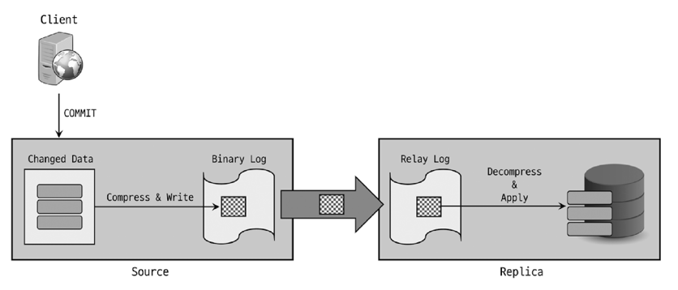
  - `zstd` 알고리즘으로 압축 후 `Transaction_payload_event`라는 하나의 이벤트로 바이너리 로그에 기록함 
  - 압축된 상태로 전송, 압축된 상태로 릴레이 로그에 기록 

---

---

# 16.5 복제 동기화 방식 
- 비동기 복제(Asynchronous replication)
- 반동기 복제(Semi-synchronous replication)

## 16.5.1 비동기 복제
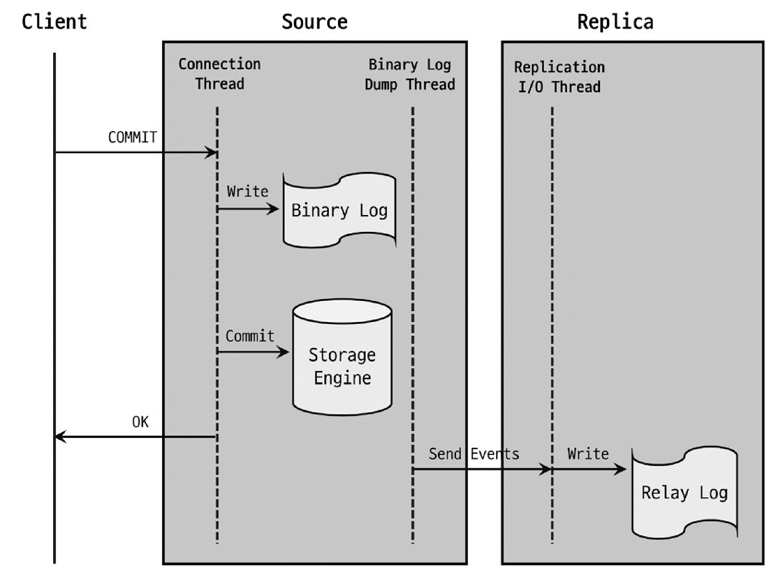
- 커밋된 트랜잭션 → 바이너리 로그에 기록 → 레플리카 서버가 주기적으로 신규 트랜잭션에 대한 바이너리 로그를 요청 → 소스 서버가 바이너리 로그 이벤트 전달 → 레플리카 서버가 릴레이 로그에 기록
- MySQL 복제는 기본적으로 비동기 방식으로 동작함
  - 소스 서버가 복제 연결된 레플리카 서버에서 변경 이벤트가 정상적으로 전달되어 적용됐는지 확인하지 않음
  - 소스 서버에 장애 발생 시, 최근까지 적용된 트랜잭션이 레플리카 서버에 전송되지 않을 수 있음 
  - 레플리카 서버가 소스 서버로 승격될 경우, 누락된 트랜잭션이 있는지 확인한 후 수동으로 적용해야 함 
- 장점
  - 전송 여부를 고려하지 않아 트랜잭션 처리가 좀 더 빠름 
  - 레플리카 서버에 문제가 생겨도 소스 서버에는 영향을 주지 않음 
  - 소스 서버에 레플리카 서버를 여러 대 연결해도 큰 성능 저하가 없음 (10대 이상 연결 시, 저하가 있을 수는 있음)
  - 읽기 트래픽 분산 용도 or 분석 용도로 제격임
- 즉각 반영된 데이터를 조회해야 하는 경우, 즉 데이터의 정확도가 중요한 경우에는 소스 서버에서 직접 조회하도록 구현할 것 

## 16.5.2 반동기 복제
- 비동기 복제보다 좀 더 **향상된 데이터 무결성을 제공**하는 방식
- 소스 서버는 레플리카 서버가 전달받은 변경 이벤트를 릴레이 로그에 기록 후 응답(ACK)을 보내면 그 때 트랜잭션을 완전히 커밋시키고 클라이언트에 결과를 반환함
- 소스 서버에서 정상적으로 결과가 반환된 모든 트랜잭션들에 대해 **적어도 하나의 레플리카 서버에는 해당 트랜잭션들이 전송됐음을 보장함**
  - "전송됐음"을 보장하는 것이며, **"적용"은 보장하지 않음**
- 어느 지점에서 레플리카 서버의 응답(ACK)을 기다리느냐에 따라 소스 서버에서 장애가 발생했을 때 겪을 수 있는 문제 상황이 조금 다를 수 있음 

### `AFTER_SYNC`

- 각 트랜잭션을 바이너리 로그에 기록 후, 스토리지 엔진에 커밋하기 전 단계에서 레플리카 서버의 응답 대기
  - 응답 이후 스토리지 엔진에 커밋 
- 소스 서버에 장애가 발생해도 팬텀 리드가 발생하지 않음
  - 스토리지 엔진 커밋 전에 레플리카 서버의 응답을 대기 → 응답 대기 중에 소스 서버에 장애가 발생 → 소스 서버로 승격된 레플리카 서버에서는 해당 데이터를 볼 수 있음 
  - Q. 근데 레플리카 서버에만 기록되고, 소스 서버의 스토리지 엔진에는 커밋이 안된다면.....? 🤔
    - Q. 복제까지 완료가 돼야 하나의 트랜잭션이 완료됐다고 보는걸까? 🤔
    - Q. 스토리지 엔진에 커밋이 안 되면, 레플리카 서버에 보낸 바이너리 로그도 롤백할까? 
- 장애가 발생한 소스 서버에 대해 좀 더 수월하게 복구 처리가 가능

### `AFTER_COMMIT`
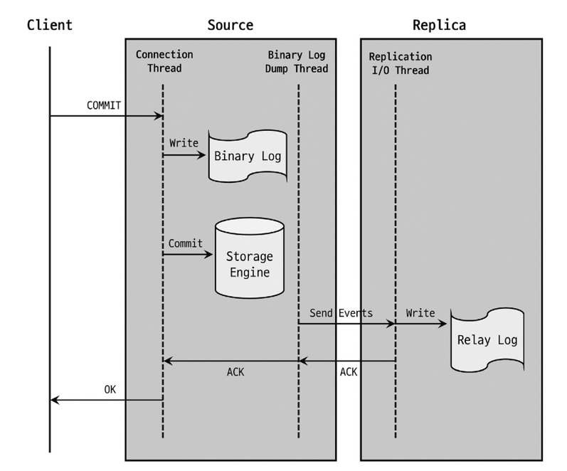
- 각 트랜잭션을 스토리지 엔진에 커밋한 후 레플리카 서버의 응답 대기
  - 응답 이후 클라이언트에 결과 반환
- 트랜잭션이 스토리지 엔진 커밋까지 완료된 데이터는 다른 세션에서도 조회가 가능함 
  - 소스 서버가 커밋 후 레플리카 서버로부터 응답을 대기 → 소스 서버에 장애 발생 → 소스 서버로 승격된 레플리카 서버에서는 해당 데이터를 보지 못할 수 있음 (팬텀 리드)
  - 즉, 소스 서버에는 커밋됐으나 레플리카 서버에는 복제가 되지 않은 상황이 발생할 수 있음 
    - 이럴 경우, 소스 서버를 재사용할 때 트랜잭션들을 수동으로 롤백처리 해줘야 할 수 있음 

### 반동기 복제 주의 사항 
- 장애가 발생한 소스 서버를 바로 재사용하지 말 것 
  - 소스 서버의 데이터와 레플리카 서버의 데이터가 달라지는 경우가 발생할 수 있기 때문 
  - 소스 서버를 바로 재사용하기 보다, 백업된 데이터로 새로 구축해서 사용하자 

### 반동기 복제 특징
- 단점
  - 비동기 방식보다 트랜잭션 처리 속도가 더 느릴 수 있음 
- 소스 서버는, 레플리카 서버에서 응답이 없을 시 (타임아웃 발생 시) 자동으로 비동기 복제 방식으로 전환
- 연결된 전체 레플리카 서버의 응답을 기다려야 하는 것은 아님

---

---

# 16.6 복제 토폴로지 
## 16.6.1 싱글 레플리카 복제 구성 

- 소스 서버 하나에 레플리카 서버 하나가 연결된 복제 형태 
- 레플리카 서버는 소스 서버에서 장애가 발생했을 때 사용될 수 있는 예비 서버 or 데이터 백업 용도
- 레플리카 서버를 읽기용으로 사용할 경우, 레플리카 서버에 장애가 나면 대응하기 어려움 
  - 레플리카 서버는 정말 예비용 서버로만 사용하는 것이 적합함 
  - 혹은, 서비스와 연관 없는 배치 작업이나 어드민 툴에서 사용하는 쿼리들은 레플리카 서버에서 실행되도록 구현해도 무방함 

## 16.6.2 멀티 레플리카 복제 구성
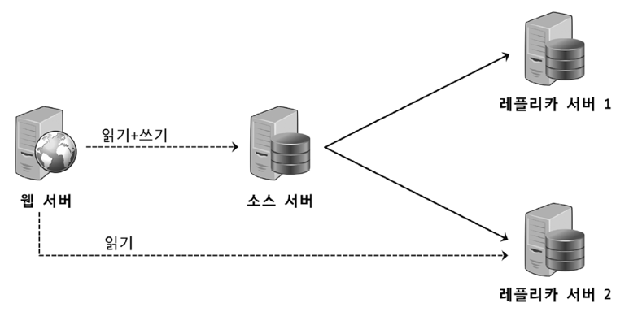
- 소스 서버 하나에 2개 이상의 레플리카 서버가 연결된 형태 
  - 싱글 레플리카 복제 구성 + 용도를 위한 여분의 레플리카 서버 추가 
- 서비스 트래픽이 증가하는 경우, 소스 서버 한 대에서만 쿼리 요청을 처리하기에는 벅찰 수 있음 
  - 멀티 레플리카 복제를 구성하여 읽기 요청 처리를 분산
- 배치, 통계, 분석 등의 작업 전용으로 사용하게 할 수도 있음 
- 레플리카 서버 한 대는 예비용으로 남겨두는 것이 좋음 
  - 대체 서버, 백업 수행 용도 외에는 최소한의 용도로만 사용 
  - 추후 소스 서버 대체 or 다른 레플리카 서버의 대체 서버로도 사용 가능 

## 16.6.3 체인 레플리카 복제 구성

- 레플리카 서버가 너무 많아 소스 서버의 성능에 악영향이 예상되는 경우 사용 
- `1:M:M` 구조로 구성함
  - 레플리카 서버이면서 동시에 소스 서버 역할을 하는 서버가 필요함
- 각 그룹을 용도별로 사용할 수 있음 
  - 1차 복제 그룹은 OLTP 서비스 용도로 사용 
  - 2차 복제 그룹은 통계, 배치, 백업 용도로 사용
- MySQL 서버를 업그레이드 하거나 장비를 일괄 교체할 때도 많이 사용함 
  - 기존 장비의 MySQL은 그대로 둠
  - 새로운 장비에 업그레이드한 MySQL을 설치 후 신규 장비로 데이터를 이관 
  - 무중단으로 진행 가능 
- 단점
  - 장애 처리 시 복잡도가 더 높을 수 있음 

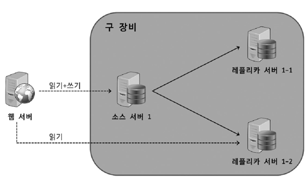
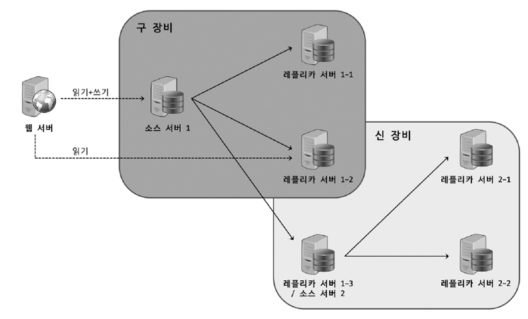

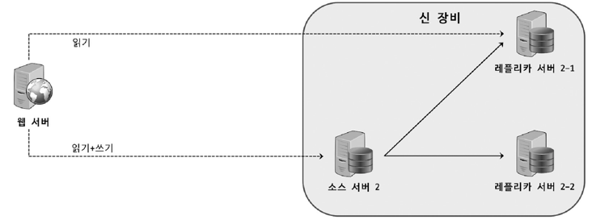

## 16.6.4 듀얼 소스 복제 구성 
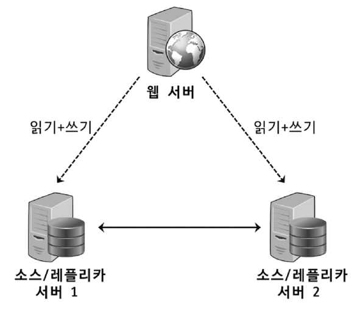
- 두 개의 서버가 서로 소스 서버이자 레플리카 서버로 구성된 형태 
- 둘 모두 쓰기가 가능하다는 것이 가장 큰 특징 
- `ACTIVE-PASSIVE`: 하나의 서버에서만 쓰기 작업이 수행되는 형태 
  - 예비 서버인 MySQL 서버가 쓰기 작업이 바로 가능한 상태임 (레플리카 서버는 불가능. 읽기 전용임.)
  - 한 서버에서 바로 다른 서버로 쓰기 전환이 가능한 환경이 필요한 경우 사용 
- `ACTIVE-ACTIVE`: 두 서버 모두에 쓰기 작업을 수행하는 형태 
  - 지리적으로 매우 떨어진 위치에서 유입되는 쓰기 요청도 원활하게 처리하기 위해 주로 사용 
    - 각 지역에 서버를 두고, 각 지역에서 발생하는 쓰기 요청은 해당 지역의 서버로 수행 
  - 최종적으로 두 서버는 같은 데이터를 갖게 되지만, 다른 지역의 내용이 적용되기 까지는 다소 시간이 걸릴 수 있음 
  - 문제 발생 주의
    - 동일한 데이터를 각 서버에서 변경하는 경우 
      - 시점상 나중에 처리된 트랜잭션 내용이 최종 반영됨 
      - 사용자가 예상하지 못한 방향으로 데이터가 처리될 수 있음 
    - 테이블에서 Auto-increment 키를 사용하는 경우 
      - 중복 키 에러가 발생할 수 있음 
    - 해당 형태에서는 동일한 데이터를 변경하는 트랜잭션이 있어서는 안되고, Auto-increment 키 사용을 지양해야 함 (글로벌 키 값 생성 필요)
      - Auto-Increment 키 값을 사용하고자 하는 경우, 충돌하지 않도록 신경써야 함 
- 역효과가 많은 편이라 잘 사용되지 않음 
- 쓰기 성능의 확장이 필요한 경우, 데이터베이스 서버를 샤딩(Sharding)하는 방법을 권장함 

## 16.6.5 멀티 소스 복제 구성 

- 레플리카 서버가 둘 이상의 소스 서버를 갖는 형태 
- 사용 목적
  - 여러 서버에 존재하는 각기 다른 데이터를 하나의 서버로 통합 
  - 여러 서버에 샤딩돼 있는 테이블 데이터를 하나의 테이블로 통합
  - 여러 서버의 데이터들을 모아 하나의 서버에서 백업을 수행 
- 데이터를 한곳으로 모아 좀 더 빠르고 편리하게 분석을 수행하고자 할 때 사용하면 효율적임
- 샤딩을 해두었으나, 예상만큼 트래픽이 많지 않은 경우 다시 하나의 서버로 통합 
- 주의사항 
  - 각 소스 서버로부터 유입되는 변경 이벤트들이 레플리카 서버로 복제됐을 때 서로 충돌을 일으킬 만한 부분이 없는지 사전 검토가 충분히 필요함 
  - 멀티 소스 레플리카 서버는 각 서버의 대체 서버로 사용하기에는 어려움이 있음 

### 동작 
- 자신과 연결된 소스 서버들의 변경 이벤트들을 동시점에 병렬로 동기화 
  - 각 소스 서버들에 대한 복제가 독립적으로 처리되는 것을 의미 
- 각 독립된 복제 처리를 채널(Channel)이라고 함
  - 각 복제 채널은 개별적인 레플리케이션 I/O 스레드, 릴레이 로그, 레플리케이션 SQL 스레드를 가짐 
  - 채널의 이름은 어느 소스 서버와의 복제 연결인지를 구별할 수 있는 식별자 역할을 함 
- 동작 방식
  - 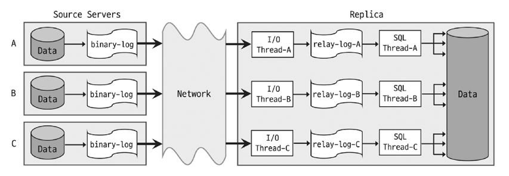

### 구축 
- 여러 대의 소스 서버 백업 데이터를 가져와야 하기 때문에 아래의 요소를 고려해야 함 
  - 데이터가 없는 상태에서 복제 연결은 문제 없음
  - 데이터가 있는 상태라면 
    - mysql 데이터베이스와 같이 공통으로 가지고 있는 데이터베이스와 InnoDB 시스템 테이블 스페이스의 충돌과 병합을 고려해야 함