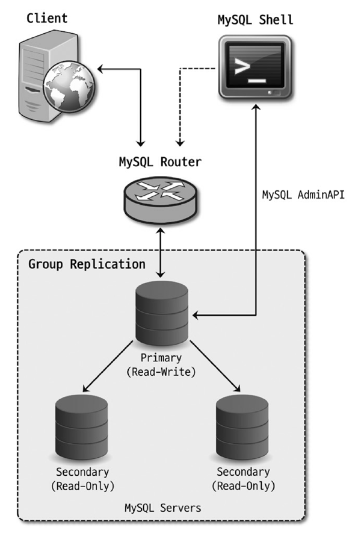
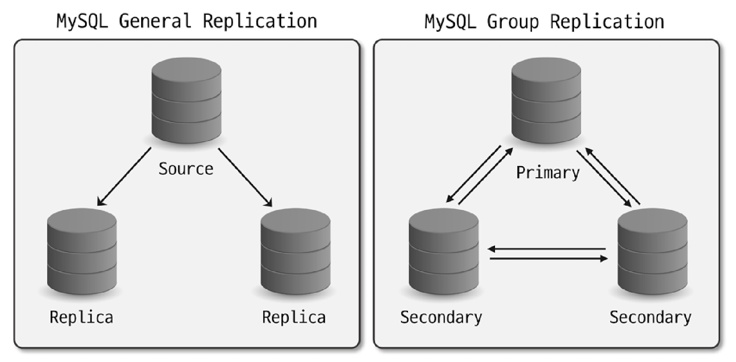
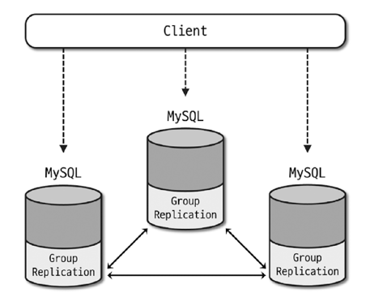
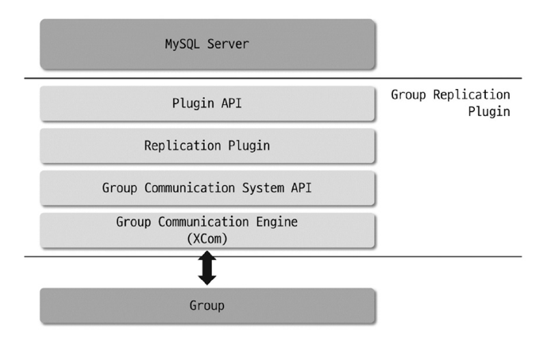
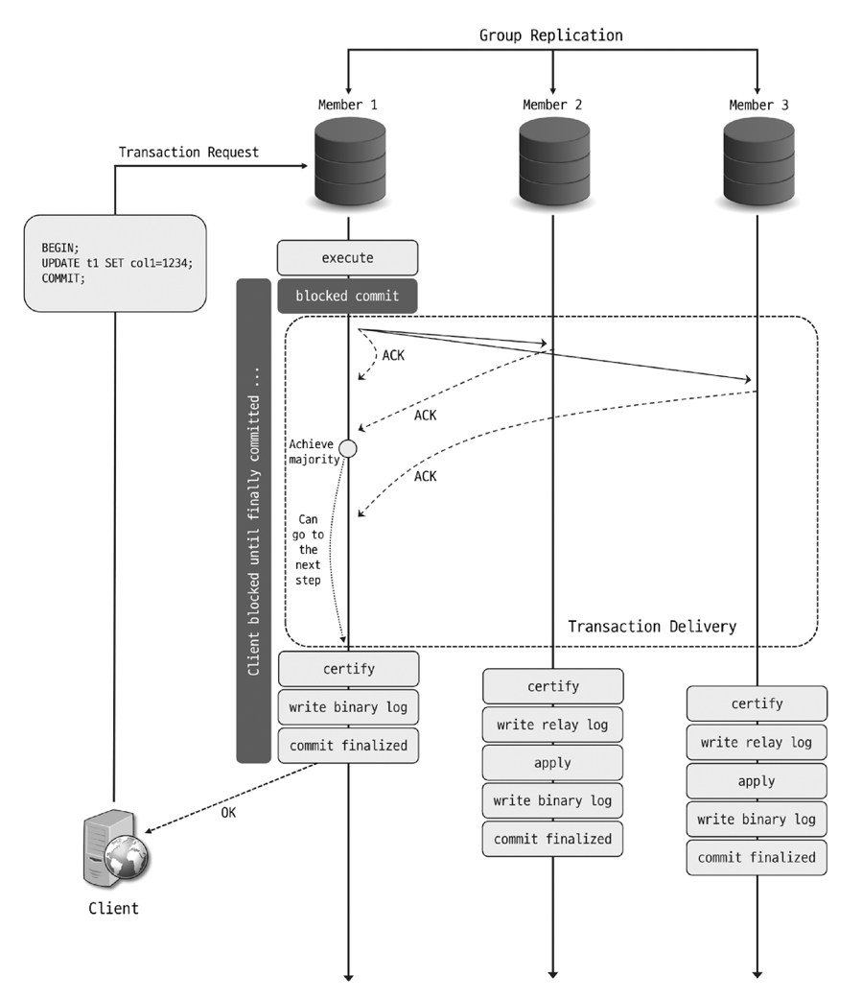
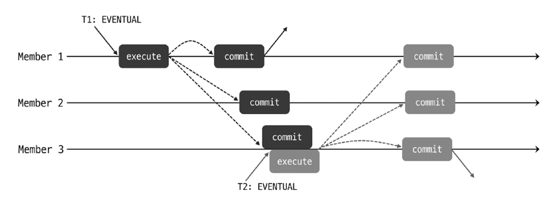
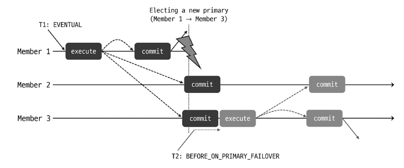
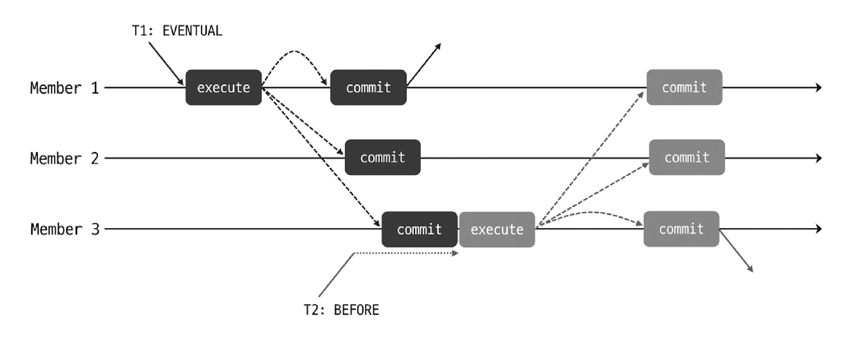
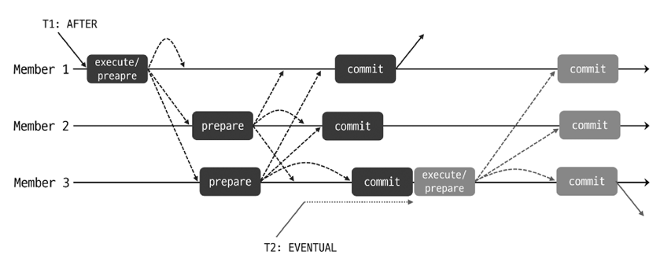
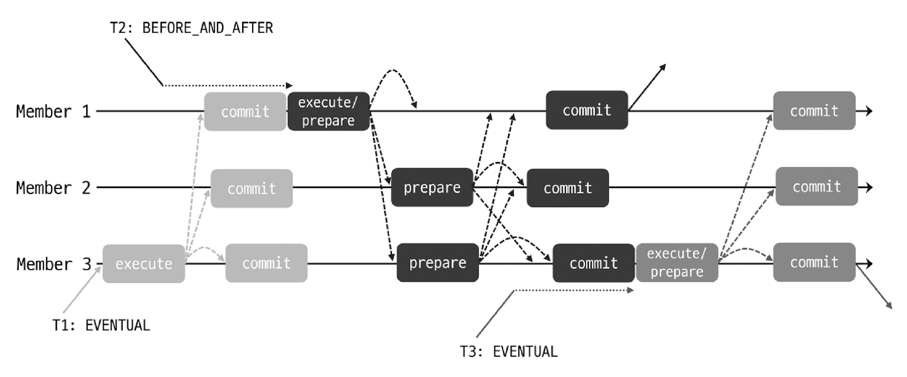

# 17. InnoDB 클러스터

- 소스 - 레플리카 구조의 복제 형태를 구성해도 서버 장애는 MySQL 서버에서 알아서 처리해주지 않는다.
- 그래서 자동으로 Fail over를 감지해 처리하는 HA 솔루션을 사용해야 한다.
    - 서브파티로는 MMM / MHA / Orchestrator가 있다.
    - InnoDB 빌트으로는 **InnoDB 클러스터**가 있다.


## 17.1 InnoDB 클러스터 아키텍처

InnoDB 클러스터를 구성하는 요소들
- 그룹 복제(Group Replication): 복제를 관리하고 그룹에 새로운 맴버의 추가 제거를 담당
- MySQL 라우터(MySQL Router): 애플리케이션 서버와 MySQL 서버 사이에서 동작하는 미들웨어 프로그램, 애플리케이션이 실행한 쿼리를 적절한 MySQL서버로 전달하는 프록시 역할
- MySQL 셸(MySQL Shell): 기존 MySQL 클라이언트보다 더 확장된 기능을 가진 클라이언트 프로그램, 기본적인 SQL / 스크립트 작성 기능 / MySQL 서버 클러스터 구성 작성을 하는 API를 제공



특징들
- 복제 그룹에서 소스 서버는 "프라이머리", 레플리카 서버는 "세컨더리" 로 표현한다.
- 복제 그룹에는 서버가 3개 이상 있어야 한다. 서버 한 대에 장애가 발생해도 복제 그룹이 정상적으로 동작해야 하기 때문.
- 쿼리는 MySQL 라우터를 통해서 전송한다, 클라이언트는 InnoDB 클러스터가 어떻게 구성되어 있는지 알 필요가 없다.
- 서버 장애가 발생하면 그룹 복제가 이를 감지해서 복제 그룹에서 제외시킨다.

## 17.2 그룹 복제(Group Replication)

- 기본 MySQL 복제 프레임워크를 기반으로 구현
    - Row 포맷의 바이너리 로그 / 릴레이 로그 / GTID를 사용
- 그룹복제에서 제공하는 대표적인 기능
    - 그룹 맴버 관리
    - 그룹 단위의 정렬된 트랜잭션 적용 및 트랜잭션 충돌 감지
    - 자동 페일오버
    - 자동 분산 복구

### 기본 MySQL 복제와 차이점

- 그룹 복제는 양방향으로 복제를 처리할 수 있다. (쓰기 서버가 여러개일 수 있다.)
    
- 데이터 동기화 방식의 차이가 있다.
    
    - 그룹 복제에서는 아래와 같이 처리한다.
    1. 한 서버에서 트랜잭션이 커밋 준비가 되면 다른 맴버에게 트랜잭션 정보를 전송한다.
    2. 과반수 이상의 맴버로부터 응답을 전달받으면 해당 트랜잭션을 인증(Certify)하고 커밋처리 한다.
        - 인증: 동시점에 동일한 데이터를 변경했는지 충돌 여부를 검사해서 문제 없이 적용 가능한지 확인하는 과정
        - 이 과정을 합의(Consensus) 라고 한다. (읽기는 합의 과정 필요없다.)
    3. 과반수 이상의 맴버로부터 응답을 못 받으면 해당 트랜잭션은 그룹에 적용되지 않는다.

### 17.2.1 그룹 복제 아키텍쳐

- 그룹복제는 별도 플러그인으로 구현되어 있다. 
    - 그룹 복제 플러그인을 설치해야 사용 가능하다.
    - 서버들은 플러그인을 통해 서로 지속적으로 동기화 한다.
    
    - `group_replication_applier`라는 복제 채널으로 트랜잭션을 전달받는다.
    - `group_replication_recovery`라는 복제 채널으로 분산 복구 작업을 처리한다.


- 그룹 복제 플러그인 내부 구조
    
    - Plugin API: MySQL 서버와 상호작용하기 위한 인터페이스
        - MySQL -> 플러그인: 서버 시작과 복구, 트랜잭션 커밋등 이벤트 전송
        - 플러그인 -> MySQL: 처리중인 트랜잭션 커밋과 중단, 릴레이 로그 기록 요청등 전송
    - Replication Plugin: 다른 서버에서 실행된 원격 트랜잭션 처리 / 트랜잭션 충돌 감지 / 그룹 전파등을 수행
    - Group Communication System API: 그룹 통신 시스템 API
    - XCom : 그룹 통신 엔진, 다른 MySQL들과 통신처리를 담당

### 17.2.2 그룹 복제 모드

- 프라이머리 서버 수 설정 (`group_replication_single_primary_mode`)
    - ON: 그룹 복제를 싱글 프라이머리 서버로 동작함
    - OFF: 그룹 복제를 멀티 프라이머리 서버로 동작함 (프라이머리 서버가 여러개)

#### 싱글 프라이머리 모드

- 프라이머리 서버(쓰기 처리하는 서버)가 한 대만 존재
- 기본값임
- 여러 이유로 프라이머리 서버가 그룹을 탈퇴하는 경우 세컨더리 서버 중 하나를 프라이머리로 설정한다.

#### 멀티 프라이머리 모드

- 복제 그룹 맴버들이 전부 프라이머리 서버임
- 모든 맴버들의 MySQL 버전 호환성이 중요하다.
    - 그룹에서 가장 낮은 MySQL 버전의 서버가 프라이머리 모드로 설정된다.
    - 때문에, 더 낮은 버전의 서버는 그룹에 참여할 수 없다.
    - 또, 높은 버전의 서버는 읽기 모드로 설정된다. (싱글 프라이머리 모드도 동일)

#### 17.2.3 그룹 멤버 관리(Group Membership)

- 그룹 복제에서는 현재 어떤 서버들이 그룹에 참여하고 있는지 맴버들의 목록과 상태를 관리한다.

##### 뷰(View)

- 그룹 복제가 관리하는 멤버 목록과 상태 정보를 `뷰(View)`라고도 한다.
- 그룹 맴버가 변경될 때마다 새로운 뷰 ID값이 생성된다.
- 뷰는 ID값으로 식별한다.
    ```
    # Prefix: 그룹 복제가 초기화될 때 타임스탬프를 기반으로 생성
    View ID = [Prefix value]:[Sequence value]
    ```
-

#### 17.2.4 그룹 복제에서 트랜잭션 처리

그룹복제에서 트랜잭션이 처리되는 것에 대해 다룬다.  
대략적으로 아래와 같은 과정으로 트랜잭션은 처리된다.

- 합의: 트랜잭션 적용 가능? ㅇㅇ
    1. 클라이언트가 트랜잭션을 커밋하려고 함
    2. 해당 멤버는 그룹 통신 엔진(XCom)으로 트랜잭션 데이터를 다른 멤버들로 전파
    3. 과반수 이상에게 응답 메시지를 받으면 다음 프로세스 진행
    4. 과반수가 안되면 클라이언트에게 에러 반환
- 인증: 동시점에 동일한 데이터를 변경한건가? 
    1. 다수의 멤버들에서 실행된 트랜잭션은 글로벌하게 정렬 후 인증 단계를 거침
    2. 이후 원격 멤버는 바이너리 로그에 트랜잭션을 기록하고 커밋 완료함
    3. 다른 멤버는 인증 단계를 거치면서 받은 로그 데이터를 릴레이 로그 이벤트에 작성


##### 트랜잭션 일관성 수준

- 일시적으로 동기화가 이루어지지 않아 이전 오래된 데이터를 읽거나 쓸 수 있다.
- 이를 해결하기 위해 그룹 복제에서 트랜잭션의 일관성 수준을 설정할 수 있다.

1. EEVENTUAL 일관성 수준

- 기본 수준
- 읽기 전용 및 읽기-쓰기 트랜잭션이 별도의 제약 없이 바로 실행 가능
- 오래된 데이터를 읽거나 쓰는 경우가 생길 수 있으며 트랜잭션이 충돌할 수 있다.



- T2 트랜잭션은 T1이 Member3에서 완전히 적용되기 전에 실행되었으므로 오래된 데이터를 읽을 수 있으며 T1과 충돌할 수 있다. (충돌시 롤백)

2. BEFORE_ON_PRIMARY_FAILOVER 일관성 수준

- 싱글 프라이머리 모드로 설정된 그룹 복제에서 프라이머리 Fail over가 발생해서 신규 프라이머리가 선출되었을때 영향을 미친다.
- 선출된 신규 프라이머리가 해당 일관성 수준으로 되어있고, 아직 이전 프라이머리의 트랜잭션을 적용하고 있으면 새로운 트랜잭션은 대기한다.
- 트랜잭션의 대시시간은 신규 프라이머리와 이전 프라이머리의 트랜잭션 갭에 따라 달라진다.
    - 갭이 크면 동기화 과정을 거치느라 대기를 오랫동안 해야 한다.
    - 때문에 클라이언트에서 이 지연을 대비하는 코드가 구현되어 있으면 좋다.
    - 대기는 wait_timeout 시스템 변수에 설정된 값까지만 최대로 대기할 수 있다. (기본 8시간ㄷ;) 



3. BEFORE 일관성 수준

- 읽기 전용 및 읽기-쓰기 트랜잭션은 모든 선행 트랜잭션이 완료될 때까지 대기한다.
- 반드시 최신 데이터를 읽어야 하고, 읽기가 적고 쓰기가 많은 경우에 사용하는게 좋다.



4. AFTER 일관성 수준

- 트랜잭션이 적용되면 해당 시점에 그룹 멤버들이 모두 동기화된 데이터를 갖게 한다.
    - 읽기-쓰기 트랜잭션은 모든 멤버들에서 트랜잭션이 커밋될 준비가 될때까지 대기한다.
    - 읽기 전용 트랜잭션은 별도의 제약 없이 바로 처리된다.
- AFTER 일관성 수준으로 설정된 트랜잭션이 실행중인 동안 다른 멤버에서 새로운 트랜잭션이 실행되면 AFTER 트랜잭션이 완전히 커밋될때까지 대기해야 한다.
- DB에서 쓰기 요청보다 읽기 요청이 많고, 분산된 최신 읽기를 수행해야 할때 사용하는게 좋다.



5. BEFORE_AND_AFTER 일관성 수준

- BEFORE + AFTER 일관성 수준
    - 읽기-쓰기 트랜잭션은 모든 선행 트랜잭션이 적용될 때까지 대기 (BEFORE)
         + 다른 멤버들이 커밋할 준비가 될때까지 대기 (AFTER)
    - 읽기 전용 트랜잭션은 모든 선행 트랜잭션이 적용될 때까지 대기 (BEFORE)



#### 흐름 제어(Flow Control)

- 특정 멤버의 하드웨어 스펙 이슈 혹은 네트워크 대역폭 이슈로 트랜잭션 적용이 지연될 수 있다.
- 쓰기 처리량을 조절해서 이를 해결하고자 할 수 있다.

### 17.2.5 그룹 복제의 자동 장애 감지 및 대응

장애 감지 매커니즘
- 멤버 간에 주기적으로 통신 메시지를 주고받으며 서로의 상태를 확인한다.
- 5초 내로 응답을 받지 못하면 의심 스택이 1 쌓인다.
- 어떤 멤버가 대해 과반수에 대해 의심을 받으면 그룹에서 추방당한다.
    - 이때 의심되는 멤버는 5초의 변명 시간을 갖는다. (응답하면 추방 안당함)
    - 네트워크가 좋지 않으면 이 값을 늘리는게 좋다.
- 추방된 멤버는..
    - UNREACHABLE 상태가 된다.
    - 다른 멤버와 통신을 재개하면 자신이 추방된걸 알 수 있다.
        - 다른 맴버들의 뷰ID가 변경되기 때문이다.
    - 추방된 후 재가입 할 수 있다. (재가입 시도 횟수는 기본 3이다.)
    - 재가입에 실패하면 설정에 따라 아래 중 하나의 종료 액션을 수행한다.
        - READ_ONLY: 슈퍼 읽기 전용 모드로 전환한다. (기본)
        - OFFLINE_MODE: 슈퍼 읽기 + 연결 불가
        - ABORT_SERVER: 서버 종료

### 17.2.6 그룹 복제의 분산 복구

- 멤버가 그룹에 새로 가입하거나 재가입하는 경우 동기화가 필요하다.
- 가입 멤버에서 누락된 트랜잭션들을 다른 멤버에게 가져와 적용하는 프로세스를 자동으로 수행한다. 
    - 이를 분산 복구라고 한다.
    - 북구해주는 멤버를 기증자(Donor) 멤버라고 한다.

#### 분산 복구 방식

- (재가입) 릴레이 로그에는 있는데 적용못한 트랜잭션 적용
    - 가입 맴버의 group_replication_applier 복제 체널의 릴레이 로그를 확인한다.
    - 그룹에서 추방되는 시점에 릴레이 로그는 기록했는데, 적용못한 트랜잭션들이 있을 수 있다.
    - 해당 트랜잭션이 있으면 적용한다.
- 기증자에 연결해서 아래 두 가지 방식 중 하나를 선택한다.
    - 바이너리 로그 복제 방식:
        1. 기증자와 가입맴버를 group_replication_recovery 복제 채널로 연결한다.
        2. 기증자의 바이너리 로그에서 적용되지 않은 트랜잭션을 복제해 적용한다.
    - 원격 클론 방식:
        1. 기증자의 모든 데이터와 메타데이터를 일관된 스냅샷으로 가져와 가입맴버를 재구축한다.

#### 분산 복구 프로세스

분산 복구 작업은 다음과 같이 크게 세 단계로 나뉜다.

1. 로컬 복구
    - 가입 맴버가 재가입이고, 릴레이 로그에 적용 못한 트랜잭션이 있다.
    - 따라서 이 트랜잭션 먼저 적용 후 복구 작업을 시작한다.
2. 글로벌 복구
    - 가입 멤버는 기증자를 선택한 후 트랜잭션을 가져와 자신에게 적용한다.
    - 이 과정에서 처리되는 트랜잭션은 캐싱된다.
3. 캐시 트랜잭션 적용
    - 캐싱해서 보관하고 있던 트랜잭션들을 적용해 최족적으로 그룹에 참여한다.

### 17.2.7 그룹 복제 요구사항

- InnoDB 스토리지 엔진 사용
- 프라이머리 키 사용
- 원활한 네트워크 통신
- ROW 형태의 바이너리 로그 활성화
- 바이너리 로그 체크섬 설정 (버전에 따라 지원하지 않아서 None으로 해야 하기도 함)
- GTID 사용
- 고유 server_id 사용
등등... 찾아봐~

## 17.3 MySQL 셸

- 고오급 클라이언트
- 기본적으로 js 모드로 동작하며 sql 모드나 **python** 모드로도 가능하다.

## 17.4 MySQL 라우터

- 라우터는 애플리케이션 서버와 클러스터 내 서버로 전달하는 프락시 역할
- 아래와 같은 기능을 한다.
    - InnoDB 클러스터의 MySQL 구성 변경 자동 감지
    - 쿼리 부하 분산
    - 자동 FailOver
- 라우터를 왜 쓰나?
    - 라우터가 없으면 MySQL 서버를 도메인이나 VIP(Virtual IP)를 설정하거나 서버의 ip에 직접 연결해야 한다.
    - 서버가 변경되면 이러한 설정을 다시 해줘야 하는 불편함이 있기 때문에 라우터 좋다~