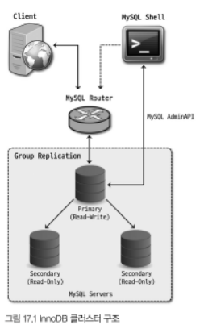
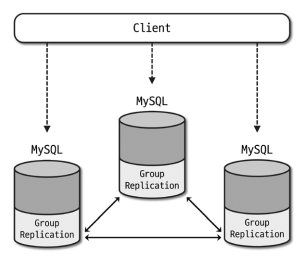
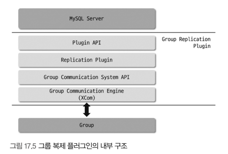
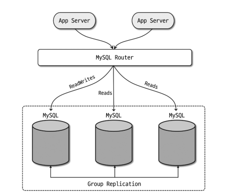

# 17 InnoDB 클러스터
- MySQL 서버 자체적으로 페일오버를 처리할 수 없기 때문에 장애 발생 시 레플리카 서버를 새로운 소스 서버로 사용하기 위해 작업을 진행해야한다.
- 레플리카 서버의 읽기 모드 해제, 장애가 발생한 서버의 데이터 변경 막기, 애플리케이션과의 커넥션 설정을 레플리카서버로 옮기는 작업을 해야해 적지 않은 시간이 소요된다.

- 장애 시간을 최소화하기 위해 대부분 위의 전환 작업을 자동화하는 편으로 장애를 감지해 직접 페일오버를 처리하는 시스템을 개발하거나, 서드파티 HA 솔루션을 사용한다.
- 솔루션의 대표적인 것으로는 MMM 과 MHA, Orchestrator 등이 존재한다.
- MySL 5.7.17 버전 이후 빌트인 형태의 HA 솔류션이 도입되며 사용자가 좀 더 쉽게 사용할 수 있게 되었다.

# 17.1 InnoDB 클러스터 아키텍처
- InnoDB 클러스터는 MySQL의 고가용성 실현을 위해 만들어진 여러 구성요소들의 집합체
- InnoDB 클러스터의 구성요소
  - 그룹 복제(GroupReplication)
    - 기본적인 복제 역할 뿐만이 아니라 복제에 참여하는 서버들에 대한 자동화된 멤버십 관리 역할을 담당
  - MySQL 라우터(MySQL Router)
    - 애플리케이션 서버와 MySQL 서버 사이에서 동작하는 미들웨어 프로그램
    - 애플리케이션에서 실행된 쿼리를 적절한 MySQL 서버로 전달하는 프락시 역할을 한다.
  - MySQL 셀(MySQL Shell)
    - 기존 MySQL 클라이언트보다 좀 더 확장된 기능을 가진 프로그램
    - 기본적인 SLQ 실행, 스크립트 작성 기능, MySQL 서버에 대해 클러스터 구성등의 어드민 작업을 할 수 있는 API 제공

- InnoDB 클러스터에서 데이터가 저장되는 서버는 그룹 복제 형태로 구성
- 읽기/쓰기가 모두 가능한 프라이머리 서버가 소스 서버, 읽기만 가능한 세컨더리 서버가 레플리카 서버라고 볼 수 있다.
- 소스 서버는 여러개를 사용할 수 있으며 그룹 복제는 InnoDB 스토리지엔진에서만 사용이 가능해 InnoDB 클러스터라고 한다.
- 복제 구성시 고가용성을 위해 3대 이상의 서버로 구성해야한다.
- InnoDB 클러스터 사용 환경은 MySQL의 라우터를 통해 애플리케이션에서 전달된 쿼리를 적절한 MySQL 서버로 전달한다.
- MySQL 라우터는 InnoDB 클러스터를 구성하고 있는 서버의 메타데이터를 가지고 쿼리를 적절한 서버로 전달해 실행한다.
- MySQL 셀은 사용자가 InnoDB 클러스터 생성 및 관리를 돕는 API 를 제공해 API를 통해 클러스터 상태 확인, 서버 설정 변경등이 가능한다.

- InnoDB 크러스터는 서버 장애 발생을 감지해 자동으로 장애 서버를 복제 그룹에서 제외하고, 라우터는 해당 변경을 인지해 메타테이터를 변경하여 장애가 발생하지 않은 서버로만 요청을 전달하게 된다.
- 위의 과정을 진행하는 InnoDB 클러스터는 MySQL에서 공식적으로 제공하는 HA 솔루션으로 MySQL 에서 테스트하고 개발하기 때문에 사용자가 별도의 솔루션 개발, 수정에 신경쓰지 않아도 된다.

# 17.2 그룹 복제(Group Replication)
- MySQL 5.7.17 버전부터 그룹복제 방식이 적용되었다.
- 기존 MySQL 복제 프레임워크와 비슷하지만 복제 구성 형태와 트랜잭션 처리 방식 측면에서 그룹복제와 완전히 다르다.
  - 기존 복제의 경우 소스-레플리카 형태의 단방향 복제가 이뤄진다.
  - 그룹 복제는 복제 참여 서버들이 하나의 복제 그룹으로 묶인 클러스터 형태를 가지며 그룹 내 서버들이 서로 통신하며 양방향 복제 처리가 가능하다.
- 그룹 복제에서는 쓰기 처리 서버를 프라이머리, 읽기 전용 서버를 세컨더리라고 표현하며 그룹 복제 참여 mySQL 서버를 그룹 멤버라고 지칭한다.

- 그룹 복제와 기존 복제의 복제 처리 방식
  - 기존 복제: 비동기 방식, 반동기 방식으로 처리
    - 비동기 방식: 소스 서버에서 트랜잭션 커밋 시 레플리카 서버로도 해당 트랜잭션이 잘 전달 되었는지 확인하지 않음
    - 반동기 방식: 소스 서버에서는 트랜잭션 커밋 처리 중 레플리카 서버로 잘 전달되었는지 응답을 받은 후 처리
      - 응답을 못받았다고 트랜잭션이 소스 서버에서 적용되지 않는것은 아니다
  - 그룹 복제: 반동기 방식으로 처리하지만 기존과는 다른 처리 방식
    - 한 서버에서 트랜잭션이 커밋될 준비가 되면 같은 그룹 내 서버들에게 트랜잭션 정보를 전달, 과반수 이상의 서버로부터 응답을 받으면 그때 인증하고 최종적으로 커밋한다.
      - 인증을 통해 충돌 여부를 검사해 문제 없이 적용 가능한지 확인한다.
      - 과반후 이상의 응답을 받지 못하면 트랜잭션은 그룹에 적용되지 않는다.
    - 응답을 받지 못하면 트랜잭션 처리를 하지 않기 때문에 기존 복제 방식과는 완전히 다른 형태이다.
    - 트랜잭션 커밋 처리할 때 그룹의 다른 멤버들에 대한 응답을 확인하는 과정을 합의라고한다.
    - 합의는 데이터를 변경할 때만 필요한 과정이며 읽기만 할 때는 필요하지 않다.
- 그룹 복제에서 제공하는 대표적인 기능
  - 그룹 멤버 관리(그룹 내 서버 들 관리)
  - 그룹 단위의 정렬된 트랜잭션 적용 및 트랜잭션 충돌 감지
  - 자동 페일오버
  - 자동 분산 복구

## 17.2.1 그룹 복제 아키텍처

- 그룹 복제에 참여하는 MySQL 서버들은 그룹 복제 플러그인을 통해 서로 통신하며 동기화처리한다.
- 플러그인은 그룹 복제가 설정되면 group_replication_applier 라는 채널을 생성하고, 이 채널을 통해 실행되는 트랜잭션을 전달받아 처리한다.
- 추가로 group_replication_recovery 라는 복제 채널을 생성해 분산 복구 작업도 진행한다.

- Plugin API
  - MySQl 서버와 상호작용하기 위해 구현된 인터페이스 집합
  - API를 통해 MySQL 서버에서 그룹 복제 플러그인이나 그 반대 방향으로 요청이 전달되며, 서버에서는 서버의 시작, 복구, 트랜백션 커밋등의 이벤트를 그룹 복제 플러그인에 전달한다.
  - 그룹 복제 플러그인에서는 처리중인 트랜잭션에 대한 커밋 또는 중단, 릴레이 로그 기록을 위한 요청을 서버에 전달한다.
- 복제 플러그인 계층
  - 계층 내부는 여러 모듈로 나눠져있다.
  - API를 통해 들어온 요청을 각각 적절한 모듈로 전달한다.
  - 로컬 및 그룹 복제의 다른 MySQL 서버에서 실행된 원격 트랜잭션들이 처리, 트랜잭션의 충돌감지 및 그룹 내 전파 등이 수행
  - 그룹 복제 분산 복구 작업도 이 계층에서 처리한다.
- 그룹 통신 시스템 API
  - 상위 플러그인 계층과 그룹 통신 엔진 사이를 이어주는 역할을 담당한다.
- 그룹 통신 엔진
  - 그룹 복제에 참여중인 다른 MySQL 서버들과의 통신 처리를 담당
  - 기본 포트가 아닌 그룹 복제 설정시 지정된 별도의 포트를 통해 통신을 수행
  - 트랜잭션이 그룹 복제 멤버들에게 동일한 순서로 전달될 수 있게 보장하며 그룹 복제 토폴리지 변경, 그룹 멤버 장애등을 감지한다.
  - 트랜잭션 적용등을 위한 합의 처리도 담당한다.
    - 합의 처리를 위한 알고리즘은 Paxos 와 Raft 가 있다.

## 17.2.2 그룹 복제 모드
- group_replication_single_primary_mode 변수를 통해 프라이머리 모드를 설정할 수 있다.
  - ON 으로 설정 시 싱글 프라이머리 모드로 동작, OFF 로 설정시 멀티 프라이머리 모드로 동작한다.
  - 기본값은 ON 으로 설정되어있음
- MySQL 8.0.13 전까지는 복제 중단 후 그룹의 모든 멤버들의 정보를 변경해야했는데 8.0.13 이후로는 중단 없이 변경이 가능하다.
### 17.2.2.1 싱글 프라이머리 모드
- 프라이머리 서버가 한대만 존재하는 형태
- 처음 구축 시 복제 구축을 진행한 MySQL 서버가 프라이머리 서버로 지정된다.
- 프라이머리 서버 변경
  - 자발적, 예기치 않게 프라이머리 서버가 그룹을 탈퇴하는 경우
    1. MySQL 서버 버전 - 가장 낮은 버전을 실행중인 멤버를 확인하는데 모든 멤버가 8.0.17 이상 사용중인 경우 패치 버전을 기준으로 정렬, 미만 사용시 메이저 버전을 기준으로 정렬해 사용한다.
    2. 각 멤버의 가중치 값 - 동일 버전을 실행중일 경우 시스템 변수에 지정된 가중치 값을 비교해 선정한다.
    3. UUID 값의 사전식 순서 - 동일 버전, 가중치 인 경우 해당 멤버들이 가지는 UUID 값의 사전식 순서를 바탕으로 가장 낮은 값을 가진 멤버를 선택한다.
  - group_replication_set_as_primary() UDF를 사용해 새로운 프라이머리 서버를 지정한 경우
### 17.2.2.2 멀티 프라이머리 모드
- 그룹 멤버들이 전부 프라이머리로 동작하는 형태로 클라이언트는 어떤 MySQL 서버로든 쓰기, 읽기 요청을 보낼 수 있다.
- 모든 멤버에서 쓰기가 발생할 수 있고, 쓰기 발생 시 다른 멤버들에게 전파되어 처리된다.
- 따라서 MySQl 버전의 호환성이 중요해 성능과 호환성을 위해 동일한 버전으로 실행되는게 좋다.
- 그룹 복제에서 버전에 따른 호환 기능 기준
  - 새로운 멤버가 그룹의 가장 낮은 MySQL 버전보다 낮을 경우 그룹에 참여할 수 없다.
  - 새로운 멤버가 그룹의 가장 낮은 MySQL 버전과 동일한 버전을 사용중이면 참여할 수 있다.
  - 새로운 멤버가 그룹의 가장 낮은 MySQL 버전보다 높을 경우 참여할수는 있지만 읽기 전용 모드를 유지한다.
    - 싱글 프라이머리 모드로 설정된 그룹은 버전에 관계 없이 새로 참여하는 멤버는 읽기 전용 모드로 설정된다.
- MySQL 8.0.17 이상의 버전 사용시 호환 가능 여부에 따라 그룹 복제에서 읽기 전용 및 읽기-쓰기 모드 전환을 자동으로 처리한다.

## 17.2.3 그룹 멤버 관리
- 그룹 복제에서는 어떤 서버가 그룹에 참여중인지 목록과 상태 정보를 내부적으로 관리한다.
- performance_schema 의 replication_group_members 테이블을 통해 그룹 멤버 목록 확인이 가능하다.
  - 그룹 멤버들의 호스트명과 사용 포트, UUID 값, MySQL 버전 확인이 가능
  - MEMBER_STATE 칼럼으로 현재 상태를 확인할 수 있다.
    - ONLINE: 그룹 복제의 한 구성원으로 정상 동작하고 있음을 의미
    - RECOVERING: 그룹 복제 참여를 위해 기존 그룹 멤버로 부터 데이터를 전달받는 복구 작업이 진행중
    - OFFLINE: MySQL 서버에 그룹 복제 플러그인이 로딩되었지만 아직 참여하지 않음
    - ERROR: 그룹 복제에 속해있으나 정상적으로 복제가 동작하지 않고 있는 상태
    - UNREACHABLE: 현재 통신이 불가능하다고 판단되는 멤버에 대해 표시
- 그룹 복제가 관리하는 멤버 목록과 상태 정보를 뷰라고도 하는데 뷰는 뷰ID 라는 고유 식별자를 가지고, 그룹 멤버 변경시 마다 새로운 식별자를 받아 이를 통해 변경을 추적한다.
  - `View ID = [Prefix value]:[Sequence value]` 
  - 첫 번째 부분은 그룹 복제 초기화시 생성되며 그 시점의 타임스탬프를 기반으로 만들어진다.
    - 이 값으로 동일한 그룹의 다른 시점인지 아니면 완전히 다른 그룹의 뷰인지 구분한다.
  - 두 번째 부분은 단조 증가하는 정수 값으로 그룹에서 멤버가 변경될 때마다 1씩 증가한다.

## 17.2.4 그룹 복제의 트랜잭션 처리
- 그룹 복제에서 트랜잭션은 **합의**, **인증**  단계를 거쳐 그룹의 각 서버에 적용된다.
  - 합의
    - 그룹 내 일관된 트랜잭션 적용을 위해 그룹 멤버들에게 트랜잭션 적용을 제안하고 승낙 받는 과정
    - 그룹 멤버 간 통신 결과를 바탕으로 처리한다.
    - 한 멤버에서 트랜잭션 실행 후 커밋 요청을 보내면 다른 멤버들이 해당 트랜잭션에 대한 데이터를 전달받고 내용을 바탕으로 합의를 수행해 과반수 이상으로부터 응답을 받으면 다음 프로세스를 진행한다.
  - 인증
    - 합의 단계가 지나고 글로벌하게 정렬되어 각 멤버들에게 인증단계를 거치게 된다.
    - 전달받은 트랜잭션 데이터와 로컬에서 내부적으로 관리하고 있는 데이터를 바탕으로 선행된 트랜잭션과의 충돌 여부를 확인한다.
      - 충돌은 멀티 프라이머리 모드에서만 발생한다.
    - 충돌이 있을 경우 커밋되지 못하고, 없다면 인증단계를 거쳐 바이너리 로그에 트랜잭션을 기록하고 커밋한다.
      - 클라이언트는 이 시점에 커밋에 대한 응답을 받고, 다른 멤버들은 인증 단계를 수행한 후 릴레이로그를 작성해 바이너리 로그에도 기록해 해당 트랜잭션을 적용한다.

### 17.2.4.1 트랜잭션 일관성 수준
- 그룹 복제에서 각 멤버들은 동일한 트랜잭션을 적용하지만 적용 시점까지 불일치할 수 있다.
- 위의 상황을 방지하기 위해 MySQL 8.0.14 버전부터는 그룹 복제에서 트랜잭션의 일관성 수준을 설정할 수 있게 지원하고있다.

#### 17.2.4.1.1 EVENTUAL 일관성 수준
- 기본 설정 값으로 그룹 멤버들이 일관된 데이터를 가지게 됨을 의미한다.
- 읽기 전용 및 읽기-쓰기 트랜잭션이 별도의 제약없이 실행 간으해 변경 전 상태의 데이터가 읽혀질 수 있다.
- 페일오버 발생 시 새로운 프라이머리가 이전 프라이머리의 트랜잭션을 모두 적용하기 전 읽기 발생 시 오래된 데이터를 읽을 수 있다
- 읽기-쓰기 트랜잭션의 경우 커밋 시 이전 프라이머리 트랜잭션과의 충돌로 롤백될 수 있다.
#### 17.2.4.1.2 BEFORE_ON_PRIMARY_FAILOVER 일관성 수준
- 싱글 프라이머리 모드로 설정된 그룹 복제에서 프라이머리 페일오버 발생 해 신규 프라이머리가 선출됐을 때만 트랜잭션에 영향을 준다.
- 이전 프라이머리의 트랜잭션을 적용하고 있을 경우 새로운 프라이머리로 유입된 읽기 전용 및 읽기-쓰기 트랜잭션은 이전 트랜잭션이 모두 적용될때까지 대기한다.
- 대기시간이 길어질 수 있어 대기 시간을 따로 설정할 수 있다.
- BEFORE_ON_PRIMARY_FAILOVER 에서의 보장
  - 신규 프라이머리로 유입된 읽기 전용 및 읽기-쓰기 트랜잭션들은 오래된 데이터가 아닌 최신 데이터를 바탕으로 동작하게 된다.
  - 신규 프라이머리로 유입된 읽기-쓰기 트랜잭션은 적용 대기중인 이전 프라이머리의 트랜잭션과의 충돌로 롤백이 발생되지 않는다.
- 처리 지연이 되는 쿼리
  - SHOW, SET, DO, EMPTY, USE 문
  - performance_schema 및 sys 데이터 베이스에 대한 SELECT 문 사용
  - imformation_schema 데이터베이스의 PROCESSLIST 테이블에 대한 select 문 사용
  - 등
#### 17.2.4.1.3 BEFORE 일관성 수준
- 선행 트랜잭션이 완료될 때까지 대기 후 처리
- 항상 최신 데이터를 읽으며, 선행 트랜잭션의 처리시간에 영향을 받는다.
- MySQL 의 wait_timeout 시스템 변수에 설정된 시간까지 대기할 수 있고, 그 시간이 넘어가면 에러가 반환된다.
- DB에서 읽기 요청은 적고 쓰기 요청이 많은 경우에 사용하는게 좋다.

#### 17.2.4.1.4 AFTER 일관성 수준
- 해당 시점에 그룹 멤버들이 모두 동기화된 데이터를 갖게 해 다른 모든 멤버들이 트랜잭션 커밋 준비가 될때까지 대기한다.
- 다른 멤버에서 동시점에 실행되는 트랜잭션에 영향을 미치기 때문에 정상 동작중인 멤버 모두에게 영향을 미친다.
- 모든 멤버들이 커밋 준비가 된 후 트랜잭션이 로컬 멤버에게 최종적으로 커밋 되어 후속 트랜잭션은 모두 일관된 데이터를 얻을 수 있다.
- 모든 멤버들에게 응답을 받아야해서 본래의 처리 시간보다 많은 시간이 소요되기 때문에 쓰기 요청보다 읽기가 많고, 분산된 최신 읽기를 수행하고자 할때 사용하는게 좋다.
#### 17.2.4.1.5 BEFORE_AND_AFTER 일관성 수준
- BEFORE 수준과 AFTER 수준이 결합된 형태
- 모든 선행 트랜잭션이 적용된 후 실행되며 모든 멤버들에게서 커밋 준비 응답을 받았을 때 커밋된다.
- 읽기 전용 트랜잭션은 선행 트랜잭션이 모두 적용될 때까지 대기 후 실행된다.

### 17.2.4.2 흐름 제어(Flow Control)
- 그룹 멤버 간 트랜잭션 적용 불균형으로 발생하는 문제를 방지하기 위한 매커니즘
- 멤버간 트랜잭션 갭을 적게 유지해 멤버들간 데이터가 최대한 동기화된 상태로 유지될 수 있게 하며 워크로드 유입 등의 변화에 빠르게 적응해 처리량을 균등하게 관리한다.
- 필요 이상으로 처리량을 줄이지 않아 서버의 자원이 불필요하게 유휴 상태에 놓이지 않게 한다.
- group_replication_flow_control_mode 시스템 변수를 통해 흐름 제어를 어떤 모드로 사용할지 설정할 수 있다.
  - 현재 QUOTA 모드만 존재하며 흐름 제어의 기본 모드로 그룹에서 쓰기를 처리하는 멤버가 정해진 할당량 만큼만 처리하게 한다.

- QUOTA 흐름 제어의 동작 방식
  - 모든 그룹의 멤버들의 쓰기 처리량, 처리 대기중인 트랜잭션에 대한 통계 수집 후 처리량 조절 필요를 확인한다.
  - 처리량 조절이 필요할 경우 수집한 통계 데이터를 바탕으로 멤버들에게 할당할 처리량을 계산해 계산된 값을 넘어 쓰지 않게 처리를 제한한다.
- 흐름 제어가 수집하는 통계 데이터
  - 인증 큐 크기
  - 적용 큐 크기
  - 인증된 총 트랜잭션 수
  - 적용된 원격 트랜잭션 수
  - 로컬 트랜잭션 수
- 인증 큐 크기와 적용 큐 크기를 바탕으로 멤버의 처리량을 조절한다.

## 17.2.5 그룹 복제의 자동 장애 감지 및 대응
- 그룹 복제에서는 일부 멤버의 장애 발생시 메커니즘을 통해 해당 멤버를 식별해 그룹 복제에서 제외시켜 그룹을 정상동작할 수 있게 한다.
- 멤버간 주기적 통신 메시지를 통해 서로 상태를 확인하고, 5초 이내로 메시지를 받지 못하면 문제가 생긴것으로 의심, 과반수의 멤버가 의심하면 그룹에서 추방한다.
  - 5초라고 했지만 group_replication_member_expel_timeout 변수로 설정할 수 있다.
  - 네트워크가 느리다면 좀 더 긴 시간으로 설정하는게 좋다.
- 그룹에서 추방되면 뷰ID 가 변경되기 때문에 추방 사실을 알수 있고, 설정에 따라 그룹 재가입을 시도할 수 있다.
- 그룹에서 탈퇴 상태가 된 후 재가입에 실패하거나 시도하지 않으면 종료 액션을 진행한다.
  - READ_ONLY: 슈퍼 읽기 전용으로 전환해 사용자가 admin 권한을 가지고 있더라도 변경작업을 하지 못하게 막는다.
  - OFFLINE_MODE: 서버를 오프라인 모드로 전환해 기존에 연결된 세션을 끊고 ADMIN 사용자를 제외하고 연결을 허용하지 않는다.
  - ABORT_SERVER: 서버를 종료시킨다.

## 17.2.6 그룹 복제의 분산 복구
- 멤버가 그룹에 새로 가입하거나 탈퇴 후 재가입 시 기존에 적용된 트랜잭션을 모두 적용해야해서 복구 프로세스를 수행한다. 이를 **분산 복구** 라고 한다.

### 17.2.6.1 분산 복구 방식
- 가입 멤버에게서 복제 채널의 릴레이 로그를 확인 해 가입한 멤버가 이전에 가입했었고, 릴레이 로그에는 기록되어있지만 실제로 적용되지 않은 데이터가 있으면 해당 트랜잭션을 적용한다.
- 릴레이 로그 확인 후 그룹에 온라인 상태로 존재하는 다른 그룹과 연결해 바이너리 로그 복제 방식이나 원격 클론 방식으로 복구를 진행한다.
  - 바이너리 로그 복제 방식
    - 비동기 복제를 기반으로 구현되어 기증자로 선택된 멤버와 별도의 복제 채널로 연결해 데이터를 적용한다.
  - 원격 클론 방식
    - 다른 그룹 멤버의 InnoDB 스토리지 엔진에 저장된 모든 데이터와 메타데이터를 스냅숏으로 가져와 가입 멤버를 재구축한다.
- 가입한 멤버에 대해 가장 적합한 형태의 복구방식으로 자동 선택되지만 기존 멤버들간의 트랜잭션 갭이 크거나 바이너리 로그 파일이 없을 경우 원격 클론 방식으로 복구작업을 시작한다.

### 17.2.6.2 분산 복구 프로세스
1. 로컬 복구
  - 가입 멤버가 이전에 가입된 적이 있는 경우 적용하지 못한 트랜잭션들을 우선 적용한 후 복구 작업을 진행한다.
2. 글로벌 복구
  - 가입 멤버는 그룹의 기존 멤버 중 기증자 역할을 할 멤버를 선택해 해당 멤버로부터 데이터를 가져와 적용한다.
  - 작업 진행동안 그룹 내 처리되는 트랜잭션들은 내부적으로 캐싱한다.
3. 캐시 트랜잭션 적용
   - 글로벌 복구 단계가 완료되면 캐싱된 트랜잭션들을 적용해 최종적으로 그룹에 참여한다.

### 17.2.6.3 분산 복구 설정
- 연결 시도 횟수(group_replication_recovery_retry_count)
  - 가입한 멤버가 기존 그룹 멤버에 연결을 시도하는 횟수를 제한할 수 있다.
- 연결 시도 간격(group_replication_recovery_reconnect_interval)
  - 복구 작업 진행 시 기존 그룹 멤버들에 대한 연결 시도 사이 간격을 지정할 수 있다.
  - 연결 대상 멤버에 대해 한번씩 연결 시도 후 변수에 지정된 시간만큼 대기한다.
- 가입한 멤버를 온랑니 상태로 표기하는 시점
  - 기본적으로는 가입 멤버에서 분산 복구가 완료되면 가입한 멤버 상태가 online 으로 표시된다.
  - 설정에 따라 누락된 트랜잭션들이 인증 단계까지 모두 완료했을 때 online 으로 표시하게 설정할 수 있다.

### 17.2.6.4 분산 복구 오류 처리
- 복구 작업 중 문제가 발생하더라도 가능한 경우 다시 작업을 시도하는 장애 감지 메커니즘이 구현되어있다.
- 다음의 경우 다시 작업을 시도한다.
  - 기증자로 선택한 그룹 멤버로의 연결에 문제가 발생해 정상적으로 이뤄지지 않는 경우
  - 바이너리 로그 복제 방식으로 복구 작업 진행 중 레플리케이션 I/O 스레드나 SQL 스레드에서 에러가 발생한 겨우
  - 원격 클론 작업이 실패하거나 완료 전 중단된 경우
  - 복구 작업 동안 기증자 멤버에서 그룹 복제가 중단된 경우

## 17.2.7 그룹 복제 요구사항
- InnoDB 스토리지 엔진 사용
  - 데이터 저장 테이블은 반드시 InnoDB 스토리지 엔진을 사용해야한다.
  - 충돌 발생 시 롤백 처리를 위해 트랜잭션이 지원되는 스토리지 엔진이 필요한데 다른 스토리지 엔진에서는 에러가 발생할 수 있다.
- 프라이머리 키 사용
  - 그룹에서 복제될 모든 테이블은 프라이머리 키를 가지고 있어야한다.
  - 명시적 프라이머리키가 없을 경우 not null 의 유니크 키가 있어야한다.
- 원활한 네트워크 통신 환경
- 바이너리 로그 활성화
  - 복제에서 바이너리 로그를 사용하기 때문에 바이너리 로그가 활성화 되어있어야한다.
- ROW 형태의 바이너리 로그 포맷 사용
- 바이너리 로그 체크섬 설정
- log_slave_updates 활성화
  - 그룹 복제에서는 그룹의 모든 멤버들이 쓰기를 수행하는 프라이머리 서버가 될 수 있어서 log_slave_updates 시스템 변수가 반드시 활성화 되어있어야한다.
- GTID 사용
  - 그룹 복제는 기본적으로 GTID를 사용하기 때문에 옵션을 설정해야한다.
- 고유한 server_id 값 사용
- 복제 메타데이터 저장소 설정
  - 복제 관련 데이터는 데이터의 일관성을 위해 파일이 아닌 테이블에 저장되어야한다.
- 트랜잭션 WriteSet 설정
- 테이블 스페이스 암호화 설정
  - default_table_encryption 시스템 변수는 모든 그룹 멤버에서 동일한 값으로 설정되어야한다.
- lower_case_table_names 설정
  - lower_case_table_names 시스템 변수는 모든 그룹 멤버에서 동일한 값으로 설정 되어야한다.
- 멀티 스레드 복제 설정
  - 그룹 복제에서도 스레드 복제 기능을 사용해 트랜잭션을 병렬로 적용할 수 있는데, 이때 커밋 순서가 변경되지 않도록 slave_preserve_commit_order 옵션을 ON해야한다.

## 17.2.8 그룹 복제 제약사항
- 갭락은 갭락을 발생시킨 트랜잭션이 실행된 멤버에서만 유효, 인증 단계에서 해당 정보는 공유되지 않는다. 따라서 갭락이 사용되지 않는 READ-COMMITTED 트랜잭션 격리 수준이 좋다.
- 테이블 락, 네임드 락도 그릅 단위로 락 정보가 공유되지 않는다.
- 멀티 프라이머리 모드로 동작중인 그룹은 SERIALIZABLE 트랜잭션 격리 수준을 사용할 수 없다.
- 멀티 프라이머리 모드로 동작중인 그룹에서 동일한 테이블에 대해 서로 다른 멤버로 동시에 DDL 및 DML 사용은 지원하지 않는다.
- 멀티 프라이머리 모드로 동작중인 그룹에서 외래키 존재 테이블 중 CASCADE 제약조건이 사용된 테이블은 지원하지 않는다.
- 멀티 프라이머리 모드에서 SELECT ...  FOR UPDATE 구문 사용시 데드락이 발생할 수 있다.
- 그룹 복제에서 복제 필터 기능은 사용할 수 없다.
- 그룹 복제는 최대 9대의 서버까지 구성이 가능하고 더 추가되는 경우 에러가 발생한다.

# 17.3 MySQL 셸
- 고급 클라이언트 툴로 SQL 뿐만 아니라 자바스크립트와 파이썬 언어 모드를 지원한다.

# 17.4 MySQL 라우터
- InnoDB 클러스터에서 애플리케이션 서버로부터 유입된 쿼리 요청을 적절한 서버로 전달하고 반환된 결과를 애플리케이션으로 보내는 프락시 역할을 수행한다.

## 주요 기능
- InnoDB 클러스터의 MySQL 구성 변경 자동 감지
  - 애플리케이션 서버에서 라우터를 통해 접근해 커넥션 설정에는 라우터 서버 정보가 들어간다.
  - 라우터에서 클러스터 내 서버들에 대한 정보를 캐싱하고, 주기적으로 갱신하며 변경을 자동으로 감지해 애플리케이션과의 연결을 조절한다.
- 쿼리 부하 분산
  - 라우터에서 클러스터로 설정된 라우팅 커넥션별로 수행
  - 사용자는 각 커넥션에서 사용하고자 하는 부하 분산 방식을 지정해 사용할 수 있다.
- 자동 페일오버
  - 지정된 부하분산 방식에 따라 장애 발생 시 재시도할 서버를 결정한다.
  - 장애가 발생하면 라우터에서 이를 감지해 자동으로 실행하기 때문에 애플리케이션 서버단에서는 별도의 조치 없이 쿼리 실행이 가능하다.
- 