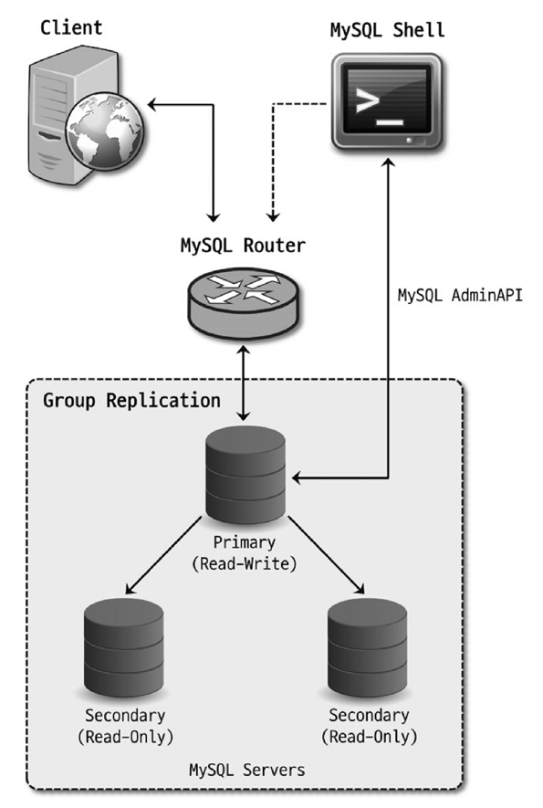
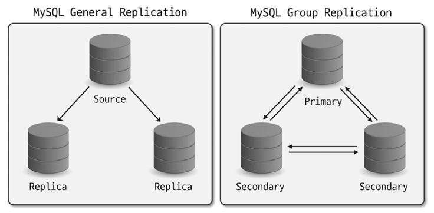
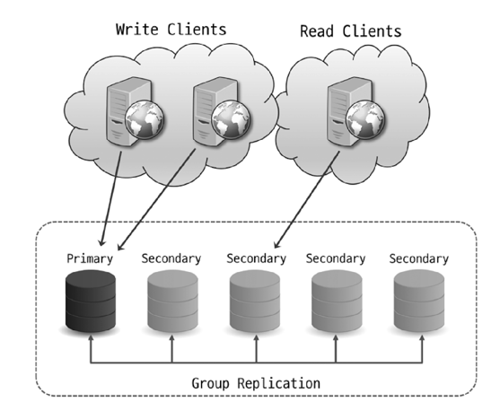
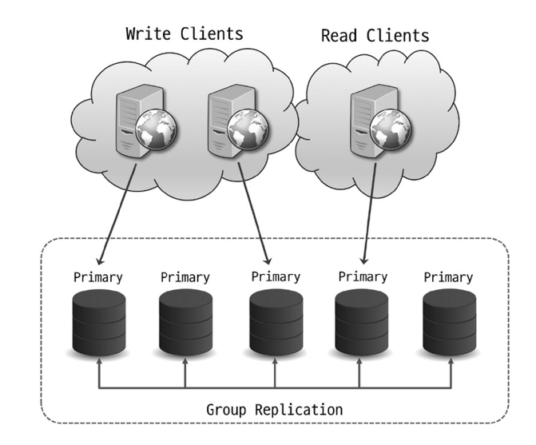
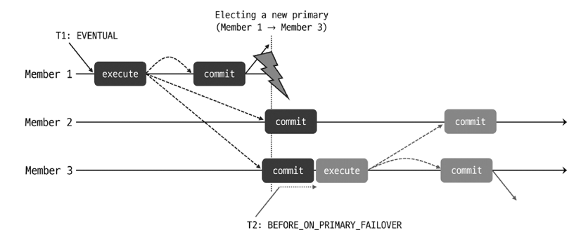
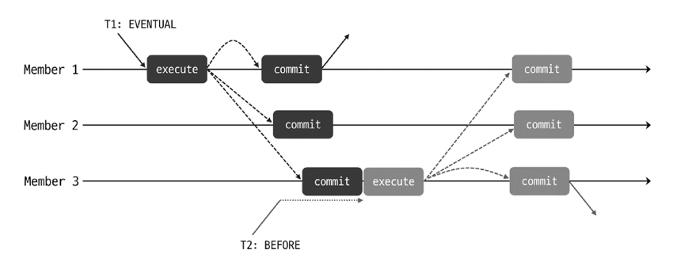
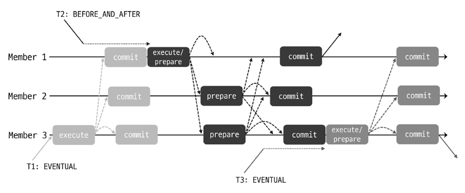

# Introduction
- 복제를 구성한다고 고가용성이 실현되는 것은 아님 
  - 소스 서버에 장애가 발생했을 때 레플리카 서버가 **자동으로 기존 소스 서버를 대체하는 것이 새로운 소스 서버로 전환되는 것이 아니**기 때문 
- MySQL은 서버 자체적으로 자동 페일오버(Failover)를 처리하는 기능을 제공하지 않음
  - 장애 발생 시, 사용자가 레플리카 서버가 새로운 소스 서버가 될 수 있도록 일련의 작업들을 수행해야 함 
- 일련의 작업
  - 레플리카 서버에 설정된 읽기 모드를 해제 
  - 스블릿 브레인(Split-Brain) 현상을 방지하기 위해 장애가 발생한 소스 서버에서 데이터 변경을 실행하지 못하도록 해야 함 
    - 스플릿 브레인?
      - 클러스터로 구성된 두 시스템 간의 네트워크가 일시적으로 동시에 단절되거나 기타 시스템상의 이유로, 클러스터 상의 모든 노드들이 각자 자신이 Primary라고 인식하게 되는 상황 
      - 아마 MySQL 복제에서는 두 서버 모두 자신이 소스 서버라고 인식하는 상황을 말하는 것 같다. 
  - 애플리케이션 서버가 새로운 소스 서버를 바라보도록 커넥션 설정을 변경해야 함 
- 장애 시간을 최소화 하는 것이 중요하다 
  - 자동화를 고려해야 함 
  - 서드파티 MA 솔루션: MMM, MHA, Orchestrator 
  - MySQL 5.7.17 부터는 빌트인 형태의 HA 솔루션인 InnoDB 클러스터가 도입됨 

---

---

# 17.1 InnoDB 클러스터 아키텍처 

- InnoDB 클러스터는 MySQL의 고가용성 실현을 위해 만들어진 여러 구성 요소들의 집합체임 
- 구성 요소
  - 그룹 복제(Group Replication)
    - 소스 서버 데이터를 레플리카 서버로 동기화 하는 기본적인 복제 역할 
    - 복제에 참여하는 MySQL 서버들에 대한 자동화된 멤버십 관리(그룹에 새로운 멤버 추가/제거) 역할 
    - Primary 서버: 읽기/쓰기 모두 가능 (소스 서버) 
      - 1~N대 존재 가능 
    - Secondary 서버: 읽기만 가능 (레플리카 서버)
    - 최소 3대 이상의 서버가 필요 
      - 3대로 구성했을 때 부터 서버 한 대에 장애가 발생하더라도 복제 그룹이 정상 동작하기 때문 
  - MySQL 라우터(MySQL Router)
    - 애플리케이션 서버와 MySQL 서버 사이에서 동작하는 미들웨어 프로그램 
    - 애플리케이션이 실행한 쿼리를 적절한 MySQL 서버로 전달하는 Proxy 역할
      - InnoDB 클러스터로 구성된 MySQL 서버들에 대한 메타 데이터 정보를 가지고 있음 
      - 애플리케이션의 커넥션 정보에는 MySQL 라우터 서버만 설정해두면 됨 
  - MySQL 셸(MySQL Shell)
    - 기본적인 SQL문 실행 
    - js, python 기반의 스크립트 작성 기능 
    - MySQL 서버에 대해 클러스터 구성 등의 Admin 작업을 할 수 있게 하는 AdminAPI 제공
      - 손쉽게 InnoDB 클러스터를 생성하고 관리할 수 있음 
      - 클러스터 상태 확인, 서버 설정 변경 등 여러 기능 제공 
- 장애가 발생한 경우
  - 그룹 복제가 먼저 이를 감지함 
    - 자동으로 해당 서버를 복제 그룹에서 제외 
  - MySQL 라우터가 복제 토폴로지 변경을 인지
    - 서버 관련 메타데이터를 갱신하여 애플리케이션 서버에서 실행된 쿼리가 정상 동작하는 MySQL 서버로만 전달되도록 함 

---

---

# 17.2 그룹 복제(Group Replication)
- 내부적으로 ROW 포맷 바이너리 로그와 릴레이 로그, GTID를 사용 

## 17.2.0 기존 복제와 그룹 복제의 차이
### 복제 방향  

- 기존 복제: 소스-레플리카 형태로 구성되어 단방향으로만 복제 
- 그룹 복제: 그룹 내 서버들은 서로 통신하며 양방향 복제 처리 가능 (쓰기 처리 서버 여러대 존재 가능)

### 복제 처리 방식 

- 기존 복제: 비동기, 반동기 방식으로 나뉨 
  - 소스 서버에서의 트랜잭션 커밋 처리가 레플리카 서버와 무관하게 처리됨
  - 소스 서버에서는 트랜잭션이 커밋될 경우, 레플리카 서버에도 해당 트랜잭션이 잘 적용됐는지 확인하지 않음 (반동기에서 전달 정도만 확인함)
  - 레플리카 서버로부터 응답을 받지 못했다고 해서 트랜잭션이 소스 서버에서 적용되지 않는 것은 아님 
    - 소스 서버에서 일방적으로 적용 
- 그룹 복제: 반동기 방식이라고 할 수 있으나, 기존 반동기 방식과는 차이가 있음 
  - 한 서버에서 트랜잭션 커밋 준비 완료 → 트랜잭션 정보를 그룹의 다른 멤버들에게 전송 → 과반수 이상의 멤버로부터 응답을 받음(consensus) → 트랜잭션을 인증(certify) → 커밋 처리 
    - 인증 과정: 인증 대상 트랜잭션이 이미 인증 단계를 통과한 선행 트랜잭션과 동시점에 동일한 데이터를 변경했는지 "충돌 여부"를 검사하고, 문제 없이 적용 가능한지 그 여부를 확인함 
    - 과반 수 이상의 멤버로부터 응답을 받지 못할 경우, 해당 트랜잭션은 그룹에 적용되지 않음
  - 그룹 내 멤버들의 응답에 따라 트랜잭션 적용 여부가 결정됨
    - 합의(consensus) 과정 이라고 함 
    - 데이터를 변경하는 트랜잭션에 대해서만 이같은 합의 과정이 필요함 (읽기에는 필요 없음)
  - 트랜잭션을 실제로 적용했는지는 확인하지 않음

### 대표 기능 
- 그룹 멤버 관리
- 그룹 단위의 정렬된 트랜잭션 적용 및 트랜잭션 충돌 감지 
- 자동 Failover
- 자동 분산 복구 

## 17.2.1 그룹 복제 아키텍처 

- 그룹 복제 플러그인을 통해 서로간에 지속적으로 통신하며 복제 동기화를 처리 
- 복제 채널을 통해 그룹에서 실행된 모든 트랜잭션을 전달받아 적용하게 됨 
- 그룹에 새로 가입할 경우, 이미 참여중인 다른 서버들과 같이 최신 데이터를 가지도록 하는 그룹 복제 분산 복구 작업 가능

- 그룹 복제 플러그인의 구성 
  - Plugin API: 그룹 복제 플러그인이 MySQL 서버와 상호작용 하기위한 인터페이스 
    - MySQL 서버에서는 서버의 시작 또는 복구, 트랜잭션 커밋 등의 이벤트를 그룹 복제 플러그인에 전달함 
    - 그룹 복제 플러그인에서는 처리 중인 트랜잭션에 대한 커밋 또는 중단, 릴레이 로그 기록을 위한 요청 등을 서버에 전달함 
  - Replication Plugin: 그룹 복제 기능들이 실질적으로 구현돼 있는 계층 
    - 여러 모듈로 나눠져 있음 
    - API로 들어온 요청들은 각각 적절한 모듈로 전달됨 
    - 로컬 및 그룹 복제의 다른 MySQL 서버에서 실행된 원격 트랜잭션들이 처리됨 
    - 트랜잭션들에 대한 충돌 감지 및 그룹 내 전파 등이 수행됨 
    - 그룹 복제의 분산 복구 작업도 해당 계층에서 처리 됨 
  - 그룹 통신 시스템 API & 그룹 통신 엔진
    - 그룹 복제에 참여 중인 다른 MySQL 서버들과의 통신 처리를 담당하는 그룹 복제의 핵심 구성 요소 
    - 그룹 통신 엔진은 트랜잭션이 그룹 복제 멤버들에 동일한 순서로 전달될 수 있도록 보장함 
    - 그룹 복제 토폴로지 변경과 그룹 멤버의 장애 등을 감지 
    - 트랜잭션 적용 등을 위한 그룹 멤버 간의 합의 처리도 담당 
      - 합의 처리 알고리즘: Paxos, Raft 등
        - Paxos: 분산 시스템에서 데이터 변경이 발생하는 서버가 여러 대 존재하는 경우 주로 사용
        - Raft: 데이터 변경이 한 대에서만 발생하는 경우 주로 사용
      - 그룹 통신 엔진은 Paxos 계열의 Mencius 알고리즘을 기반으로 구현됨 

- 그룹 복제를 구성하는 MySQL 서버의 수 
  - 복제 처리 시 합의 절차가 수행되므로, 정상 동작 하기 위해서는 과반수에 해당하는 서버가 정상 동작하고 있어야 함 
  - 적어도 세 대의 서버가 그룹에 존재해야 그룹 복제가 문제 없이 정상적으로 처리됨 
    - 한 대에 문제가 생겨도 그룹의 과반수에 해당하는 나머지 두 대의 서버에서 합의가 처리될 수 있어 그룹 복제가 계속 진행될 수 있기 때문
  - 서버 수 결정 공식 
    - `n = 2f + 1 (n: 전체 서버 수, f: 허용하고자 하는 장애 서버 수)`

## 17.2.2 그룹 복제 모드 
### 싱글 프라이머리 모드

- 그룹 내에서 쓰기를 처리할 수 있는 서버가 오직 한 대만 존재하는 형태 
- 프라이머리 서버가 변경되는 상황 
  - 자발적으로, 혹은 예기치 않게 프라이머리 서버가 그룹을 탈퇴하는 경우 
  - 그룹의 특정 멤버를 새로운 프라이머리로 지정한 경우 
- 프라이머리 서버 선출 기준  
  - MySQL 서버 버전 (최우선 고려)
    - 가장 낮은 MySQL 버전을 실행 중인 멤버를 확인함  
      - 모두 8.0.17 이상 → 패치 버전 기준 정렬
      - 8.0.17 미만 서버가 존재함 → 메이저 버전을 기준으로 정렬 
  - 각 멤버의 가중치 값 
    - 가장 낮은 버전을 가진 서버가 둘 이상 존재하는 경우, 시스템 변수에 지정된 가중치 값을 비교함 
  - UUID 값의 사전식 순서
    - 서버 버전과 가중치를 기준으로 선정된 멤버가 둘 이상 존재하는 경우, UUID 값의 사전식 순서를 바탕으로 가장 낮은 값을 가지는 멤버가 새로운 프라이머리로 최종 선택됨 

### 멀티 프라이머리 모드

- 그룹 내에서 멤버들이 전부 프라이머리로 동작하는 형태 
- 발생한 쓰기가 그룹의 다른 멤버들로 전파되어 각 멤버에서 다시 처리됨 
  - 그룹 멤버 간의 버전 호환성이 중요 
  - 모든 멤버가 동일한 MySQL 버전으로 실행되는 것이 좋음 
- 버전 호환성 검사를 수행함 
  - 새로운 멤버가 그룹 내 가장 낮은 버전보다 낮은 버전을 사용중인 경우 그룹에 참여 불가 
  - 새로운 멤버가 그룹 내 가장 낮은 버전과 동일한 버전을 사용중인 경우 그룹에 참여 가능 
  - 새로운 멤버가 그룹 내 가장 낮은 버전보다 높은 버전을 사용중인 경우 그룹에 참여는 가능하나, 읽기 전용 모드를 유지함 

## 17.2.3 그룹 멤버 관리(Group Membership)
- 그룹 멤버들에 대한 목록과 상태 정보를 관리 
  - 이를 "뷰(View)"라고도 함 

## 17.2.4 그룹 복제에서의 트랜잭션 처리
- 트랜잭션 적용을 위해 필요한 단계
  - 합의(Consensus)
  - 인증(Certification)

- 합의
  - 그룹 내 일관된 트랜잭션 적용을 위해 수행되는 과정 
  - 그룹 멤버들에게 트랜잭션 적용을 제안하고 승낙을 받는 과정 (그룹 멤버 간 통신 결과를 바탕으로 처리)
  - 트랜잭션 커밋 요청 → 그룹 멤버가 그룹 통신 엔진을 통해 트랜잭션 데이터를 다른 멤버들에게 전파 → Paxos 기반 프로토콜을 바탕으로 합의 수행 → 최종 합의 완료 → 과반수 응답 메세지(ACK)를 전달받으면 다음 프로세스 진행 
    - 트랜잭션 데이터: WriteSet, 커밋될 당시의 스냅숏, 트랜잭션 이벤트 로그 데이터 등 
    - 과반수 응답을 받지 못한 경우 트랜잭션은 적용되지 않고 에러 반환 

- 인증
  - 전달받은 트랜잭션 WriteSet 데이터와 로컬의 WriteSet 히스토리 데이터를 비교 → 트랜잭션 충돌 여부 확인 (멀티 프라이머리 모드에서만 발생) 
    - 충돌이 감지된 트랜잭션은 커밋되지 못하고 롤백 
  - 인증 후 바이너리 로그에 트랜잭션을 기록하고 최종적으로 커밋을 완료
    - 클라이언트는 해당 시점에 커밋 요청에 대한 응답을 받게 됨
  - 트랜잭션을 전달받은 그룹의 다른 멤버들
    - 인증 → 트랜잭션 로그 데이터를 바탕으로 릴레이 로그 이벤트 작성 → 어플라이어 스레드는 릴레이 로그에 기록된 트랜잭션을 실행 → 바이너리 로그에도 기록 → 트랜잭션 적용 

- 과정
  - 

### 트랜잭션 일관성 수준 
- 그룹 복제에서 각 멤버들은 모두 동일한 트랜잭션을 적용하나, **실제 적용 시점까지 완전히 일치하는 것은 아님** 
  - 한 멤버에서 쓰기 수행 → 다른 멤버에서 읽었을 때 최신 변경 사항이 반영되지 않았을 수 있음 
  - 프라이머리 장애로 인해 Failover가 발생해도 이러한 상황이 발생할 수 있음 
    - 새로 선출된 프라이머리가 이전 프라이머리에서 발생했던 트랜잭션을 적용하고 있는 상황에서 클라이언트가 새로운 프라이머리에 연결해 트랜잭션을 실행하는 경우 
    - 오래된 데이터를 읽거나 쓸 수 있음 
- 동기화는 빠르게 처리되므로 위와 같은 문제가 거의 발생하진 않으나, 짧은 순간에 일시적으로 발생할 위험이 있는 문제들임 
- MySQL 8.0.14 버전부터 문제 발생 방지 가능  
  - 그룹 복제에서 트랜잭션 일관성 수준을 설정할 수 있는 기능이 도입됨 

#### EVENTUAL 일관성 수준 

- 기본 설정값 
- 최종적으로는 그룹 멤버들이 일관된 데이터를 가지게 됨을 의미 
- 읽기 전용 및 읽기-쓰기 트랜잭션이 별도의 제약 없이 바로 실행 가능 
  - 트랜잭션이 직접 실행된 멤버가 아닐 경우, 일시적으로 변경 직전 상태가 읽혀질 수 있음
  - 프라이머리 Failover로 새로 선출된 프라이머리가 오래된 데이터를 읽거나, 쓰기 트랜잭션의 경우 충돌로 롤백될 수 있음 
  - 즉, 그림에서처럼 T1 트랜잭션이 완전히 적용되기 전에 T2가 실행될 수 있음

#### BEFORE_ON_PRIMARY_FAILOVER 일관성 수준

- 싱글 프라이머리 모드로 설정된 그룹 복제에서, 프라이머리 Failover가 발생해서 신규 프라이머리가 선출됐을 때만 트랜잭션에 영향을 미치는 일관성 수준  
  - 선출된 신규 프라이머리가 BEFORE_ON_PRIMARY_FAILOVER 일관성 수준으로 설정돼 있고, 이전 트랜잭션을 적용하고 있는 경우
    - 새로 유입된 모든 트랜잭션은 이전 트랜잭션이 모두 적용될 때까지 처리하지 못하고 대기하게 된다
    - 즉, Failover로 프라이머리가 변경될 때, 이전 프라이머리의 트랜잭션이 모두 적용될 때 까지 신규 프라이머리는 새로운 트랜잭션을 처리하지 못함 
- 동기화가 잘 처리되고 있던 경우라면, 트랜잭션 간의 갭이 작아 문제가 되지 않을 것임 
  - 예상치 못한 변수로 트랜잭션 간의 갭이 크다면 응답 지연이 발생할 것임 (지연 대비 코드가 필요)
- 보장 수준
  - 신규 프라이머리로 유입된 모든 트랜잭션들은 최신 데이터를 바탕으로 동작함 
  - 신규 프라이머리로 유입된 읽기-쓰기 트랜잭션 간의 충돌로 인한 롤백은 발생하지 않음 
- 모든 새로운 읽기-쓰기 트랜잭션은 처리가 지연되나, 읽기 전용 트랜잭션에서 모든 종류의 읽기 쿼리들이 전부 지연되는 것은 아님 

#### BEFORE 일관성 수준 

- 모든 신규 트랜잭션은 모든 선행 트랜잭션이 완료될 때까지 대기 후 처리됨 
  - 선행 트랜잭션 = 해당 트랜잭션이 실행된 그룹 멤버에서의 선행 트랜잭션만을 의미함 (그림의 T1 트랜잭션)
- 보장 수준
  - 신규 트랜잭션은 항상 최신 데이터를 읽음 
  - 신규 트랜잭션은 선행 트랜잭션의 처리 시간에 영향을 받음 
- 반드시 최신 데이터를 읽어야 하며, DB에서 읽기 요청은 적고 쓰기 요청이 많은 경우에 사용하는 것이 좋음 

#### AFTER 일관성 수준

- 트랜잭션이 적용되면 해당 시점에 그룹 멤버들이 모두 동기화된 데이터를 갖게 함  
  - 읽기-쓰기 트랜잭션은 다른 모든 멤버들에게도 해당 트랜잭션이 커밋될 준비가 됐을 때까지 대기한 후 처리됨
    - 그룹의 다른 멤버들로부터 응답을 받으면 최종적으로 커밋됨
    - 동시점에 실행되는 트랜잭션에 영향을 미침 (모든 멤버에 영향)
  - 읽기 트랜잭션은 별도의 제약 없이 바로 처리 
- 보장 수준
  - 후속 트랜잭션은 어떤 멤버에서는 일관된 최신 데이터를 얻을 수 있음 
- 모든 멤버를 대기해야 하므로 본래 처리 시간보다 더 많은 시간을 소요 
- 쓰기 요청보다 읽기 요청이 많고, 분산된 최신 읽기를 사용하고자 할 때 사용하면 좋음 

#### BEFORE_AND_AFTER 일관성 수준

- BEFORE와 AFTER가 결합된 형태 
- 읽기-쓰기 트랜잭션은 모든 선행 트랜잭션이 적용될 때까지 기다린 후 실행 
  - 다른 모든 멤버들에게도 커밋이 준비되어 응답을 보내면 그 때 최종 커밋 
- 읽기 전용 트랜잭션은 모든 선행 트랜잭션이 적용될 때까지 대기한 후 실행 
- 보장 수준
  - 최신 데이터를 읽을 수 있음 
  - 읽기-쓰기 트랜잭션의 경우, 커밋되면 이후 모든 후속 트랜잭션은 최신 데이터를 읽게 됨 

### 흐름 제어(Flow Control)

